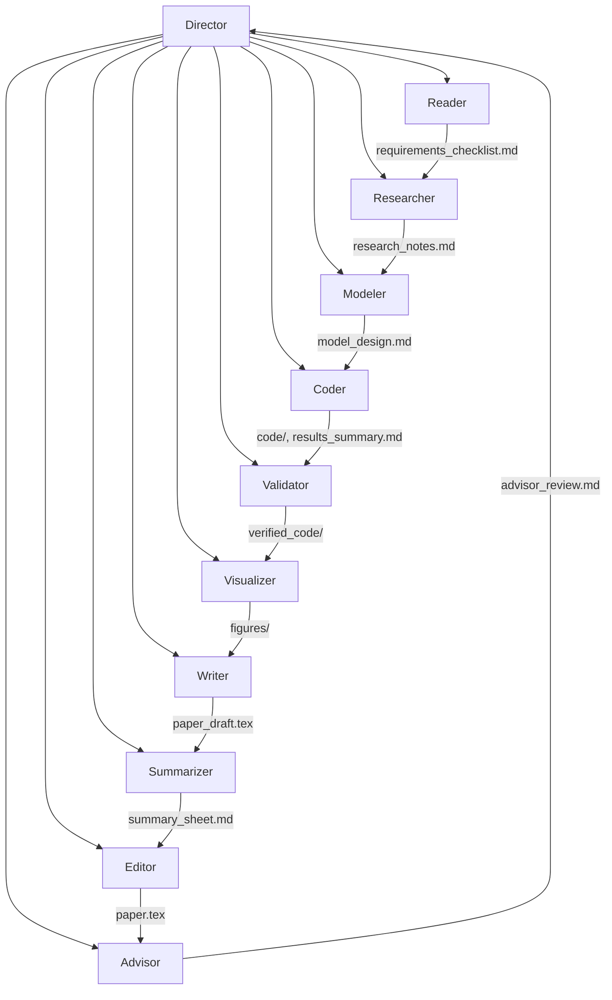

# MCM-Killer Agent 🤖

> **Project Goal**: Building an Autonomous Multi-Agent AI System to conquer the Mathematical Contest in Modeling (MCM/ICM).

**MCM-Killer** is an active research project using Claude Code's multi-agent architecture to fully automate the MCM competition process—from reading the problem to producing an O-Prize quality paper.

---

## 🏗️ Multi-Agent Architecture



| Agent | Role | Model | Key Responsibility |
|-------|------|-------|-------------------|
| **Director** | Team Captain | - | Orchestrates workflow, coordinates parallel work, verifies gates |
| **Reader** | Problem Analyst | Opus | Extracts ALL requirements from PDF using docling MCP |
| **Researcher** | Strategy Advisor | Sonnet | Brainstorms methods based on O-Prize papers |
| **Modeler** | Math Architect | Opus | Designs models with multi-agent consultation |
| **Coder** | Implementation Engineer | Sonnet | Writes and executes Python code |
| **Validator** | Quality Checker | Sonnet | Verifies code reproducibility and correctness |
| **Visualizer** | Graphics Designer | Sonnet | Creates professional figures and visualizations |
| **Writer** | Paper Author | Opus | Writes LaTeX paper using mcmthesis template |
| **Summarizer** | Summary Expert | Opus | Creates 1-page summary sheet |
| **Editor** | Language Polisher | Sonnet | Grammar, style, consistency check |
| **Advisor** | Faculty Reviewer | Opus | Quality gate against O-Prize standards |

---

## 📚 Lessons Learned

### ⚠️ Critical Issues Discovered

| Issue | Root Cause | Solution |
|-------|-----------|----------|
| **Agent Hallucination** | Subagent returned "0 tool uses" but claimed success | Added strict "0 tools = FAILURE" enforcement |
| **Wrong Problem Solved** | Agent guessed problem content instead of reading PDF | Added CRITICAL warnings to force tool usage |
| **Single-Agent Failure** | Director did work itself instead of delegating | Made CLAUDE.md FORBID solo work |
| **Shallow Analysis** | Only 2/6 requirements addressed | Added requirement coverage matrix |
| **Wrong Format** | Markdown instead of 25-page LaTeX | Specified exact format in writer.md |
| **File Deletion Risk** | Source files potentially deleted during operation | Added .gitignore, recommend read-only permissions |

### ✅ Best Practices Established

1. **Always verify output files exist** before proceeding to next phase
2. **Compare against past O-Prize papers** for quality benchmarking
3. **Use Advisor agent** as final quality gate before completion
4. **Maintain Git history** for recovery and debugging
5. **Protect source data** with read-only permissions
6. **Enforce auto-reverification loop** when revisions are requested
7. **Mandatory multi-agent consultation** for model design decisions

---

## 🔄 Auto-Reverification Protocol

> [!IMPORTANT]
> **Critical quality control mechanism:** When agents report "revisions complete", the Director MUST automatically send the work back for re-verification.

### How It Works

```
Round 1:
Director → Agent: "Implement feature"
Agent → "Implementation complete"
Director → Validator: "Please verify"
Validator → "NEEDS REVISION: Missing X, Y, Z"

Round 2:
Director → Agent: "Please fix: X, Y, Z"
Agent → "Revisions complete. Request re-verification from @validator"
Director → Validator: "Please re-verify the fixes for X, Y, Z"

Validator → "APPROVED: All issues resolved"
Director → "Great! Proceeding to next phase"
```

### Key Rules

- ❌ **WRONG**: Agent says "revisions complete" → Director moves to next step without re-checking
- ✅ **CORRECT**: Agent says "revisions complete" → Director automatically calls reviewing agent for re-verification
- 🔄 **LOOP**: If re-verification finds issues → send back to original agent → repeat until APPROVED

This prevents partial fixes and ensures quality gates are actually met.

---

## 🧪 Data Strategy: Training vs Testing

| Dataset | Years | Purpose |
|---------|-------|---------|
| **Training** | 2020 - 2024 | Knowledge Base, Few-Shot Examples |
| **Blind Test** | 2025 | Hold-out set for Agent evaluation |

---

## 📂 Directory Structure

```
MCM-killer/
│
├── student paper/              # [Few-Shot Corpus] O-Prize Papers
│   ├── YYYY/                   # Year (2020-2024)
│   │   └── A-F/                # Problem Category
│   │       └── ID.pdf          # Paper PDF
│
├── problems and results/       # [Benchmark Set] READ-ONLY
│   ├── YYYY/                   # Year
│   │   ├── YYYY_MCM_Problem_X.pdf
│   │   ├── YYYY_Problem_X_Data.zip
│   │   └── YYYY_MCM_Problem_X_Results.pdf
│
├── problem analysis/           # [CoT Templates] Strategy Guides
│   └── A-F/                    # Category
│       ├── question.md
│       └── solution.md
│
├── LaTeX__Template_for_MCM_ICM/  # [MCM/ICM Template] LaTeX class files
│   ├── mcmthesis.cls           # Custom document class
│   ├── mcmthesis-demo.tex      # Example paper
│   └── figures/                # Template figures
│
├── workspace/                  # [Working Directory] Agent Output
│   └── 2025_C/                 # Current problem workspace
│       ├── 2025_MCM_Problem_C.pdf  # Problem statement
│       ├── 2025_Problem_C_Data.zip # Data files
│       ├── reference_papers/   # 33 O-Prize reference papers
│       ├── latex_template/     # LaTeX template copy
│       ├── CLAUDE.md           # Director configuration
│       ├── .claude/
│       │   ├── agents/         # 10 agent configurations
│       │   └── settings.local.json
│       ├── .mcp.json           # MCP server config
│       └── output/             # Generated files
│           ├── requirements_checklist.md
│           ├── research_notes.md
│           ├── model_design.md
│           ├── consultations/  # Multi-agent consultation logs
│           ├── code/           # Python scripts
│           ├── figures/        # Generated figures
│           └── paper.tex       # Final LaTeX paper
│
└── .gitignore                  # Excludes generated content
```

---

## 📋 Prerequisites

### System Requirements

| Requirement | Version | Purpose |
|-------------|---------|---------|
| **Python** | 3.10+ | Code execution (agents will manage venv) |
| **Claude Code** | Latest | Multi-agent orchestration |
| **LaTeX** | TeX Live / MiKTeX | Paper compilation (optional) |

### MCP Server: Docling (REQUIRED)

> [!IMPORTANT]
> **Claude's built-in PDF reader causes hallucinations.** You MUST use `docling-mcp` for accurate PDF extraction.

---

## 🚀 Environment Setup

### Platform-Specific Instructions

Choose your platform below:

- [AutoDL Linux (Root)](#autodl-setup-recommended)
- [General Windows/Linux/macOS](#general-setup)

---

### AutoDL Setup (Recommended)

> [!NOTE]
> **AutoDL-specific requirements**: Root execution, path issues, missing system libraries. The scripts below solve all these problems at once.

#### Step 1: Base Environment & Toolchain (Execute All at Once)

This step solves three problems:

**Missing libraries**: Installs Docling-required OCR and graphics libraries.

**Path issues**: Installs uv and forces AutoDL path fixes.

**Permissions**: Writes `IS_SANDBOX` variable to allow Claude to run as root without confirmation.

```bash
# 1. Install system dependencies
apt-get update
apt-get install -y libgl1 libglib2.0-0 poppler-utils tesseract-ocr

# 2. Install uv (Python environment manager)
curl -LsSf https://astral.sh/uv/install.sh | sh

# 3. Write critical environment variables (solves path + Root permission issues)
echo 'export PATH="$HOME/.local/bin:$HOME/.cargo/bin:$PATH"' >> ~/.bashrc
echo 'export IS_SANDBOX=1' >> ~/.bashrc

# 4. Apply configuration immediately
source ~/.bashrc
```

#### Step 2: Register Docling MCP Server

This step uses the most robust approach discovered: find absolute path first, then use double dash `--` for parameters to prevent parsing errors.

```bash
# 1. Force-find uvx absolute path (most stable method on AutoDL)
UVX_PATH=$(find /root -name uvx -type f | head -n 1)
echo "uvx path locked to: $UVX_PATH"

# 2. Register tool (note the -- symbol in the middle)
claude mcp add docling -- "$UVX_PATH" --from docling-mcp docling-mcp-server
```

#### Step 3: Verify & Run

Environment is now configured. Since we added `IS_SANDBOX=1` to `.bashrc`, running Claude directly will work without any confirmation prompts.

```bash
cd /root/autodl-tmp/MCM-Killer/workspace/2025_C
claude
```

#### Step 4: Run Multi-Agent Workflow

```
Read CLAUDE.md. You are the Director.
Start the multi-agent workflow by calling @reader first.
```

---

### General Setup

For Windows, macOS, or standard Linux environments (non-root).

#### Step 1: Install System Dependencies (Linux/macOS only)

```bash
# Ubuntu/Debian
sudo apt-get update
sudo apt-get install -y libgl1 libglib2.0-0 poppler-utils tesseract-ocr

# macOS
brew install poppler tesseract
```

#### Step 2: Install uv

```powershell
# Windows (PowerShell)
powershell -ExecutionPolicy ByPass -c "irm https://astral.sh/uv/install.ps1 | iex"

# Linux/macOS
curl -LsSf https://astral.sh/uv/install.sh | sh
```

#### Step 3: Register Docling MCP Server

```bash
claude mcp add docling -- uvx --from docling-mcp docling-mcp-server
```

#### Step 4: Navigate to Workspace & Run

```bash
cd path/to/MCM-Killer/workspace/2025_C
claude
```

#### Step 5: Run Multi-Agent Workflow

```
Read CLAUDE.md. You are the Director.
Start the multi-agent workflow by calling @reader first.
```


---

## 🛡️ Data Protection

To prevent accidental deletion of source files:

**Linux/macOS:**
```bash
chmod -R a-w "problems and results/"
chmod -R a-w "student paper/"
```

**Windows:**
```powershell
attrib +R "problems and results\*" /S
attrib +R "student paper\*" /S
```

---

## 🗺️ Roadmap

- [x] **Phase 1**: Data Collection & Standardization
- [x] **Phase 2**: Multi-Agent Architecture Design
- [ ] **Phase 3**: Successful Problem Solving
- [ ] **Phase 4**: O-Prize Quality Validation

---

## 📄 License

This project is for research and educational purposes.