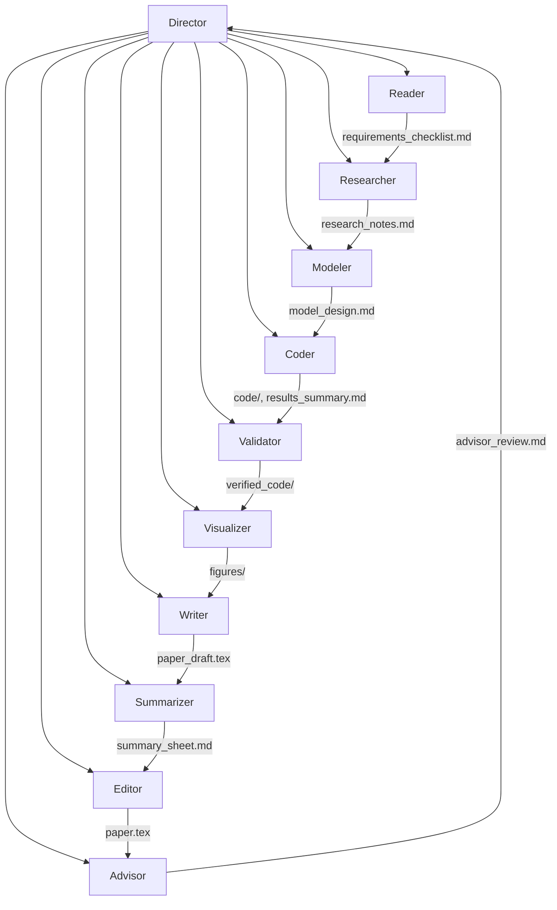

# MCM-Killer Agent 🤖

> **Project Goal**: 构建一个可复用的多agent系统框架，用于自动化数学建模竞赛全流程

> [!WARNING]
> **⚠️ IMPORTANT: READ THIS BEFORE USING**
>
> - This is a **RESEARCH PROJECT**, not a production tool
> - AI-generated content is **unreliable** and requires **human verification**
> - You **MUST** disclose AI use per competition rules (e.g., MCM AI Use Report)
> - You are **SOLELY RESPONSIBLE** for all content you submit
> - Developers provide **NO WARRANTY** and accept **NO LIABILITY**
>
> See [Academic Integrity & AI Use Policy](#-academic-integrity--ai-use-policy) and [Disclaimer](#-disclaimer--liability) below.

---

## 🎯 What is MCM-Killer?

**MCM-Killer is a framework, not a paper generator.**

### The Core Distinction

| Aspect | ❌ Common Misconception | ✅ What MCM-Killer Actually Is |
|--------|------------------------|-------------------------------|
| **Nature** | An AI that writes your MCM paper | A tool that CREATES multi-agent systems |
| **Input** | Just the problem PDF | Problem PDF + O-Prize reference papers |
| **Output** | A finished paper | A **customized 10-agent system** |
| **User's Role** | Passive recipient | Active participant who runs and directs the agents |
| **Ownership** | AI-generated content | **You own everything the agents produce** |

### The Two-Stage Workflow

```
┌─────────────────────────────────────────────────────────────┐
│  STAGE 1: Framework Setup (One-time, per competition)      │
│  Input: Problem PDF + Reference Papers                      │
│  Process: MCM-Killer configures agents, prompts, workflows  │
│  Output: workspace/YYYY_X/ with 10 specialized agents       │
│  Creator: Framework developers                              │
└─────────────────────────────────────────────────────────────┘
                              ↓
┌─────────────────────────────────────────────────────────────┐
│  STAGE 2: Competition Execution (You control this)          │
│  Input: Your chosen LLM backend (Claude/GPT-4/GLM/etc.)     │
│  Process: YOU direct agents to solve the problem           │
│  Output: Requirements, models, code, figures, paper         │
│  Owner: YOU (the competition participant)                   │
│  ⚠️ YOU MUST report AI usage per competition rules         │
└─────────────────────────────────────────────────────────────┘
```

### Key Principle

**MCM-Killer provides the ARCHITECTURE, YOU provide the INTELLIGENCE.**

- The framework defines: Agent roles, workflows, quality gates, file structure
- **You provide**: The LLM backend, strategic decisions, iteration direction
- **You own**: The generated paper, models, code, and competition results
- **You are responsible for**: AI use disclosure, academic integrity, submission quality

> [!CAUTION]
> **Important**: Unlike a compiler, AI tools **DO** contribute to your work. You **MUST**:
> - Follow competition AI use policies (e.g., MCM/ICM AI Use Report requirements)
> - Properly disclose AI assistance in your submission
> - Take full responsibility for the generated content

---

## 🏗️ Multi-Agent Architecture



| Agent | Role | Model | Key Responsibility |
|-------|------|-------|-------------------|
| **Director** | Team Captain | - | Orchestrates workflow, coordinates parallel work, verifies gates |
| **Reader** | Problem Analyst | Opus | Extracts ALL requirements from PDF using docling MCP |
| **Researcher** | Strategy Advisor | Sonnet | Brainstorms methods based on O-Prize papers |
| **Modeler** | Math Architect | Opus | Designs models with multi-agent consultation |
| **Coder** | Implementation Engineer | Sonnet | Writes and executes Python code |
| **Validator** | Quality Checker | Sonnet | Verifies code reproducibility and correctness |
| **Visualizer** | Graphics Designer | Sonnet | Creates professional figures and visualizations |
| **Writer** | Paper Author | Opus | Writes LaTeX paper using mcmthesis template |
| **Summarizer** | Summary Expert | Opus | Creates 1-page summary sheet |
| **Editor** | Language Polisher | Sonnet | Grammar, style, consistency check |
| **Advisor** | Faculty Reviewer | Opus | Quality gate against O-Prize standards |

---

## 📚 Lessons Learned

### ⚠️ Critical Issues Discovered

| Issue | Root Cause | Solution |
|-------|-----------|----------|
| **Agent Hallucination** | Subagent returned "0 tool uses" but claimed success | Added strict "0 tools = FAILURE" enforcement |
| **Wrong Problem Solved** | Agent guessed problem content instead of reading PDF | Added CRITICAL warnings to force tool usage |
| **Single-Agent Failure** | Director did work itself instead of delegating | Made CLAUDE.md FORBID solo work |
| **Shallow Analysis** | Only 2/6 requirements addressed | Added requirement coverage matrix |
| **Wrong Format** | Markdown instead of 25-page LaTeX | Specified exact format in writer.md |
| **File Deletion Risk** | Source files potentially deleted during operation | Added .gitignore, recommend read-only permissions |

### ✅ Best Practices Established

1. **Always verify output files exist** before proceeding to next phase
2. **Compare against past O-Prize papers** for quality benchmarking
3. **Use Advisor agent** as final quality gate before completion
4. **Maintain Git history** for recovery and debugging
5. **Protect source data** with read-only permissions
6. **Enforce auto-reverification loop** when revisions are requested
7. **Mandatory multi-agent consultation** for model design decisions

---

## 🔄 Auto-Reverification Protocol

> [!IMPORTANT]
> **Critical quality control mechanism:** When agents report "revisions complete", the Director MUST automatically send the work back for re-verification.

### How It Works

```
Round 1:
Director → Agent: "Implement feature"
Agent → "Implementation complete"
Director → Validator: "Please verify"
Validator → "NEEDS REVISION: Missing X, Y, Z"

Round 2:
Director → Agent: "Please fix: X, Y, Z"
Agent → "Revisions complete. Request re-verification from @validator"
Director → Validator: "Please re-verify the fixes for X, Y, Z"

Validator → "APPROVED: All issues resolved"
Director → "Great! Proceeding to next phase"
```

### Key Rules

- ❌ **WRONG**: Agent says "revisions complete" → Director moves to next step without re-checking
- ✅ **CORRECT**: Agent says "revisions complete" → Director automatically calls reviewing agent for re-verification
- 🔄 **LOOP**: If re-verification finds issues → send back to original agent → repeat until APPROVED

This prevents partial fixes and ensures quality gates are actually met.

---

## 🧪 Data Strategy: Training vs Testing

| Dataset | Years | Purpose |
|---------|-------|---------|
| **Training** | 2020 - 2024 | Knowledge Base, Few-Shot Examples |
| **Blind Test** | 2025 | Hold-out set for Agent evaluation |

---

## 📂 Directory Structure

```
MCM-killer/
│
├── student paper/              # [Few-Shot Corpus] O-Prize Papers
│   ├── YYYY/                   # Year (2020-2024)
│   │   └── A-F/                # Problem Category
│   │       └── ID.pdf          # Paper PDF
│
├── problems and results/       # [Benchmark Set] READ-ONLY
│   ├── YYYY/                   # Year
│   │   ├── YYYY_MCM_Problem_X.pdf
│   │   ├── YYYY_Problem_X_Data.zip
│   │   └── YYYY_MCM_Problem_X_Results.pdf
│
├── problem analysis/           # [CoT Templates] Strategy Guides
│   └── A-F/                    # Category
│       ├── question.md
│       └── solution.md
│
├── LaTeX__Template_for_MCM_ICM/  # [MCM/ICM Template] LaTeX class files
│   ├── mcmthesis.cls           # Custom document class
│   ├── mcmthesis-demo.tex      # Example paper
│   └── figures/                # Template figures
│
├── workspace/                  # [Generated Workspace] Framework Output
│   └── 2025_C/                 # Generated multi-agent system for 2025 Problem C
│       ├── 2025_MCM_Problem_C.pdf  # Problem statement (input)
│       ├── 2025_Problem_C_Data.zip # Data files (input)
│       ├── reference_papers/   # 33 O-Prize reference papers (knowledge base)
│       ├── latex_template/     # LaTeX template copy
│       ├── CLAUDE.md           # Director agent configuration
│       ├── .claude/
│       │   ├── agents/         # 10 specialized agent configurations
│       │   └── settings.local.json
│       ├── .mcp.json           # MCP server config
│       └── output/             # YOUR work products (you own these!)
│           ├── requirements_checklist.md
│           ├── research_notes.md
│           ├── model_design.md
│           ├── consultations/  # Multi-agent consultation logs
│           ├── code/           # Python scripts
│           ├── figures/        # Generated figures
│           └── paper.tex       # YOUR final LaTeX paper
│
└── .gitignore                  # Excludes generated content
```

---

## 📋 Prerequisites

### System Requirements

| Requirement | Version | Purpose |
|-------------|---------|---------|
| **Python** | 3.10+ | Code execution (agents will manage venv) |
| **Claude Code** | Latest | Multi-agent orchestration |
| **LaTeX** | TeX Live / MiKTeX | Paper compilation (optional) |

### MCP Server: Docling (REQUIRED)

> [!IMPORTANT]
> **Claude's built-in PDF reader causes hallucinations.** You MUST use `docling-mcp` for accurate PDF extraction.

---

## 🚀 Environment Setup

### Platform-Specific Instructions

Choose your platform below:

- [AutoDL Linux (Root)](#autodl-setup-recommended)
- [General Windows/Linux/macOS](#general-setup)

---

### AutoDL Setup (Recommended)

> [!NOTE]
> **AutoDL-specific requirements**: Root execution, path issues, missing system libraries. The scripts below solve all these problems at once.

#### Step 1: Base Environment & Toolchain (Execute All at Once)

This step solves three problems:

**Missing libraries**: Installs Docling-required OCR and graphics libraries.

**Path issues**: Installs uv and forces AutoDL path fixes.

**Permissions**: Writes `IS_SANDBOX` variable to allow Claude to run as root without confirmation.

```bash
# 1. Install system dependencies
apt-get update
apt-get install -y libgl1 libglib2.0-0 poppler-utils tesseract-ocr

# 2. Install uv (Python environment manager)
curl -LsSf https://astral.sh/uv/install.sh | sh

# 3. Write critical environment variables (solves path + Root permission issues)
echo 'export PATH="$HOME/.local/bin:$HOME/.cargo/bin:$PATH"' >> ~/.bashrc
echo 'export IS_SANDBOX=1' >> ~/.bashrc

# 4. Apply configuration immediately
source ~/.bashrc
```

#### Step 2: Register Docling MCP Server

This step uses the most robust approach discovered: find absolute path first, then use double dash `--` for parameters to prevent parsing errors.

```bash
# 1. Force-find uvx absolute path (most stable method on AutoDL)
UVX_PATH=$(find /root -name uvx -type f | head -n 1)
echo "uvx path locked to: $UVX_PATH"

# 2. Register tool (note the -- symbol in the middle)
claude mcp add docling -- "$UVX_PATH" --from docling-mcp docling-mcp-server
```

#### Step 3: Verify & Run

Environment is now configured. Since we added `IS_SANDBOX=1` to `.bashrc`, running Claude directly will work without any confirmation prompts.

```bash
cd /root/autodl-tmp/MCM-Killer/workspace/2025_C
claude
```

#### Step 4: Run Multi-Agent Workflow

```
Read CLAUDE.md. You are the Director.
Start the multi-agent workflow by calling @reader first.
```

---

### General Setup

For Windows, macOS, or standard Linux environments (non-root).

#### Step 1: Install System Dependencies (Linux/macOS only)

```bash
# Ubuntu/Debian
sudo apt-get update
sudo apt-get install -y libgl1 libglib2.0-0 poppler-utils tesseract-ocr

# macOS
brew install poppler tesseract
```

#### Step 2: Install uv

```powershell
# Windows (PowerShell)
powershell -ExecutionPolicy ByPass -c "irm https://astral.sh/uv/install.ps1 | iex"

# Linux/macOS
curl -LsSf https://astral.sh/uv/install.sh | sh
```

#### Step 3: Register Docling MCP Server

```bash
claude mcp add docling -- uvx --from docling-mcp docling-mcp-server
```

#### Step 4: Navigate to Workspace & Run

```bash
cd path/to/MCM-Killer/workspace/2025_C
claude
```

#### Step 5: Run Multi-Agent Workflow

```
Read CLAUDE.md. You are the Director.
Start the multi-agent workflow by calling @reader first.
```


---

## 🛡️ Data Protection

To prevent accidental deletion of source files:

**Linux/macOS:**
```bash
chmod -R a-w "problems and results/"
chmod -R a-w "student paper/"
```

**Windows:**
```powershell
attrib +R "problems and results\*" /S
attrib +R "student paper\*" /S
```

---

## ⚖️ Academic Integrity & AI Use Policy

> [!WARNING]
> **CRITICAL**: This project uses AI tools extensively. You **MUST** follow these guidelines.

### AI Use Disclosure Requirements

**For MCM/ICM Competitions:**
- **AI IS permitted** by COMAP for MCM/ICM competitions
- **AI Use Report is REQUIRED** if you use any AI tools
- Report does **NOT** count toward the 25-page limit
- Report must follow [COMAP AI Use Policy](https://www.comap.com/undergraduate/contests/mcm/instructions.html#AI)

**What You Must Disclose:**
- ✅ Which AI tools you used (Claude, GPT-4, GLM, etc.)
- ✅ What tasks AI assisted with (brainstorming, coding, writing, etc.)
- ✅ How you verified and refined AI-generated content
- ✅ Your role in directing and validating the work

**Example AI Use Report Structure:**
```markdown
# AI Use Report

## Tools Used
- Claude Code CLI (Model: Claude Opus 4.5 / GPT-4 Turbo / GLM-4)
- GitHub Copilot (code completion)

## AI-Assisted Tasks
1. Problem analysis and requirement extraction
2. Model design and mathematical formulation
3. Python code implementation
4. LaTeX paper writing

## Human Verification
- All models were reviewed for mathematical correctness
- Code was tested and debugged
- Paper content was edited for clarity and consistency
- Final submission was approved by human team members

## Responsibility Statement
We take full responsibility for the content of this submission.
The AI tools served as productivity aids, not replacements for our work.
```

### Academic Integrity Principles

| Principle | Your Responsibility |
|-----------|-------------------|
| **Honesty** | Disclose ALL AI use, don't hide AI assistance |
| **Accuracy** | Verify AI-generated content for correctness |
| **Attribution** | Don't claim AI-generated work as solely your own |
| **Understanding** | Be able to explain everything in your submission |
| **Accountability** | You are responsible for the final product, not the AI |

**Consequences of Misuse:**
- ❌ **Academic misconduct** if you fail to disclose AI use
- ❌ **Disqualification** from competitions
- ❌ **Reputation damage** to you and your institution

---

## ⚠️ Disclaimer & Liability

> [!DANGER]
> **READ THIS SECTION CAREFULLY BEFORE USING THIS PROJECT**

### Research-Only Status

**This project is currently in RESEARCH and DEVELOPMENT stage.**

- ❌ **NOT production-ready**
- ❌ **NOT suitable for unattended use**
- ❌ **NOT a substitute for human reviewers**
- ✅ **Intended for research and educational purposes only**

### Reliability Warnings

**AI-generated content is fundamentally unreliable:**

| Risk Category | Description |
|---------------|-------------|
| **Hallucinations** | AI may generate false citations, incorrect math, fabricated data |
| **Logical Errors** | Reasoning may be flawed or unsound |
| **Code Bugs** | Generated code may contain errors, security vulnerabilities |
| **Plagiarism Risk** | AI may reproduce text without proper attribution |
| **Quality Variance** | Output quality varies widely between runs and models |

### No Warranty

**THIS PROJECT IS PROVIDED "AS IS", WITHOUT WARRANTY OF ANY KIND.**

THE AUTHORS AND CONTRIBUTORS:
- ❌ **Do NOT guarantee** the correctness of any AI-generated content
- ❌ **Do NOT guarantee** suitability for any purpose
- ❌ **Do NOT guarantee** competition results or performance
- ❌ **Will NOT be liable** for any damages from using this project

### Your Responsibility

**By using this project, you agree that:**

1. **YOU are solely responsible** for verifying all AI-generated content
2. **YOU must conduct human review** of all outputs before submission
3. **YOU take full liability** for any consequences of using this project
4. **YOU will not hold the developers liable** for any damages, including but not limited to:
   - Academic penalties
   - Competition disqualification
   - Reputation damage
   - Financial losses

### Recommended Usage

**✅ DO:**
- Use as a productivity aid for brainstorming and drafting
- Verify all mathematical derivations
- Test all code thoroughly
- Review and edit all text
- Disclose AI use per competition rules
- Conduct multiple quality checks

**❌ DON'T:**
- Blindly trust AI-generated content
- Submit without human review
- Use AI to cheat or plagiarize
- Hide AI assistance
- Skip verification steps

### Contact

For questions about appropriate use, consult with:
- Your academic advisor
- Competition officials
- Your institution's research ethics board

---

## 🗺️ Roadmap

- [x] **Phase 1**: Data Collection & Standardization
- [x] **Phase 2**: Multi-Agent Architecture Design
- [ ] **Phase 3**: Successful Problem Solving
- [ ] **Phase 4**: O-Prize Quality Validation

---

## 🤖 AI Tools & Models

### 🔧 Development Tools (Framework Creation)

**Tools used to BUILD the MCM-Killer framework:**

| Tool | LLM Backend | Role in Framework Development |
|------|-------------|-------------------------------|
| **Claude Code CLI** | GLM-4.7 / GLM-4.6 | Architecture design, prompt engineering, agent configuration |
| **Antigravity** | Claude Sonnet 4.5 | Exploratory prototyping, alternative approach testing |
| **GitHub Copilot** | Claude Sonnet 4.5 | Code completion, syntax assistance during development |

**Why These Tools?**
- **GLM-4.x**: Strong multi-agent reasoning capabilities for complex workflow design
- **Claude Sonnet 4.5**: Excellent code completion and rapid prototyping

**Transparency Note**: All AI-assisted development is documented here. Framework commits use clean commit messages without AI co-authorship tags to maintain repository clarity.

---

### 🚀 Runtime Configuration (Framework Usage)

**When YOU use MCM-Killer, YOU control the AI backend:**

#### Supported LLM Backends

MCM-Killer (via Claude Code CLI) supports multiple LLM backends:

| LLM | Provider | Characteristics |
|-----|----------|-----------------|
| **Claude Opus/Sonnet** | Anthropic | Excellent for complex reasoning, long-context tasks |
| **GPT-4 / GPT-4 Turbo** | OpenAI | Strong coding capabilities, fast responses |
| **GLM-4** | Zhipu AI | Cost-effective, good Chinese language support |
| **Other Claude-compatible APIs** | Various | Configurable via Claude Code settings |

#### You Decide Everything

- **Choice of Model**: Pick based on your budget, quality requirements, language needs
- **Usage Pattern**: Run agents sequentially or in parallel, iterate as needed
- **Strategic Decisions**: You direct the agents, not the other way around
- **Output Ownership**: The paper, models, and code belong to **YOU**, not the AI

#### Example Configuration

```bash
# Use Claude Opus for best quality
export ANTHROPIC_MODEL=claude-opus-4

# Or use GPT-4 for faster iterations
export OPENAI_MODEL=gpt-4-turbo

# Or use GLM-4 for cost efficiency
export ZHIPU_MODEL=glm-4
```

---

### 📊 Summary: Framework vs. Usage

| Aspect | Framework Development (Stage 1) | Competition Usage (Stage 2) |
|--------|--------------------------------|----------------------------|
| **Who** | Framework developers + AI tools | **YOU** + your chosen LLM |
| **AI Tools Used** | Claude Code (GLM-4.7/4.6), Antigravity, Copilot | **Your choice**: Claude, GPT-4, GLM, etc. |
| **Output Ownership** | Framework code, configs, documentation | **Your** paper, models, competition results |
| **AI Co-authorship?** | Documented in this README | **YES - You MUST report AI use per competition rules** |
| **Your Responsibility** | N/A | **Disclose AI use, verify content, take full liability** |

---

## 📄 License

**This project is for research and educational purposes only.**

### Usage Terms

By using this project, you agree to:

1. **Research/Educational Use Only**
   - This is a research prototype, not a production tool
   - Use at your own risk

2. **Academic Integrity**
   - Follow all competition AI use policies
   - Disclose AI assistance honestly
   - Take responsibility for generated content

3. **No Liability**
   - Developers provide NO warranty
   - Developers are NOT liable for any damages
   - You are SOLELY responsible for your submissions

4. **Human Review Required**
   - AI outputs MUST be verified by humans
   - Do NOT submit unreviewed AI-generated content

### License Type

This project is shared for research and educational purposes. Commercial use is prohibited without explicit permission.

---

**For questions about licensing or appropriate use, please contact the framework developers.**