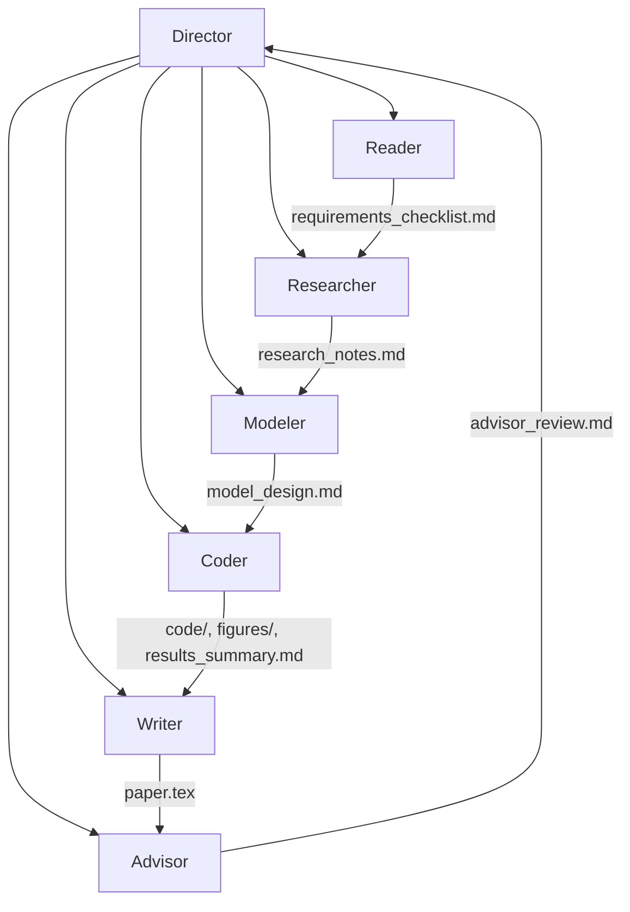

# MCM-Killer Agent 🤖

> **Project Goal**: Building an Autonomous Multi-Agent AI System to conquer the Mathematical Contest in Modeling (MCM/ICM).

**MCM-Killer** is an active research project using Claude Code's multi-agent architecture to fully automate the MCM competition process—from reading the problem to producing an O-Prize quality paper.

---

## 🏗️ Multi-Agent Architecture



| Agent | Role | Model | Key Responsibility |
|-------|------|-------|-------------------|
| **Director** | Orchestrator | - | Coordinates workflow, verifies outputs |
| **Reader** | Problem Analyst | Opus | Extracts ALL requirements from PDF |
| **Researcher** | Knowledge Miner | Sonnet | Searches past O-Prize papers |
| **Modeler** | Math Designer | Opus | Designs models for each requirement |
| **Coder** | Implementer | Sonnet | Writes and executes Python code |
| **Writer** | Paper Author | Opus | Writes 25-page LaTeX paper |
| **Advisor** | Quality Reviewer | Opus | Compares against O-Prize standards |

---

## � Lessons Learned

### ⚠️ Critical Issues Discovered

| Issue | Root Cause | Solution |
|-------|-----------|----------|
| **Agent Hallucination** | Subagent returned "0 tool uses" but claimed success | Added strict "0 tools = FAILURE" enforcement |
| **Wrong Problem Solved** | Agent guessed problem content instead of reading PDF | Added CRITICAL warnings to force tool usage |
| **Single-Agent Failure** | Director did work itself instead of delegating | Made CLAUDE.md FORBID solo work |
| **Shallow Analysis** | Only 2/6 requirements addressed | Added requirement coverage matrix |
| **Wrong Format** | Markdown instead of 25-page LaTeX | Specified exact format in writer.md |
| **File Deletion Risk** | Source files potentially deleted during operation | Added .gitignore, recommend read-only permissions |

### ✅ Best Practices Established

1. **Always verify output files exist** before proceeding to next phase
2. **Compare against past O-Prize papers** for quality benchmarking
3. **Use Advisor agent** as final quality gate before completion
4. **Maintain Git history** for recovery and debugging
5. **Protect source data** with read-only permissions

---

## 🧪 Data Strategy: Training vs Testing

| Dataset | Years | Purpose |
|---------|-------|---------|
| **Training** | 2020 - 2024 | Knowledge Base, Few-Shot Examples |
| **Blind Test** | 2025 | Hold-out set for Agent evaluation |

---

## 📂 Directory Structure

```
MCM-killer/
│
├── student paper/              # [Few-Shot Corpus] O-Prize Papers
│   ├── YYYY/                   # Year (2020-2024)
│   │   └── A-F/                # Problem Category
│   │       └── ID.pdf          # Paper PDF
│
├── problems and results/       # [Benchmark Set] READ-ONLY
│   ├── YYYY/                   # Year
│   │   ├── YYYY_MCM_Problem_X.pdf
│   │   ├── YYYY_Problem_X_Data.zip
│   │   └── YYYY_MCM_Problem_X_Results.pdf
│
├── problem analysis/           # [CoT Templates] Strategy Guides
│   └── A-F/                    # Category
│       ├── question.md
│       └── solution.md
│
├── workspace/                  # [Working Directory] Agent Output
│   └── 2025_C/                 # Current problem workspace
│       ├── CLAUDE.md           # Director configuration
│       ├── .claude/agents/     # Subagent configurations
│       └── output/             # Generated files
│
└── .gitignore                  # Excludes generated content
```

---

## 🚀 Usage

### 1. Navigate to workspace
```powershell
cd c:\Projects\MCM-killer\workspace\2025_C
```

### 2. Start Claude Code
```powershell
claude
```

### 3. Run multi-agent workflow
```
Read CLAUDE.md. You are the Director. 
Start the multi-agent workflow by calling @reader first.
```

---

## 🛡️ Data Protection

To prevent accidental deletion of source files:

```powershell
# Set read-only on important directories
attrib +R "problems and results\*" /S
attrib +R "student paper\*" /S
```

---

## � Roadmap

- [x] **Phase 1**: Data Collection & Standardization
- [x] **Phase 2**: Multi-Agent Architecture Design
- [ ] **Phase 3**: Successful Problem Solving
- [ ] **Phase 4**: O-Prize Quality Validation

---

## 📄 License

This project is for research and educational purposes.