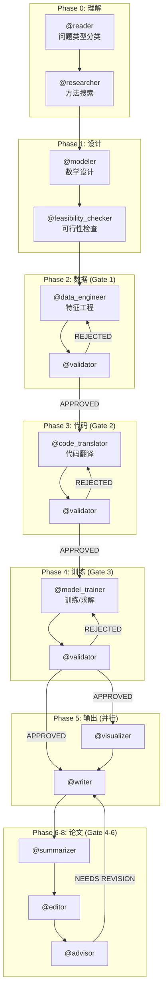

# MCM-Killer v2.3.0 系统架构文档

> **基于对 CLAUDE.md 主配置 + 全部 13 个 Agent 提示词的完整阅读分析（2026-01-03）**

---

## 1. 系统概览

MCM-Killer 是一个多 Agent 协作系统，用于自动化参与 MCM/ICM 数学建模竞赛。系统由 **1 个主控制器 (Director)** 和 **13 个专业化 Agent** 组成，以流水线方式协作完成从问题分析到论文提交的全流程。

### 1.1 主控制器 (CLAUDE.md)

`CLAUDE.md` 是整个系统的核心配置文件（713 行），定义了：

| 职责 | 说明 |
|------|------|
| **角色定义** | 用户扮演 "Team Captain (Director)"，负责编排 13 个 Agent |
| **不可谈判规则** | 禁止 Director 自己写代码/设计模型/写论文，必须委托给 Agent |
| **问题类型驱动** | 一切策略基于 Reader 识别的 6 种问题类型 |
| **文件系统安全** | 禁止修改 `output/` 以外的任何文件 |
| **版本控制** | 强制使用 `VERSION_MANIFEST.json` 和版本后缀 |
| **数据权威等级** | Level 1 (CSV) > Level 2 (MD) > Level 3 (TEX) |
| **流水线阶段** | 8 个阶段，6 个验证门 (Gate) |

### 1.2 系统流程图



---

## 2. Agent 职责与数据流（根据 CLAUDE.md 核准）

| Agent | 核心职责 | 输入 | 输出 | 写入目录 |
|-------|---------|------|------|----------|
| **Reader** | PDF 解析 + **问题类型分类** | 问题 PDF | `requirements_checklist.md` | `output/reports/` |
| **Researcher** | 搜索数据源和方法 | `requirements_checklist.md` | `research_notes.md` | `output/reports/` |
| **Modeler** | 设计数学模型 | `requirements_checklist.md`, `research_notes.md` | `model_design.md` | `output/reports/` |
| **Feasibility Checker** | 验证库可用性 | `model_design.md` | `feasibility_report.md` | `output/reports/` |
| **Data Engineer** | 数据清洗 + 特征工程 | `requirements_checklist.md`, `model_design.md` | `features.pkl/.csv` | `output/data/` |
| **Code Translator** | 数学→Python 代码转换 | `model_design.md`, `features.pkl` | `[model].py`, `translation_report.md` | `output/code/` |
| **Model Trainer** | 训练/求解模型 | `[model].py`, `features.pkl` | `[results].csv` (类型决定文件名) | `output/data/` |
| **Validator** | 多阶段质量验证 (6 Gates) | 各阶段产物 | `verification_report.md` | `output/reports/` |
| **Visualizer** | 生成发布级图表 | `features.pkl`, `[results].csv` | `*.png`, `*.pdf`, `figure_index.md` | `output/figures/` |
| **Writer** | LaTeX 论文撰写 | 所有报告 + 图表 | `paper.tex` | `output/paper/` |
| **Summarizer** | 1 页摘要单 | `paper.tex` | `summary_sheet.tex` | `output/summary/` |
| **Editor** | 语言润色 + 一致性检查 | `paper.tex`, `summary_sheet.tex` | 原地覆盖 | `output/paper/`, `output/summary/` |
| **Advisor** | 最终 O-Prize 标准审核 | `paper.tex` | `advisor_review.md` | `output/reports/` |

### 2.1 输出文件名与问题类型对应（CLAUDE.md 定义）

```python
if problem_type == 'PREDICTION':     output = 'predictions.csv'
elif problem_type == 'OPTIMIZATION': output = 'solution.csv'
elif problem_type == 'NETWORK_DESIGN': output = 'network_solution.csv'
elif problem_type == 'EVALUATION':   output = 'rankings.csv'
else:                                 output = 'results.csv'
```

---

## 3. 核心协议（CLAUDE.md 定义）

### 3.1 问题类型驱动 (Problem-Type-Aware)

**Reader** 负责将问题分类为 6 种类型之一：
- `PREDICTION` / `OPTIMIZATION` / `NETWORK_DESIGN` / `EVALUATION` / `CLASSIFICATION` / `SIMULATION`

**CLAUDE.md 规定**：
> "NEVER assume the problem is time-series prediction"
> "Every agent MUST read `requirements_checklist.md` to identify the problem type"

### 3.2 数据权威等级 (Data Authority Hierarchy)

| Level | 来源 | 示例 | 修改权 |
|-------|------|------|--------|
| **Level 1** | 代码输出 (pkl/csv) | `predictions.csv` | 仅 Model Trainer |
| **Level 2** | Agent 报告 (md) | `training_report.md` | 必须与 Level 1 一致 |
| **Level 3** | LaTeX 文本 | `paper.tex` | 必须与 Level 1 一致 |

**规则**：当发现不一致时，**Level 1 > Level 2 > Level 3**。

### 3.3 版本控制协议

- 所有输出文件必须带版本号：`xxx_v1.md`, `xxx_v2.md`
- 禁止使用 `_final` 后缀
- 必须更新 `VERSION_MANIFEST.json`

### 3.4 文件系统安全

**全局禁止**：
- ❌ 修改 `output/` 以外的任何文件
- ❌ 写入 `reference_papers/` 或 `latex_template/`
- ❌ 修改 `.claude/agents/` 配置文件

### 3.5 验证门 (Gates)

CLAUDE.md 定义了 6 个验证门：

| Gate | 位置 | 检查内容 |
|------|------|----------|
| Gate 1 | Data Engineer → Validator | 特征完整性、NaN、类型适配 |
| Gate 2 | Code Translator → Validator | 代码测试、模型类型匹配 |
| Gate 3 | Model Trainer → Validator | 收敛、合理性、CSV/Summary 同步 |
| Gate 4 | Writer → Validator | 数据一致性、格式 |
| Gate 5 | Summarizer → Validator | 1 页、数值匹配 Paper |
| Gate 6 | Editor → Validator | 语言、最终一致性 |

---

## 4. 发现的冲突与不一致

### ⚠️ 冲突 1：团队成员数量不一致

| 来源 | 描述的团队规模 |
|------|---------------|
| **CLAUDE.md** | **13 成员** |
| Reader | 13 成员 ✅ |
| Advisor | **10 成员** ❌ |

**建议**：统一 Advisor prompt 为 13 成员。

---

### ⚠️ 冲突 2：Editor 输出命名

| 来源 | Editor 输出描述 |
|------|----------------|
| **CLAUDE.md** | `paper_final.tex`, `summary_final.tex` |
| **Editor prompt** | 明确禁止 `paper_final.tex`，要求覆盖原文件 |

**问题**：CLAUDE.md 表格中写了 `paper_final.tex`，但这在 Editor prompt 和版本控制规则中是 **FORBIDDEN**。

**建议**：修改 CLAUDE.md 中的表格，改为"原地覆盖 `paper.tex`"。

---

### ⚠️ 冲突 3：输出路径不一致

| Agent | CLAUDE.md 路径 | Agent prompt 路径 |
|-------|---------------|-------------------|
| Model Trainer | `output/results/[results].csv` | `output/data/[results]_v{version}.csv` |
| Editor | `output/data/processed/predictions.csv` | 无此目录约定 |

**建议**：统一为 `output/data/{filename}_v{version}.csv`。

---

### ⚠️ 冲突 4：Validator 触发机制不明确

**CLAUDE.md 说**：`@validator: AFTER EVERY STAGE`

**但 Validator prompt 没有说明**：
- 被谁调用？(Director 还是自动触发)
- 调用时如何知道要验证哪个阶段？

**建议**：在 Validator prompt 中添加触发参数（如 `stage=DATA/CODE/TRAINING/PAPER`）。

---

### ⚠️ 冲突 5：验证报告命名不一致

| 来源 | 验证报告路径 |
|------|-------------|
| Summarizer prompt | 期望 `output/paper/paper_verification_report.md` |
| Validator prompt | 输出 `output/reports/verification_report.md` |
| CLAUDE.md | 未明确指定 |

**建议**：统一为 `output/reports/{stage}_verification_v{version}.md`。

---

### ⚠️ 冲突 6：Agent 名称不一致

| 应用场景 | 名称 |
|---------|------|
| CLAUDE.md 表格 | `@code_translator` |
| Advisor prompt | `Coder` |
| Reader prompt | `Code_Translator` |

**建议**：全部统一为 `@code_translator`。

---

### ⚠️ 冲突 7：Docling 使用者范围

仅以下 Agent 被授予 `mcp__docling__*` 工具：
- **Reader** ✅
- **Advisor** ✅

**但 CLAUDE.md 未明确** Researcher 是否需要读 PDF 参考论文。

**建议**：在 Researcher prompt 中明确"不读外部 PDF，仅使用自身知识"。

---

### ⚠️ 冲突 8：部分 Agent 仍是骨架

| Agent | 当前行数 | Legacy 行数 | 恢复程度 |
|-------|---------|------------|---------|
| validator | 87 | 680 | **13%** |
| writer | 101 | 800 | **13%** |
| researcher | 105 | 138 | 76% |

**建议**：优先完整恢复 `validator.md` 和 `writer.md`。

---

## 5. 运行逻辑顺序（CLAUDE.md 定义）

```
Phase 0: Problem Understanding
  1. [Reader]          读取 PDF → 输出 requirements_checklist.md (含问题类型)
  2. [Researcher]      搜索方法 → 输出 research_notes.md

Phase 1: Model Design
  3. [Modeler]         设计模型 → 输出 model_design.md
  4. [Feasibility]     检查可行性 → APPROVED / NEEDS REVISION

Phase 2: Data Preparation (GATE 1)
  5. [Data Engineer]   创建特征 → 输出 features.pkl
  6. [Validator]       验证数据 → APPROVED / REJECTED

Phase 3: Code Translation (GATE 2)
  7. [Code Translator] 翻译代码 → 输出 [model].py
  8. [Validator]       验证代码 → APPROVED / REJECTED

Phase 4: Model Training (GATE 3)
  9. [Model Trainer]   训练求解 → 输出 [results].csv (LEVEL 1 AUTHORITY)
  10. [Validator]      验证结果 → APPROVED / REJECTED

Phase 5: Output Generation (PARALLEL)
  11. [Visualizer]     生成图表 → 输出 *.png
  12. [Writer]         撰写论文 → 输出 paper.tex

Phase 6-8: Paper, Summary, Final Review (GATES 4-6)
  13. [Validator]      验证论文
  14. [Summarizer]     生成摘要 → 输出 summary_sheet.tex
  15. [Validator]      验证摘要
  16. [Editor]         润色语言 → 覆盖 paper.tex / summary_sheet.tex
  17. [Validator]      最终验证
  18. [Advisor]        最终审核 → APPROVED / NEEDS REVISION
```

---

## 6. 修复建议清单

| ID | 冲突 | 优先级 | 修复方案 |
|----|------|--------|----------|
| C1 | 团队规模 | 低 | Advisor: 10 → 13 |
| C2 | Editor `_final` | 高 | 修改 CLAUDE.md 表格，删除 `_final` |
| C3 | CSV 路径 | 中 | 统一为 `output/data/` |
| C4 | Validator 触发 | 高 | 添加 stage 参数 |
| C5 | 验证报告命名 | 中 | 统一格式 |
| C6 | Agent 名称 | 低 | 统一为 code_translator |
| C7 | Researcher PDF | 中 | 明确不读 PDF |
| C8 | validator/writer 骨架 | **最高** | 恢复完整内容 |

---

## 7. 版本信息

- **文档版本**：v2.3.0 (修订版)
- **分析日期**：2026-01-03
- **分析范围**：
  - `workspace/2025_C/CLAUDE.md` (主控制器, 713 行)
  - `workspace/2025_C/.claude/agents/` (全部 13 个 Agent)
