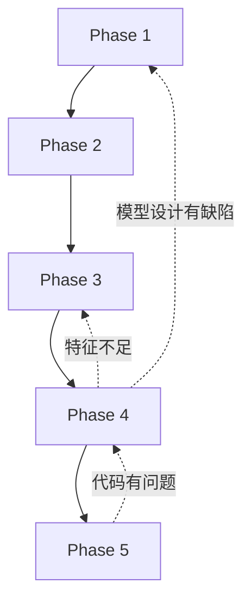

# MCM-Killer v2.5.2: Adaptive Phase Jump Architecture

> **版本**: v2.5.2
> **发布日期**: 2026-01-14
> **核心改进**: **自适应Phase跳转机制 (Adaptive Phase Jump)**
> **作者**: jcheniu

---

## 🎯 核心问题

在v2.5.1及之前的版本中，系统存在一个关键缺陷：

**AI不擅长在不同的phase之间跳转以改进结果**

### 具体表现

1. **问题发现太晚**
   - Phase 4写代码时发现模型设计有误 → 只能返工Phase 4
   - Phase 7写论文时发现结果异常 → 只能返工Phase 7
   - Phase 5训练时发现特征不足 → 只能返工Phase 5

2. **返工范围局限**
   - 返工总是当前Phase，但根源在上游
   - 无法追溯到问题源头

3. **被动执行**
   - Agent只能被动等待Validation Gate发现问题
   - 无法在执行过程中主动调整

---

## ✨ v2.5.2 解决方案

### 核心机制：Agent驱动的Phase跳转

```
v2.5.1流程:
Phase 1 → Phase 2 → Phase 3 → Phase 4 → [Validation Gate发现太晚] → 返工Phase 4

v2.5.2流程:
Phase 1 → Phase 2 → Phase 3 → Phase 4
    ↓ [Agent发现上游问题]
Rewind Recommendation → 回到Phase 1/2/3 → 修复后继续
```

### 三大核心特性

1. **Rewind Recommendation（回退建议）**
   - Agent在执行中发现上游问题时，主动建议回退
   - 通过标准化的文档格式提交建议
   - Director分析后决定是否接受

2. **Phase Dependency Graph（Phase依赖图）**
   - 明确定义Phase之间的依赖和跳转规则
   - 支持向后回退（Rewind）
   - 保护关键依赖，防止破坏已有成果

3. **Incremental Fix（增量修复）**
   - 回退后保留已有成果
   - 只修复受影响的部分
   - 避免完全重做

---

## 📚 架构文档

### 核心文档

| 文档 | 描述 | 行数 |
|------|------|------|
| **`architecture.md`** | **v2.5.2权威架构定义，完整继承v2.5.1 + 新增Phase跳转** | 1063 |
| **`phase_jump_design.md`** | Phase跳转机制详细设计，包含依赖图和决策逻辑 | - |
| **`migration_guide.md`** | 从v2.5.1升级到v2.5.2的完整指南 | - |
| **`README_v2-5-2.md`** | v2.5.2完整性验证报告 | - |

### 示例配置

| 文件 | 描述 |
|------|------|
| **`agents/code_translator.md`** | 完整的Agent配置示例，展示如何使用Rewind能力 |

---

## 🚀 快速开始

### 1. 查看核心架构

```bash
cd /home/jcheniu/MCM-Killer/architectures/v2-5-2
cat architecture.md
```

### 2. 了解Phase跳转机制

```bash
cat phase_jump_design.md
```

### 3. 查看Agent示例

```bash
cat agents/code_translator.md
```

### 4. 升级现有项目

```bash
cat migration_guide.md
```

---

## 🎨 核心概念

### Rewind vs 返工

| 方面 | 返工 (v2.5.1) | Rewind (v2.5.2) |
|------|---------------|-----------------|
| **触发时机** | Validation Gate | 执行过程中 |
| **发起者** | Validator | 任何Agent |
| **目标** | 当前Phase | 可以是上游Phase |
| **目的** | 修复当前产出 | 修复根本原因 |

**两者协同**：
- Rewind优先于返工
- 返工可以演变成Rewind
- Validation Gate也可以触发Rewind

### Phase依赖图



**允许的Rewind路径**：
- Phase 4 → Phase 1（模型设计有根本性缺陷）
- Phase 4 → Phase 3（特征数据不满足需求）
- Phase 5 → Phase 1/3/4（根据问题根源）
- Phase 7 → Phase 5（结果不合理）

---

## 📋 关键变更

### Agent Prompt变更

**新增章节**：
```markdown
## [v2.5.2 NEW] Phase跳转能力

### 你的Rewind权限
**可以建议Rewind到**：
- Phase X: 当condition
- Phase Y: 当condition

### 何时应该建议Rewind
- ✅ condition_1
- ✅ condition_2

### 如何发起Rewind建议
[标准格式模板]

### 何时不应该建议Rewind
- ❌ condition_1
- ❌ condition_2
```

### VERSION_MANIFEST.json变更

**新增字段**：
```json
{
  "workflow_state": "normal",  // "normal" | "rewinding" | "recovering"
  "rewind_history": [...],      // Rewind历史记录
  "rewind_count": 1,            // 总Rewind次数
  "skip_count": 0               // 总Skip次数
}
```

### 新增文档类型

**Rewind Recommendation**：
- 路径：`docs/rewind/rewind_rec_{i}_{from_agent}_phase{target}.md`
- 用途：Agent向Director建议Rewind
- 格式：标准化，包含问题分析、影响分析、修复方案

---

## 🔧 使用示例

### 示例1：Code Translator发现模型错误

**场景**：Phase 4执行中，发现模型设计中的公式无法实现

**Agent建议Rewind**：
```markdown
Director，我发现需要Rewind到Phase 1。

## 问题描述
公式(3)包含无限求和，无法编程实现

## 根本原因
模型设计没有考虑计算可行性

## 建议
修改公式为可计算的近似形式

## 紧急程度
**HIGH**: 当前Phase无法继续
```

**Director决策**：ACCEPT → 跳转到Phase 1 → Modeler修复 → 重新执行

### 示例2：Writer发现结果异常

**场景**：Phase 7执行中，发现预测结果有负数

**Agent建议Rewind**：
```markdown
Director，我发现需要Rewind到Phase 5。

## 问题描述
results_1.csv中有15个国家的预测为负数

## 根本原因
训练过程或特征工程有问题

## 紧急程度
MEDIUM: 论文可以继续，但数据不合理
```

**Director决策**：ACCEPT（但先检查Phase 3，如果特征有问题则Rewind到Phase 3）

---

## 🎓 最佳实践

### Agent应该

- ✅ **主动发现问题**，不要等到Validation Gate
- ✅ **清晰的证据**，不要凭感觉建议Rewind
- ✅ **完整的影响分析**，帮助Director决策
- ✅ **优先Consultation**，Rewind作为最后手段

### Director应该

- ✅ **快速响应Rewind建议**
- ✅ **基于规则决策**，不要依赖直觉
- ✅ **记录决策理由**
- ✅ **质量优先**

---

## 📊 兼容性

### 向后兼容

v2.5.2 **完全向后兼容** v2.5.1：

- v2.5.1的输出文件可以直接使用
- VERSION_MANIFEST.json v2.5.1格式仍然有效
- v2.5.1的Agent prompts仍然可以工作

### 升级路径

```
v2.5.1项目
    ↓
复制到v2.5.2环境
    ↓
可以直接使用
    ↓
首次Rewind时自动升级VERSION_MANIFEST.json
```

---

## 🛠️ 实施建议

### 对于新项目

**推荐**：直接使用v2.5.2

```bash
1. 复制 architectures/v2-5-2/agents/* 到 .claude/agents/
2. 更新 CLAUDE.md 引用 v2.5.2 架构
3. 开始使用
```

### 对于现有项目

**选项1：保守迁移**
- 使用v2.5.2架构
- Agent prompts保持v2.5.1
- 逐步添加Phase跳转能力

**选项2：完整迁移**
- 一次性升级所有组件
- 立即启用Phase跳转
- 推荐用于遇到phase跳转问题的项目

---

## 📈 预期效果

### 解决的问题

1. ✅ **问题发现更早**
   - 不需要等到Validation Gate
   - 执行过程中立即发现

2. ✅ **返工更精确**
   - 追溯到问题根源
   - 避免重复错误

3. ✅ **效率提升**
   - 减少无效返工
   - 保留已有成果

4. ✅ **AI更智能**
   - 不再机械线性执行
   - 主动优化工作流

### ✅ 完整性保证

**v2.5.2 = v2.5.1 (完整保留) + v2.5.2新特性 (可选增强)**

验证文档：`README_v2-5-2.md`

- ✅ v2.5.1的**所有章节**都包含在v2.5.2中
- ✅ v2.5.1的**所有规则**都保持有效
- ✅ v2.5.1的**所有格式**都保持不变
- ✅ v2.5.2的新增内容有明确标记
- ✅ 向后兼容，v2.5.1项目可以直接使用

### 潜在风险

1. ⚠️ **Rewind滥用**
   - **缓解**：严格的决策规则和代价分析

2. ⚠️ **复杂度增加**
   - **缓解**：清晰的文档和示例

3. ⚠️ **学习曲线**
   - **缓解**：详细的migration_guide

---

## 📝 TODO（可选增强）

这些是**可选的**未来增强，不影响v2.5.2核心功能：

- [ ] 添加自动化Rewind代价估算工具
- [ ] 可视化Phase跳转历史
- [ ] 添加Rewind频率监控和警告
- [ ] 创建更多Agent的Rewind示例
- [ ] 添加Skip Forward的完整实现
- [ ] 创建Rewind决策的辅助工具

---

## 🔗 相关资源

### MCM-Killer项目

- **主目录**: `/home/jcheniu/MCM-Killer/`
- **工作空间**: `/home/jcheniu/MCM-Killer/workspace/2025_C/`
- **Agent配置**: `/home/jcheniu/MCM-Killer/workspace/2025_C/.claude/agents/`

### 架构版本

- **v2.4.1**: 完整性强制令、数据完整性标准
- **v2.4.2**: 返工重新验证、资源利用原则
- **v2.5.0**: 反偷懒机制、Phase 5两阶段训练
- **v2.5.1**: 合并v2.4.2和v2.5.0
- **v2.5.2**: **[NEW] 自适应Phase跳转** ⭐

---

## 🤝 贡献

如果你在使用v2.5.2时发现问题或有改进建议，欢迎：

1. 创建issue描述问题
2. 提交pull request
3. 分享你的使用经验

---

## 📄 License

MCM-Killer 项目内部使用

---

**版本**: v2.5.2
**发布日期**: 2026-01-14
**作者**: jcheniu
**状态**: 🟢 稳定版本

> **核心突破**: AI现在可以在phase之间智能跳转，不再局限于线性执行！
