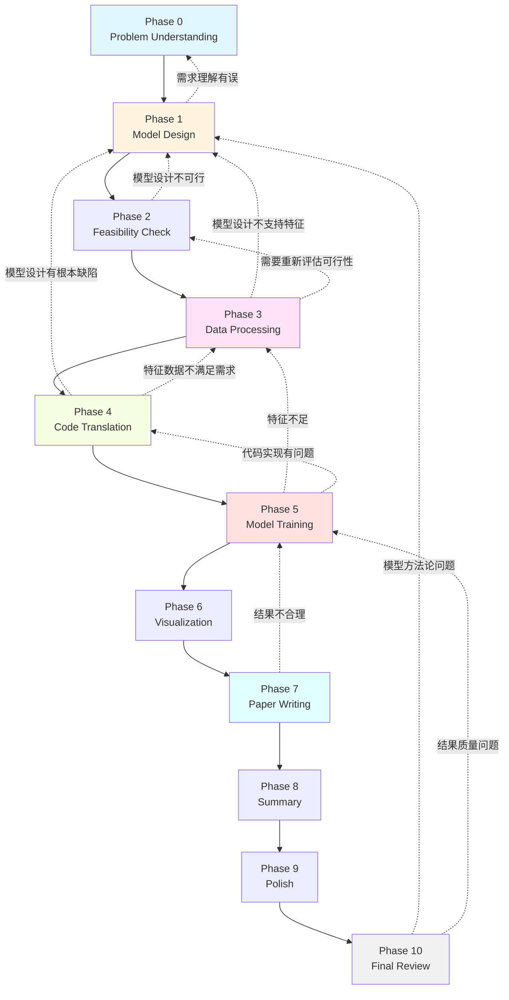

# Phase跳转机制详细设计 (v2.5.2)

> **版本**: v2.5.2
> **日期**: 2026-01-14
> **作者**: jcheniu

---

## 一、设计动机

### 1.1 v2.5.1的问题

**问题1：问题发现太晚**

在v2.5.1的线性工作流中，问题往往只能在Validation Gate被发现：

```
Phase 1 → Phase 2 → Phase 3 → Phase 4 → [Validation Gate: 问题发现] → 返工Phase 4
```

但实际中，**很多问题在执行过程中就能发现**：
- Phase 4写代码时发现模型设计有误
- Phase 7写论文时发现结果不合理
- Phase 5训练时发现特征不足

**问题2：返工范围局限**

v2.5.1的返工机制总是返工当前Phase，但问题的根源可能在更早的Phase。

**问题3：Director不擅长主动跳转**

Director需要明确的规则来决定何时跳转，而不是依赖AI的"直觉"。

### 1.2 v2.5.2的解决方案

**核心理念**：**Agent应该在发现问题的第一时间主动建议Rewind**

```
Phase 1 → Phase 2 → Phase 3 → Phase 4
                                      ↓ [Agent发现上游问题]
                              Rewind Recommendation
                                      ↓
                              Director决策
                                      ↓
                              Rewind到Phase 1
```

---

## 二、Phase依赖图

### 2.1 依赖关系定义

**Phase依赖关系**是一个有向图，定义了：
1. **前向依赖**：Phase X必须完成后才能执行Phase Y
2. **Rewind边**：Phase Y可以Rewind到Phase X

```
正式定义：
G = (V, E)
V = {Phase 0, Phase 1, ..., Phase 10}
E_forward = {(i, j) | Phase i必须完成后才能执行Phase j}
E_rewind = {(j, i) | Phase j可以Rewind到Phase i}
```

### 2.2 完整依赖图



### 2.3 依赖表

| 当前Phase | 可以Rewind到 | 条件 |
|----------|-------------|------|
| **Phase 1** | Phase 0 | 需求理解有误 |
| **Phase 2** | Phase 1 | 模型设计不可行 |
| **Phase 3** | Phase 1 | 模型设计不支持特征需求 |
| **Phase 3** | Phase 2 | 需要重新评估可行性 |
| **Phase 4** | Phase 1 | 模型设计有根本性缺陷 |
| **Phase 4** | Phase 3 | 特征数据不满足需求 |
| **Phase 5** | Phase 1 | **[严重]** 模型方法论错误 |
| **Phase 5** | Phase 3 | 特征不足或有问题 |
| **Phase 5** | Phase 4 | 代码实现有严重问题 |
| **Phase 7** | Phase 5 | 结果不合理，需要重新训练 |
| **Phase 10** | Phase 1 | **[严重]** 模型方法论问题 |
| **Phase 10** | Phase 5 | 结果质量问题 |

### 2.4 Rewind代价分级

**低代价 Rewind (1-2小时)**：
- Phase 3 → Phase 1: 废弃特征，重做设计
- Phase 3 → Phase 2: 重新评估可行性

**中代价 Rewind (2-4小时)**：
- Phase 4 → Phase 3: 废弃代码，重做特征
- Phase 5 → Phase 4: 修复代码，重新训练

**高代价 Rewind (4-8小时)**：
- Phase 5 → Phase 1: **[严重]** 废弃所有实现
- Phase 7 → Phase 5: 重写论文部分章节

**极高代价 Rewind (8+小时)**：
- Phase 10 → Phase 1: **[灾难]** 废弃整个项目
- Phase 10 → Phase 5: 重做训练+论文

**代价估算公式**：
```
Rewind代价 = Σ(需要重做的Phase时间) + 上下文切换开销
```

---

## 三、Rewind建议机制

### 3.1 Agent发起Rewind建议

**触发条件**（满足任一即可）：

1. **上游产出物根本性缺陷**
   - Phase 4发现模型设计数学错误
   - Phase 5发现特征完全不对
   - Phase 7发现结果造假或异常

2. **当前Phase无法继续**
   - 缺少必要的上游输入
   - 上游产出物与需求不符
   - 技术上无法实现上游设计

3. **修复上游更高效**
   - 在当前Phase补救需要大量hack
   - 修复上游可以避免同样问题重复
   - 上游修复可以提升整体质量

**禁止Rewind的情况**：
- ❌ 仅仅因为"不喜欢"上游产出
- ❌ 可以在当前Phase快速修复的小问题
- ❌ Rewrite代价远大于收益

### 3.2 Rewind建议协议

**Agent → Director通信格式**：

```markdown
Director，我在Phase {current}执行中，发现需要Rewind到Phase {target}。

## 问题描述

{清晰描述发现的问题}

## 根本原因

{分析为什么问题发生在上游Phase}

## 影响分析

### 受影响的Phase
- Phase {i}: {影响描述}
- Phase {j}: {影响描述}

### 需要重新执行
| Phase | 需要重做 | 预估时间 |
|-------|---------|----------|
| {i} | {内容} | {时间} |

### 可以保留的成果
| 文件 | 路径 | 保留理由 |
|------|------|----------|
| {name} | {path} | {理由} |

## Rewind Recommendation

**目标Phase**: {target_phase}

**理由**: {为什么必须回退到这里}

**修复方案**: {建议如何修复}

## 紧急程度

- [ ] LOW: 可以等到当前Phase完成
- [ ] MEDIUM: 建议尽快处理
- [ ] HIGH: **必须立即Rewind**，当前Phase无法继续

**Rewind Recommendation报告已生成**：docs/rewind/rewind_rec_{i}_{agent}_phase{target}.md
```

### 3.3 Rewind Recommendation文档

**路径**：`docs/rewind/rewind_rec_{i}_{from_agent}_phase{target}.md`

**完整格式**：

```markdown
# Rewind Recommendation #{i}: {from_agent} → Phase {target}

| 字段 | 值 |
|------|------|
| 编号 | {i} |
| 发起方 | {from_agent} |
| 当前Phase | {current_phase} |
| 目标Phase | {target_phase} |
| 发起时间 | {timestamp} |
| 状态 | PENDING / ACCEPTED / REJECTED |

---

## 问题发现

**发现时机**：{execution | validation | consultation}

**问题描述**：
{detailed_description}

**证据**：
- {evidence_1}
- {evidence_2}

---

## 根本原因分析

**问题根源**：Phase {root_cause_phase}

**为什么发生在上游**：
{root_cause_analysis}

---

## 影响分析

### 受影响的Phase

| Phase | 影响 | 严重程度 |
|-------|------|----------|
| {i} | {impact} | HIGH/MEDIUM/LOW |
| {j} | {impact} | HIGH/MEDIUM/LOW |

### 需要重新执行

| Phase | 需要重做的内容 | 预估时间 |
|-------|---------------|----------|
| {i} | {content} | {time} |

**总代价估算**：{total_time}

### 可以保留的成果

| 文件 | 路径 | 保留理由 |
|------|------|----------|
| {name} | {path} | {reason} |

---

## Rewind建议

**目标Phase**: {target_phase}

**Rewind理由**：
{justification}

**修复方案**：
{fix_plan}

**预期效果**：
{expected_outcome}

---

## 紧急程度

- [ ] **LOW**: 可以等到当前Phase完成，或Validation Gate处理
- [ ] **MEDIUM**: 建议在当前Phase完成后尽快Rewind
- [ ] **HIGH**: **必须立即Rewind**，当前Phase无法继续

**理由**: {urgency_justification}

---

## 替代方案

**是否有更轻量的修复方案**：
{alternative_solution}

**为什么Rewind更优**：
{why_rewind_is_better}

---

## Director决策

（由Director填写）

| 字段 | 值 |
|------|------|
| 决定 | ACCEPT / REJECTED |
| 决策时间 | {timestamp} |
| 决策理由 | {reason} |
| 调整方案 | {如有调整} |
```

### 3.4 Rewind状态机

```
PENDING（待决策）
    ↓
Director分析
    ↓
    ├─→ ACCEPT（接受）→ EXECUTING（执行中）→ COMPLETED（完成）
    │
    └─→ REJECTED（拒绝）→ CLOSED（关闭）
        │
        └─→ 可以记录原因，Agent可以后续重新建议
```

---

## 四、Director决策逻辑

### 4.1 决策流程图

```
收到Rewind建议
    ↓
┌─────────────────────────┐
│ 1. 验证建议有效性       │
│ - 问题是否真实存在？    │
│ - 证据是否充分？        │
└─────────────────────────┘
    ↓
    ├─→ 无效 → REJECTED，说明理由
    ↓
┌─────────────────────────┐
│ 2. 检查依赖图           │
│ - 是否允许Rewind？      │
└─────────────────────────┘
    ↓
    ├─→ 不允许 → REJECTED，说明原因
    ↓
┌─────────────────────────┐
│ 3. 分析代价收益         │
│ - Rewind代价？          │
│ - 不Rewind的后果？      │
│ - 是否有替代方案？      │
└─────────────────────────┘
    ↓
┌─────────────────────────┐
│ 4. 考虑时机             │
│ - 紧急程度？            │
│ - Token预算？           │
│ - 时间压力？            │
└─────────────────────────┘
    ↓
    ├─→ 代价过高 → REJECTED或调整目标
    ↓
┌─────────────────────────┐
│ 5. 最终决策             │
│ - ACCEPT: 执行Rewind    │
│ - REJECTED: 拒绝并说明  │
│ - MODIFY: 调整目标Phase │
└─────────────────────────┘
```

### 4.2 决策矩阵

| 问题严重度 | Rewind代价 | 紧急程度 | 决策倾向 |
|-----------|-----------|----------|---------|
| HIGH | LOW | HIGH | **ACCEPT** |
| HIGH | MEDIUM | HIGH | **ACCEPT** |
| HIGH | HIGH | HIGH | 考虑 MODIFY或 PARTIAL |
| MEDIUM | LOW | MEDIUM | **ACCEPT** |
| MEDIUM | MEDIUM | MEDIUM | 评估后决定 |
| MEDIUM | HIGH | MEDIUM | 可能 REJECTED |
| LOW | LOW | LOW | 考虑 ACCEPT |
| LOW | MEDIUM | LOW | 可能 REJECTED |
| LOW | HIGH | LOW | **REJECTED** |

### 4.3 决策规则（专家系统）

```
IF 问题严重度 == HIGH AND 紧急程度 == HIGH:
    IF 代价 <= HIGH:
        RETURN ACCEPT
    ELSE:
        RETURN MODIFY(target_phase = 更保守的回退点)

IF 问题严重度 == MEDIUM AND 代价 <= MEDIUM:
    RETURN ACCEPT

IF 问题严重度 == LOW:
    IF 代价 == LOW AND 有充裕Token:
        RETURN ACCEPT
    ELSE:
        RETURN REJECTED(reason = "问题不严重，代价过高")

IF 紧急程度 == HIGH:
    # 当前Phase无法继续
    IF 依赖图允许:
        RETURN ACCEPT
    ELSE:
        RETURN REJECTED(reason = "依赖图不允许，需寻找替代方案")
```

### 4.4 决策文档

Director决策后，更新Rewind Recommendation文档：

```markdown
## Director决策

| 字段 | 值 |
|------|------|
| 决定 | ACCEPT |
| 决策时间 | 2026-01-14 10:30:00 |
| 决策理由 | 问题严重度高，代价可接受，必须修复根本原因 |
| 执行计划 | 1. 标记Phase 0输出为preserved<br/>2. 跳转到Phase 1<br/>3. 重新执行Phase 1-4 |

**下一步行动**：调用 @modeler 修复模型设计
```

---

## 五、执行Rewind

### 5.1 执行步骤

```
1. Director决策ACCEPT
    ↓
2. 更新VERSION_MANIFEST.json
   - workflow_state = "rewinding"
   - 记录rewind_history
    ↓
3. 标记保留文件
   - 根据Rewind Recommendation
   - 在VERSION_MANIFEST中标记preserved=true
    ↓
4. 创建检查点
   - 保存当前状态到.checkpoint_phase{current}.json
    ↓
5. 跳转到目标Phase
   - 设置current_phase = target_phase
    ↓
6. 调用目标Phase的Agent
   - 传入Rewind Recommendation报告
   - 传入保留文件列表
   - 明确修复要求
    ↓
7. Agent完成修复后
   - 生成新版本文件
   - 更新VERSION_MANIFEST
    ↓
8. 重新执行受影响的后续Phase
   - 按依赖图顺序
   - 保留preserved文件不变
    ↓
9. 完成Rewind
   - workflow_state = "normal"
   - 更新rewind_count
```

### 5.2 保留文件策略

**原则**：尽可能保留已有成果，减少重复工作

| 目标Phase | 保留文件 | 废弃文件 |
|----------|---------|---------|
| Phase 1 | Phase 0所有输出 | Phase 1-10所有输出 |
| Phase 3 | Phase 0-2所有输出 | Phase 3-10所有输出 |
| Phase 5 | Phase 0-4所有输出 | Phase 5-10所有输出 |

**实现**：

```json
// VERSION_MANIFEST.json
{
  "rewind_history": [{
    "rewind_id": 1,
    "from_phase": 4,
    "to_phase": 1,
    "preserved_files": [
      "problem/*",
      "docs/consultation/*",
      "docs/validation/*"
    ],
    "redone_phases": [1, 2, 3, 4]
  }]
}
```

### 5.3 增量修复

**场景**：Rewind后只修复部分内容，保留其他成果

**示例**：Rewind到Phase 1，但Phase 0的成果保留

```
Rewind前：
Phase 0 (problem_full.md) → Phase 1 (model_design_1.md) → Phase 2-4

Rewind到Phase 1：
保留：problem_full.md
修复：model_design_1.md → model_design_2.md
重做：Phase 2-4

Rewind后：
Phase 0 (problem_full.md, preserved) → Phase 1 (model_design_2.md) → Phase 2-4 (重新生成)
```

### 5.4 多次Rewind

**场景**：第一次Rewind后，发现问题仍然存在

**策略**：
- 每次Rewind独立记录
- 如果同一位置Rewind超过2次，Director应该：
  1. 重新评估问题
  2. 考虑Rewind到更早的Phase
  3. 请求用户干预

---

## 六、Rewind与Validation Gate的协同

### 6.1 优先级

**Rewind优先于返工**：

```
1. Agent执行中 → 发现问题 → 发起Rewind建议
    ↓
2. Director处理Rewind → ACCEPT或REJECTED
    ↓
3. 如果ACCEPT → 执行Rewind
    ↓
4. 如果REJECTED → 继续当前Phase
    ↓
5. 到达Validation Gate → 如果REJECTED → 考虑Rewind
```

### 6.2 Validation Gate触发Rewind

**v2.5.2增强**：Validation Gate不再只是返工当前Phase

**流程**：

```
Validation Gate REJECTED
    ↓
分析根本原因
    ↓
    ├─→ 问题在当前Phase → 返工当前Phase
    ├─→ 问题在上游Phase → **建议Rewind**
    └─→ 不确定 → 先返工当前Phase，如失败再Rewind
```

**Validator的Rewind建议**：

```markdown
## 验证结论

**判定**: ❌ REJECTED

**根本原因**：Phase 1的模型设计有数学错误

**建议**：Rewind到Phase 1重新设计模型

**理由**：当前Phase的代码正确实现了错误的设计，
         返工当前Phase无法解决问题，必须修复上游
```

### 6.3 返工演变成Rewind

**规则**：
- 同一Gate返工2次仍REJECTED → 必须考虑Rewind
- 返工中发现上游问题 → 可以转为Rewind

**流程**：

```
Validation Gate REJECTED → 返工当前Phase
    ↓
第2次REJECTED → 返工当前Phase
    ↓
第3次REJECTED → **Director主动发起Rewind**
```

---

## 七、向前跳过 (Skip Forward)

### 7.1 定义

**Skip Forward**：跳过某些Phase，直接进入后面的Phase

**示例**：
- Phase 0的成果已经存在，直接进入Phase 1
- Phase 5已经完成，直接进入Phase 7

### 7.2 Skip条件（严格）

**允许Skip**（必须全部满足）：
1. ✅ 目标Phase的输入已经存在且质量满足
2. ✅ 不影响整体质量
3. ✅ 节省的时间显著（> 30分钟）
4. ✅ Director谨慎评估后确认

**禁止Skip**：
- ❌ 可能影响质量
- ❌ 节省时间不足（< 30分钟）
- ❌ 跳过Validation Gate

### 7.3 Skip流程

```
Agent建议Skip
    ↓
Director严格评估（质量优先）
    ↓
    ├─→ 满足所有条件 → ACCEPT
    └─→ 不满足 → REJECTED
```

**示例**：

```markdown
Director，Phase 5的成果已存在（results_1.csv），
建议Skip Phase 5，直接进入Phase 6。

**现有成果**：implementation/data/results_1.csv
**生成时间**：2小时前
**质量**：已通过TRAINING Gate验证

**理由**：节省5小时训练时间
```

---

## 八、最佳实践

### 8.1 Agent应该

- ✅ **主动发现问题**，不要等到Validation Gate
- ✅ **清晰的证据**，不要凭感觉建议Rewind
- ✅ **完整的影响分析**，帮助Director决策
- ✅ **考虑替代方案**，不要只想到Rewind

### 8.2 Agent不应该

- ❌ **轻易建议Rewind**，权衡代价
- ❌ **因为"不满意"就Rewind**，必须有实质问题
- ❌ **忽略已有成果**，尽可能保留

### 8.3 Director应该

- ✅ **快速响应Rewind建议**，不要拖延
- ✅ **基于规则决策**，不要依赖直觉
- ✅ **记录决策理由**，便于后续分析
- ✅ **考虑Agent的建议**，但独立决策

### 8.4 Director不应该

- ❌ **盲目接受Rewind**，必须验证
- ❌ **为了避免麻烦而REJECTED**，质量优先
- ❌ **频繁Rewind**，影响效率

---

## 九、示例场景

### 示例1：Phase 4发现模型错误

**场景**：code_translator发现模型设计中的公式(3)无法实现

**Rewind建议**：

```markdown
Director，我需要Rewind到Phase 1。

## 问题描述
公式(3)中的数学表达式在编程上无法实现，涉及无限求和。

## 根本原因
Phase 1的模型设计没有考虑计算可行性。

## 影响分析
- Phase 2-4需要重做
- 预估代价：3小时

## 修复方案
修改公式(3)为可计算的近似形式。

## 紧急程度
**HIGH**: 当前Phase无法继续
```

**Director决策**：ACCEPT

---

### 示例2：Phase 7发现结果异常

**场景**：writer发现results_1.csv中某些国家的预测为负数

**Rewind建议**：

```markdown
Director，我需要Rewind到Phase 5。

## 问题描述
results_1.csv中有15个国家的奖牌预测为负数，不符合现实。

## 根本原因
Phase 5的训练过程可能有问题，或Phase 3的特征异常。

## 影响分析
- Phase 5-7需要重做
- 预估代价：6小时

## 修复方案
检查训练代码和特征工程，修复预测异常。

## 紧急程度
MEDIUM: 论文可以继续写，但数据不合理
```

**Director决策**：ACCEPT（但先检查Phase 3，如果特征有问题则Rewind到Phase 3）

---

### 示例3：Phase 5发现特征不足

**场景**：model_trainer发现缺少关键特征

**Rewind建议**：

```markdown
Director，我需要Rewind到Phase 3。

## 问题描述
模型需要主办国效应特征，但features_1.pkl中没有。

## 根本原因
Phase 1的设计中要求了这个特征，但Phase 3没有生成。

## 影响分析
- Phase 3-5需要重做
- 预估代价：2小时

## 修复方案
在Phase 3添加host_country特征。

## 紧急程度
**HIGH**: 训练无法继续
```

**Director决策**：ACCEPT

---

**版本**: v2.5.2
**日期**: 2026-01-14
**作者**: jcheniu
