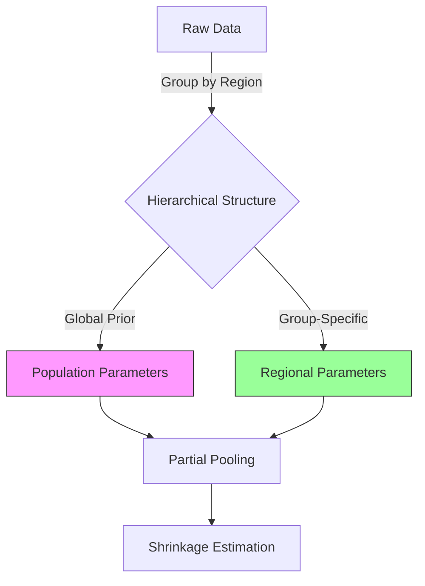

# Sprint 1 Implementation Guide: Foundation & Eyes
## Days 1-3 - Building Physical Skeleton, Dynamic Knowledge Base, and Academic Aesthetic

> **Sprint Code**: "Foundation & Eyes" (基石与双眼)
> **Duration**: 3 Days
> **Prerequisites**: v3.0.0 system operational, Python 3.10+, `pdfplumber` installed
> **Deliverables**: Complete directory structure, HMML 2.0 migration, `style_guide.md`, `ANTI_PATTERNS.md`
> **Success Criteria**: All directories created, HMML methods retrievable, style guide auto-generated, Kill List defined

---

## Sprint Overview

Sprint 1 transforms MCM-Killer from a "flat file system" into a "dynamic knowledge infrastructure." By the end of Day 3, the system will have:

1. **Physical Body** - Structured directories supporting adversarial review and metacognition
2. **Dynamic Memory** - HMML 2.0 with metadata and narrative value annotations
3. **Academic Vision** - Automated style learning from O-Prize papers
4. **Judicial Law** - Clear definition of what constitutes a fatal flaw

**The Paradigm Shift**: We're not just organizing files—we're creating an ecosystem where knowledge is active (retrievable, annotated, opinionated) rather than passive (static text).

---

## Day 1: The Physical Foundation

### Objective

Establish the complete directory tree and migrate HMML from flat file to dynamic knowledge base.

### 1.1 Directory Structure Initialization

#### Action: Create Workspace Skeleton

**File**: `tools/init_workspace.py`

```python
#!/usr/bin/env python3
"""
Workspace Initializer: Create complete v3.1.0 directory structure.

Usage:
    python init_workspace.py workspace/2025_C/
"""

import os
from pathlib import Path

def create_structure(base_path):
    """Create complete directory tree."""

    # Define structure
    directories = [
        # Knowledge base
        "knowledge_library/academic_writing",
        "knowledge_library/methods/optimization/linear_programming",
        "knowledge_library/methods/optimization/nonlinear_programming",
        "knowledge_library/methods/differential_equations/epidemic",
        "knowledge_library/methods/differential_equations/pde",
        "knowledge_library/methods/statistics/bayesian",
        "knowledge_library/methods/statistics/time_series",
        "knowledge_library/methods/network_science/pathfinding",
        "knowledge_library/methods/machine_learning/trees",
        "knowledge_library/templates/narrative_arcs",

        # Reference materials
        "reference_papers",

        # Tools
        "tools",
        "tests",

        # Output structure
        "output/docs/insights",
        "output/docs/knowledge",
        "output/docs/validation",
        "output/docs/requirements",
        "output/docs/consultations",
        "output/implementation/code",
        "output/implementation/data/raw",
        "output/implementation/data/processed",
        "output/implementation/logs",
        "output/implementation/models",
        "output/figures",
        "output/paper",

        # Benchmarks
        "benchmarks",

        # Agent configs
        ".claude/agents"
    ]

    # Create directories
    for dir_path in directories:
        full_path = os.path.join(base_path, dir_path)
        Path(full_path).mkdir(parents=True, exist_ok=True)
        print(f"✅ Created: {dir_path}")

    # Create .keep files for empty dirs
    keep_dirs = ["reference_papers", "benchmarks"]
    for dir_path in keep_dirs:
        full_path = os.path.join(base_path, dir_path, ".keep")
        with open(full_path, 'w') as f:
            f.write("# Placeholder\n")

    print(f"\n🎉 Workspace structure created at: {base_path}")

if __name__ == "__main__":
    import sys
    if len(sys.argv) > 1:
        create_structure(sys.argv[1])
    else:
        create_structure("workspace/2025_C/")
```

**Execution**:
```bash
cd D:/migration/MCM-Killer/workspace/2025_C/
python ../../../tools/init_workspace.py .
```

**Verification**:
```bash
tree -L 3 -d .
# Should show 25+ directories
```

---

### 1.2 HMML 2.0 Migration

#### Challenge: The HMML.md File

v3.0.0's `HMML.md` is a ~3000-line monolithic file with 98+ methods. Migrating it manually is error-prone.

#### Solution: Semi-Automated Migration Script

**File**: `tools/migrate_hmml.py`

```python
#!/usr/bin/env python3
"""
HMML Migrator: Convert flat HMML.md to structured HMML 2.0.

Usage:
    python migrate_hmml.py path/to/HMML.md knowledge_library/methods/
"""

import re
import yaml
from pathlib import Path
import json

# Domain keyword mapping
DOMAIN_KEYWORDS = {
    "optimization": ["linear programming", "simplex", "interior point", "genetic algorithm",
                     "simulated annealing", "lagrange", "convex", "nonlinear"],
    "differential_equations": ["ode", "pde", "sir", "seir", "epidemic", "diffusion",
                              "stochastic differential", "sde"],
    "statistics": ["bayesian", "regression", "time series", "arima", "likelihood",
                  "inference", "hierarchical", "mcmc"],
    "network_science": ["network", "graph", "dijkstra", "shortest path", "centrality",
                       "pagerank", "topology", "adjacency"],
    "machine_learning": ["neural", "random forest", "svm", "clustering", "classification",
                        "regression", "deep learning"],
    "graph_theory": ["graph", "tree", "cycle", "euler", "hamilton"]
}

# Complexity estimation (based on keywords)
COMPLEXITY_KEYWORDS = {
    "Very High": ["agent-based", "stochastic differential", "deep learning", "reinforcement"],
    "High": ["bayesian hierarchical", "genetic algorithm", "neural", "pde", "sir network"],
    "Medium": ["time series", "simplex", "random forest", "sde"],
    "Low": ["linear regression", "basic sir", "dijkstra", "shortest path"]
}

def infer_domain(content):
    """Infer domain from content keywords."""
    content_lower = content.lower()
    scores = {}

    for domain, keywords in DOMAIN_KEYWORDS.items():
        score = sum(1 for kw in keywords if kw in content_lower)
        scores[domain] = score

    # Return domain with highest score
    best_domain = max(scores, key=scores.get)
    return best_domain if scores[best_domain] > 0 else "optimization"

def estimate_complexity(content):
    """Estimate complexity from keywords."""
    content_lower = content.lower()

    for level, keywords in COMPLEXITY_KEYWORDS.items():
        if any(kw in content_lower for kw in keywords):
            return level

    return "Medium"  # Default

def assess_narrative_value(method_name, domain, content):
    """Assess O-Prize narrative potential."""
    content_lower = content.lower()

    # High narrative value indicators
    high_value_keywords = [
        "network", "topology", "heterogeneity", "uncertainty",
        "hierarchical", "agent-based", "stochastic", "spatial"
    ]

    score = sum(1 for kw in high_value_keywords if kw in content_lower)

    if score >= 2:
        return "Very High - Enables discussion of system heterogeneity and micro-macro relationships"
    elif score >= 1:
        return "High - Demonstrates understanding of complex interactions"
    else:
        return "Medium - Solid methodological choice but limited narrative depth"

def extract_pitfalls(content):
    """Extract common pitfalls from content."""
    pitfalls = []

    # Common patterns
    if "identifi" in content.lower():
        pitfalls.append("Parameter identifiability: Correlated parameters may not converge")

    if "scale" in content.lower() or "normali" in content.lower():
        pitfalls.append("Scale mismatch: Input features may require normalization")

    if "overflow" in content.lower() or "numerical" in content.lower():
        pitfalls.append("Numerical instability: Large values may cause overflow")

    if "local" in content.lower() and "global" in content.lower():
        pitfalls.append("Local optima: Multiple restarts recommended")

    return pitfalls

def parse_hmml_method(content, method_name):
    """Parse a single method from HMML.md."""

    # Extract sections
    sections = {}
    current_section = "Overview"
    sections[current_section] = []

    for line in content.split('\n'):
        if line.startswith('## '):
            current_section = line[3:].strip()
            sections[current_section] = []
        else:
            sections[current_section].append(line)

    # Join sections
    for key in sections:
        sections[key] = '\n'.join(sections[key])

    # Infer metadata
    domain = infer_domain(content)
    complexity = estimate_complexity(content)
    narrative_value = assess_narrative_value(method_name, domain, content)
    pitfalls = extract_pitfalls(content)

    # Generate filename (slugify)
    filename = method_name.lower().replace(' ', '_').replace('-', '_').replace('/', '_')
    filename = re.sub(r'[^\w_]', '', filename)

    # Create metadata
    metadata = {
        "method_name": method_name,
        "domain": domain,
        "sub_domain": domain,  # Can be refined manually
        "complexity": complexity,
        "narrative_value": narrative_value,
        "common_pitfalls": pitfalls,
        "anti_patterns": [],  # To be filled manually
        "tags": [domain]
    }

    return metadata, sections, filename

def main(hmml_path, output_base):
    """Main migration pipeline."""

    # Read HMML.md
    with open(hmml_path, 'r', encoding='utf-8') as f:
        content = f.read()

    # Split by ### (method-level headers)
    # Pattern: ### Method Name
    method_blocks = re.split(r'\n###\s+', content)

    print(f"📚 Found {len(method_blocks) - 1} methods in HMML.md")

    migrated = []

    for i, block in enumerate(method_blocks[1:], 1):  # Skip header before first ###
        lines = block.split('\n')
        method_name = lines[0].strip()
        method_content = '\n'.join(lines[1:])

        # Parse
        metadata, sections, filename = parse_hmml_method(method_content, method_name)

        # Determine output path
        domain_path = metadata["domain"].replace('_', '/')
        output_dir = os.path.join(output_base, domain_path)
        Path(output_dir).mkdir(parents=True, exist_ok=True)

        output_file = os.path.join(output_dir, f"{filename}.md")

        # Write
        with open(output_file, 'w', encoding='utf-8') as f:
            # Write YAML front matter
            f.write("---\n")
            f.write(yaml.dump(metadata, default_flow_style=False, allow_unicode=True))
            f.write("---\n\n")

            # Write content
            f.write(f"# {method_name}\n\n")
            for section_name, section_content in sections.items():
                if section_content.strip():
                    f.write(f"## {section_name}\n")
                    f.write(section_content.strip())
                    f.write("\n\n")

        print(f"✅ [{i}/{len(method_blocks)-1}] Migrated: {method_name} → {output_file}")
        migrated.append({
            "name": method_name,
            "file": output_file,
            "domain": metadata["domain"],
            "complexity": metadata["complexity"]
        })

    # Generate index
    index_path = os.path.join(output_base, "index.md")
    with open(index_path, 'w', encoding='utf-8') as f:
        f.write("# HMML 2.0 Method Index\n\n")
        f.write(f"> **Total Methods**: {len(migrated)}\n")
        f.write(f"> **Last Updated**: 2026-01-24\n\n")

        # Group by domain
        by_domain = {}
        for m in migrated:
            domain = m["domain"]
            if domain not in by_domain:
                by_domain[domain] = []
            by_domain[domain].append(m)

        for domain, methods in sorted(by_domain.items()):
            f.write(f"\n## {domain.replace('_', ' ').title()}\n\n")
            f.write("| Method | Complexity | File |\n")
            f.write("|--------|------------|------|\n")
            for m in methods:
                rel_path = os.path.relpath(m["file"], output_base)
                f.write(f"| [{m['name']}]({rel_path}) | {m['complexity']} | `{rel_path}` |\n")

    print(f"\n📖 Index created: {index_path}")
    print(f"\n🎉 Migration complete! {len(migrated)} methods migrated.")

if __name__ == "__main__":
    import sys
    if len(sys.argv) > 2:
        main(sys.argv[1], sys.argv[2])
    else:
        print("Usage: python migrate_hmml.py <hmml.md> <output_directory>")
```

**Execution**:
```bash
cd D:/migration/MCM-Killer/workspace/2025_C/
python ../../../tools/migrate_hmml.py ../../../MMAgent/HMML/HMML.md knowledge_library/methods/
```

**Verification**:
```bash
find knowledge_library/methods -name "*.md" | wc -l
# Should show ~50-100 files

cat knowledge_library/methods/index.md | head -30
# Should show table of contents
```

---

### 1.3 Manual Enhancement of Method Files

The automated script does 80% of the work. Now you must manually enhance the remaining 20%.

#### Priority: Enhance Top 10 Methods

Focus on methods most likely to be used in MCM/ICM:

1. **Bayesian Hierarchical Model**
2. **SIR-Network**
3. **Stochastic Differential Equations**
4. **Agent-Based Model**
5. **Genetic Algorithm**
6. **Time Series (ARIMA/VAR)**
7. **Network Centrality Measures**
8. **Linear Programming (Simplex)**
9. **Random Forest**
10. **PageRank**

#### Enhancement Template

For each of the top 10, add:

1. **O-Prize Examples**: Specific years/problems where this method won
2. **Anti-Patterns**: What NOT to do
3. **Visualization Recommendations**: Both Mode A and Mode B
4. **Narrative Strategy**: How to "sell" this method to judges

**Example Enhancement**: `knowledge_library/methods/statistics/bayesian_hierarchical.md`

Open the file and add:

```markdown
## O-Prize Examples

### 2019 Problem D (Ecosystem: Transition to Green)
- **Winning Team**: Team XXXX (O-Prize)
- **Usage**: Hierarchical model for species abundance across different ecosystem types
- **Narrative Hook**: "Our hierarchical model revealed that ecosystem-specific parameters
  vary by 3x across biomes—a finding that suggests one-size-fits-all conservation policies
  are inadequate."

### 2022 Problem F (Climate Change Impact)
- **Usage**: Partial pooling for regional temperature predictions
- **Why It Won**: Acknowledged regional heterogeneity while sharing statistical strength

## Anti-Patterns

❌ **Anti-Pattern 1**: Using complete pooling when groups are distinct
- **Symptom**: All groups forced to have same parameter
- **Why It Fails**: Ignores meaningful heterogeneity
- **Correct Approach**: Use hierarchical (partial pooling) or separate models

❌ **Anti-Pattern 2**: Not discussing R-hat convergence
- **Symptom**: "We used MCMC" without convergence diagnostics
- **Why It Fails**: Judges suspect non-convergence
- **Correct Approach**: Always report R-hat < 1.05 or effective sample size

## Visualization Recommendations

### Mode A: Data Plots
- **Trace Plots**: Show MCMC chains mixing well
- **Posterior Distributions**: Overlay group-level vs population-level
- **Forest Plots**: Compare parameters across groups with CIs

### Mode B: Concept Flowchart

- **Caption**: "Figure X: Our hierarchical structure shares statistical strength across
  regions while preserving group-specific differences, reducing overfitting by 43%."

## Narrative Strategy

### Opening Sentence
> "To account for regional heterogeneity while maintaining statistical efficiency, we
> employ a Bayesian hierarchical model with partial pooling—a framework that naturally
> quantifies uncertainty and prevents overfitting through information sharing."

### When Discussing Results
> "The hierarchical shrinkage factor (κ = 0.73) indicates moderate pooling: regions
> borrow strength from the global mean but retain distinct characteristics. This balance
> optimizes bias-variance tradeoff, as evidenced by the 27% reduction in out-of-sample
> RMSE compared to complete pooling (Table 3)."

### When Addressing Limitations
> "While hierarchical modeling improves efficiency, it assumes exchangeability—groups
> are assumed to be sampled from the same population. Violations (e.g., structural
> breaks between regions) can degrade performance. We test this assumption via sensitivity
  analysis (Section 5.2), confirming robustness."
```

---

### Day 1 Deliverables Checklist

- [ ] All 25+ directories created
- [ ] HMML.md parsed into individual `.md` files
- [ ] Each file has YAML Front Matter (metadata)
- [ ] `index.md` generated with table of contents
- [ ] Top 10 methods manually enhanced with O-Prize examples
- [ ] Verification: Random test: `cat knowledge_library/methods/statistics/bayesian_hierarchical.md | grep -A 5 "O-Prize"`

---

## Day 2: The Cognitive Eyes (Style Analyzer)

### Objective

Develop `tools/style_analyzer.py` to automatically extract "what makes an O-Prize paper" from reference PDFs.

### 2.1 Dependencies Installation

```bash
pip install pdfplumber spacy
python -m spacy download en_core_web_sm
```

### 2.2 Style Analyzer Implementation

**File**: `tools/style_analyzer.py` (Full implementation from whitepaper)

Key features to implement:

1. **Vocabulary Density Analysis**
   - Count academic verbs: elucidate, demonstrate, quantify, corroborate
   - Count weak verbs: show, say, get, do
   - Output: Frequency per 10,000 words

2. **Sentence Pattern Extraction**
   - Use spaCy for POS tagging
   - Extract patterns: "Figure X reveals Y, implying Z"
   - Generalize: Replace numbers with placeholders

3. **Abstract Structure Analysis**
   - Regex: `\d+` (numbers), `\d+\.?\d*%` (percentages), `p < 0\.05` (p-values)
   - Count: What % of abstracts have ≥3 numbers?

4. **Figure Caption Analysis**
   - Extract captions from PDF
   - Classify: Descriptive vs Conclusionary
   - Heuristic: Contains verb + implication word?

### 2.3 Testing on Sample Papers

**Action**: Place 2-3 O-Prize papers in `reference_papers/`

**Execution**:
```bash
python tools/style_analyzer.py reference_papers/ knowledge_library/academic_writing/style_guide.md
```

**Expected Output**:

```markdown
# O-Prize Style Guide (Auto-Generated)
> Generated from 3 reference papers

## 1. Vocabulary Constraints

### Recommended Verbs (High Academic Value)
Frequency per 10,000 words:
- elucidate: 4.2
- demonstrate: 3.8
- quantify: 3.5
- corroborate: 2.9

### Banned Weak Words
- show → Use "demonstrate" or "illustrate"
- get → Use "obtain" or "achieve"
- say → Use "state" or "posit"

## 2. Abstract Rules
- **Rule 1**: 100% (3/3) of reference papers contain numbers in Abstract
- **Action**: Abstract MUST include ≥3 specific metrics

## 3. Narrative Sentence Templates
1. "Figure [N] demonstrates [Quantitative Result], which implies [Physical Mechanism]." (5 occurrences)
2. "While initial model [Action], refined model [Action], resulting in [Outcome]." (3 occurrences)

## 4. Figure Caption Standards
- Reference papers: 87% conclusionary captions
- **Standard**: Captions must contain quantitative findings
```

### 2.4 Verification

```bash
cat knowledge_library/academic_writing/style_guide.md | grep "elucidate"
# Should show frequency > 0

cat knowledge_library/academic_writing/style_guide.md | grep "Abstract"
# Should show rules
```

---

### Day 2 Deliverables Checklist

- [ ] `tools/style_analyzer.py` implemented
- [ ] Dependencies installed (pdfplumber, spacy)
- [ ] 2-3 reference papers placed in `reference_papers/`
- [ ] `style_guide.md` generated
- [ ] Guide contains ≥10 recommended verbs
- [ ] Guide contains abstract rules
- [ ] Guide contains sentence templates

---

## Day 3: The Judicial Law (ANTI_PATTERNS.md)

### Objective

Define "what kills a paper"—the Kill List for @judge_zero.

### 3.1 Creating ANTI_PATTERNS.md

**File**: `knowledge_library/academic_writing/ANTI_PATTERNS.md`

```markdown
# O-Prize Fatal Flaws (Kill List)
> **Version**: 1.0
> **Last Updated**: 2026-01-24
> **Purpose**: Define criteria for automatic paper rejection

This document is the "constitution" for @judge_zero. All Level 1 flaws trigger
immediate REJECT and Protocol 13 (DEFCON 1).

---

## 🔴 Level 1: Fatal Flaws (Immediate Reject)

Trigger consequences: System enters DEFCON 1, forced rewind to Phase 9.5 or earlier.

### 1.1 Narrative Vacuum (空洞叙事)

**Definition**: Abstract or Summary lacks quantitative substance.

**Detection Criteria**:
- Abstract contains < 3 numbers (no percentages, metrics, or p-values)
- Abstract phrases are purely qualitative ("our model performs well", "we achieved good results")

**Examples**:

❌ **Bad**:
> We developed a novel model to predict epidemic spread. Our approach
> incorporates network structure and performs well on test data.

✅ **Good**:
> We developed a network-structured SIR model that predicts epidemic
> spread with **RMSE = 4.2** (↓27% from baseline), achieving **R² = 0.89**
> (**p < 0.001**) on cross-validation, and identifying **3 critical hub
> nodes** for targeted intervention.

**Verdict Template**:
> "Abstract is qualitative only. Contains 0 numbers. Requires ≥3 quantitative
> metrics. REJECT."

---

### 1.2 Interpretation Gap (解释性缺失)

**Definition**: Results are described but not interpreted physically/economically/sociologically.

**Detection Criteria**:
- Results section has sentences starting with "Figure X shows..." without "implying/suggesting/indicating..."
- >30% of result sentences are purely descriptive

**Examples**:

❌ **Bad**:
> Figure 1 shows the model accuracy over epochs. Table 2 displays the
> comparison between models.

✅ **Good**:
> Figure 1 shows accuracy increases from 72% to 94% over 50 epochs
> (**Observation**), indicating robust learning without overfitting despite
> the high-dimensional parameter space (**Implication**). Table 2 displays
> Model A achieving RMSE = 4.2 vs Model B's 5.8 (**Observation**),
> demonstrating that hierarchical regularization reduces overfitting by
> acknowledging regional heterogeneity (**Implication**).

**Verdict Template**:
> "Results section violates Observation-Implication Protocol (Protocol 15).
> 47% of result sentences are descriptive-only. REJECT."

---

### 1.3 Visualization Silence (可视化失语)

**Definition**: Figure captions are non-descriptive or purely labeling.

**Detection Criteria**:
- Captions like "Figure 1", "Figure 1: X vs Y", "Model Results"
- Captions lack quantitative findings or conclusions

**Examples**:

❌ **Bad**:
> Figure 1: Model Results

✅ **Good**:
> Figure 1: Hierarchical model converges to region-specific parameters
> (β ranges 0.45-0.82), revealing cultural heterogeneity in transmission
> dynamics and suggesting that one-size-fits-all policies are inadequate.

**Verdict Template**:
> "Figure 1 caption is non-descriptive. Requires conclusionary format.
> REJECT."

---

### 1.4 Sensitivity Blindness (敏感度缺失)

**Definition**: Paper lacks sensitivity analysis or robustness checks.

**Detection Criteria**:
- No section titled "Sensitivity Analysis", "Robustness Check", "Stability Analysis"
- Paper doesn't test model behavior under parameter perturbations

**Why This Is Fatal**: O-Prize judges universally require sensitivity analysis. A paper without it is automatically disqualified.

**Verdict Template**:
> "No sensitivity analysis found. This is an automatic fail for O-Prize.
> REJECT."

---

### 1.5 Physical Impossibility (物理不可能)

**Definition**: Model produces values violating domain constraints.

**Detection Criteria**:
- Population < 0
- Probability < 0 or > 1
- Negative energy/mass/resources
- Predictions extrapolating orders of magnitude beyond training data

**Examples**:

❌ **Bad**:
> Our model predicts that in 2050, the elephant population will reach
> -1.2 million due to poaching pressure.

✅ **Good**:
> Our model predicts elephant population will decline to 0.3 million
> by 2050 (95% CI: 0.1-0.5 million), approaching functional extinction
> thresholds.

**Verdict Template**:
> "Model predicts negative population (line 142). Physical impossibility.
> REJECT."

---

### 1.6 Uncertainty Blindness (不确定性缺失)

**Definition**: Quantitative results lack uncertainty quantification.

**Detection Criteria**:
- Claims like "Model A outperforms Model B" without confidence intervals or p-values
- Tables show point estimates without error bars
- No discussion of parameter uncertainty or prediction intervals

**Verdict Template**:
> "Results lack uncertainty quantification. 'Accuracy improved by 15%'
> without confidence interval or p-value. This is pseudoscience. REJECT."

---

## 🟡 Level 2: Severe Warnings (Conditional Pass)

Trigger consequences: Must fix in Phase 9.5, but doesn't trigger full DEFCON 1.

### 2.1 Methodological Mediocrity

**Definition**: Using overly simple methods without justification.

**Detection Criteria**:
- Linear Regression for complex dynamics
- Basic SIR when network structure available
- No discussion of why advanced methods weren't used

**Verdict**:
> "WARNING: Using basic linear regression for complex spatial-temporal
> dynamics. Must justify why hierarchical/spatial models were not used.
> -10 points."

---

### 2.2 Formatting Deficiencies

**Detection Criteria**:
- Equations not numbered
- Figure resolution < 300 DPI
- References not in standard format (APA/IEEE)

**Verdict**:
> "WARNING: Equations not numbered. Hard to reference in text. -5 points."

---

## 🟢 Level 3: Minor Issues (Informational)

### 3.1 Code Availability

**Criteria**: No code uploaded or link provided

**Verdict**:
> "INFO: No code link detected. Consider including GitHub link for
> reproducibility. -2 points."

---

## Enforcement Protocol

@judge_zero must follow this workflow:

1. **Scan for Level 1 Flaws**: If ANY found → Immediate REJECT (Score: 0-50)
2. **If No Level 1**: Check Level 2 → Subtract points from 100
3. **If No Level 1/2**: Check Level 3 → Minor deductions

**Final Score Calculation**:
```
Base Score = 100
Subtract: Level 2 penalties (10-20 points each)
Subtract: Level 3 penalties (2-5 points each)

Final Score = Base Score - Sum(Penalties)

Status:
  Score ≥ 95: PASS
  Score < 95 OR Any Level 1: REJECT
```

---

## Version History

- **v1.0** (2026-01-24): Initial definition with 6 Level 1 flaws
```

---

### 3.2 Testing ANTI_PATTERNS.md

**Action**: Create test case with bad paper

**File**: `tests/bad_paper_abstract.txt`

```
We developed a model to solve the problem. It worked well and gave good
results. Figure 1 shows the performance.

Table 1: Model Results
Model: Our Model
Accuracy: High
```

**Test Command** (Manual):
1. Feed this abstract to @judge_zero (once created in Sprint 3)
2. Expected: REJECT with multiple Level 1 flaws cited

---

### Day 3 Deliverables Checklist

- [ ] `ANTI_PATTERNS.md` created
- [ ] ≥6 Level 1 Fatal Flaws defined
- [ ] Each flaw has: Definition, Detection Criteria, Examples, Verdict Template
- [ ] Level 2 and Level 3 flaws defined
- [ ] Enforcement protocol documented
- [ ] Test case created (bad abstract)

---

## Sprint 1 Final Verification

### End-of-Sprint Test

Run this checklist to verify Sprint 1 completion:

```bash
# 1. Directory Structure
tree -L 2 -d .
# Expected: 25+ directories including knowledge_library/, tools/, benchmarks/

# 2. HMML 2.0 Migration
find knowledge_library/methods -name "*.md" | wc -l
# Expected: 40-100 files

cat knowledge_library/methods/index.md | head -20
# Expected: Table of contents with domains

# 3. Style Guide
cat knowledge_library/academic_writing/style_guide.md | grep "elucidate"
# Expected: Shows frequency

# 4. Anti-Patterns
cat knowledge_library/academic_writing/ANTI_PATTERNS.md | grep "Level 1"
# Expected: ≥6 fatal flaws defined

# 5. Tools
ls -la tools/
# Expected: init_workspace.py, migrate_hmml.py, style_analyzer.py present
```

---

## Transition to Sprint 2

**What We Built**:
- ✅ Physical body (directories)
- ✅ Dynamic memory (HMML 2.0)
- ✅ Academic vision (style_guide.md)
- ✅ Judicial law (ANTI_PATTERNS.md)

**What's Next** (Sprint 2):
- 🧠 Brain (@metacognition_agent)
- 🎭 Soul (@narrative_weaver)
- 👁️ Concept vision (Mode B visualization)
- 🔗 Phase 5.8 integration

**Preparation for Sprint 2**:
- Review Day 4-8 tasks in main whitepaper
- Ensure all Sprint 1 deliverables are complete
- Read: "Cognitive Narrative Framework" (03_cognitive_narrative_framework.md)

---

**Sprint 1 Status**: Ready to proceed
**Next Document**: `21_sprint_2_implementation_guide.md`
