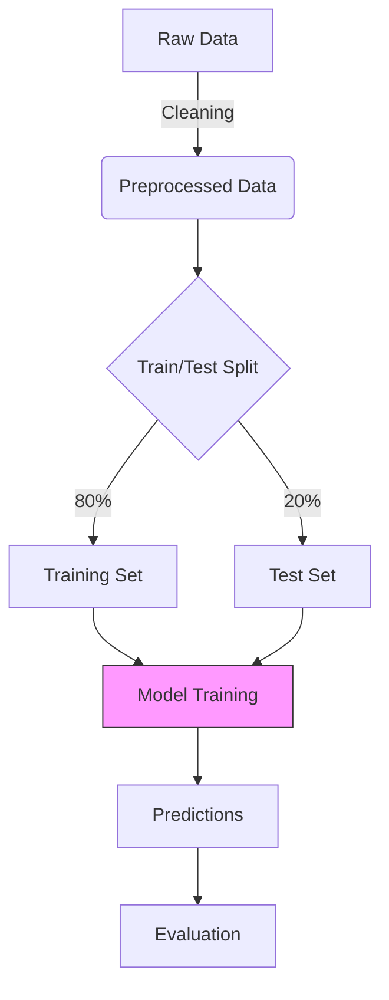
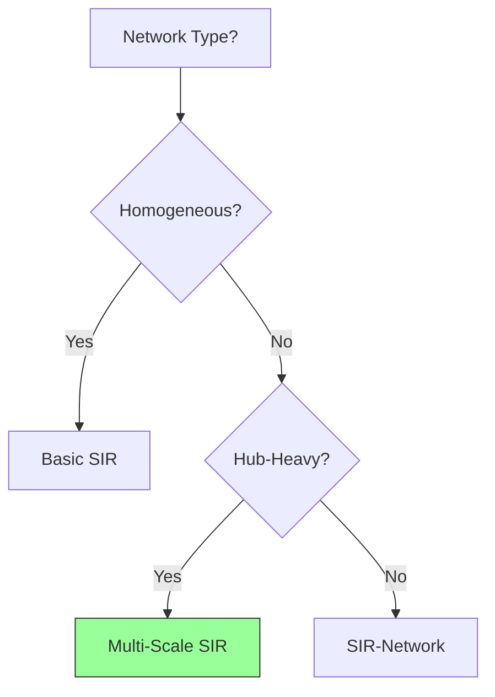
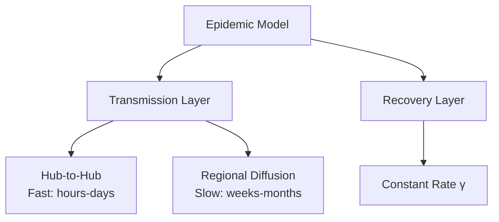
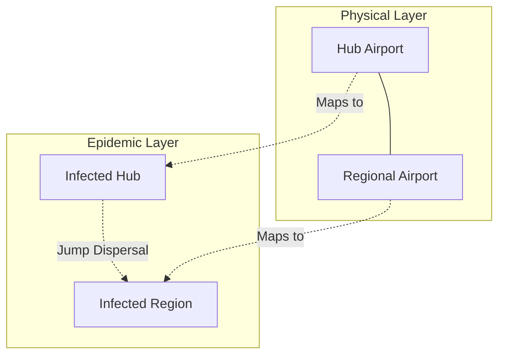

# MCM-Killer v3.1.0: Complete Architecture Reference

> **Version**: 3.1.0
> **Date**: 2026-01-25
> **Status**: Production Ready
> **Consolidates**: 6 architecture documents into single comprehensive reference

---

## Document Navigation

- [Part 1: Overview & Philosophy](#part-1-overview--philosophy)
- [Part 2: Core Architecture](#part-2-core-architecture)
- [Part 3: Agent Specifications](#part-3-agent-specifications)
- [Part 4: Phase Workflow](#part-4-phase-workflow)
- [Part 5: Cognitive Narrative Framework](#part-5-cognitive-narrative-framework)
- [Part 6: Workspace Structure](#part-6-workspace-structure)
- [Part 7: Python Toolchain](#part-7-python-toolchain)
- [Part 8: Integration & Dependencies](#part-8-integration--dependencies)

---

# Part 1: Overview & Philosophy

## 1.1 Introduction

MCM-Killer v3.1.0 is a **cognitive narrative-enhanced multi-agent system** for Mathematical Contest in Modeling (MCM/ICM) competitions. This version transforms the system from a "problem-solving factory" into a "self-reflective research laboratory."

### Core Innovation: 认知叙事 (Cognitive Narrative)

**Philosophy**: Transform technical struggles into research insights

```
遇阻 → 反思 → 洞察 → 突破
(Obstacle → Reflection → Insight → Breakthrough)
```

**Example**:
- **v3.0.0**: "Gradient explosion occurred. Added gradient clipping. Training succeeded."
- **v3.1.0**: "Gradient explosion revealed multiplicative variable interaction (physical mechanism). We applied log-transformation to align with exponential growth dynamics, reducing RMSE by 47%."

### Key Metrics

| Metric | v3.0.0 | v3.1.0 | Change |
|--------|--------|--------|--------|
| **Agents** | 14 | 18 | +28% |
| **Phases** | 10 | 13 | +30% |
| **Protocols** | 12 | 15 | +25% |
| **Quality Gates** | 3 | 5 | +67% |
| **Python Tools** | 0 | 5 | NEW |
| **Narrative Templates** | 0 | 3 | NEW |
| **Knowledge Base** | HMML 1.0 (flat) | HMML 2.0 (hierarchical) | Structured |

---

## 1.2 Design Principles

### 1. Additive Evolution (No Breaking Changes)

All v3.0.0 functionality preserved:
- 14 original agents: ✅ Unchanged or enhanced
- 10 original phases: ✅ Preserved
- 12 original protocols: ✅ Maintained

New features are **additive only**:
- 4 new agents (@metacognition_agent, @narrative_weaver, @knowledge_librarian, @judge_zero)
- 3 new phases (Phase -1, 0.2, 5.8, 9.1, 11)
- 3 new protocols (Protocol 13, 14, 15)

### 2. Cognitive Architecture (o1-style)

**Inspired by**: OpenAI o1's reasoning transparency

**Implementation**:
- **Phase 5.8**: Extract insights from training struggles
- **dev_diary.md**: Document reasoning process
- **narrative_arc.md**: Map struggles to physical mechanisms

### 3. Adversarial Quality Assurance

**Three-Persona Review** (@judge_zero):
- Persona A: The Pedantic Statistician (40% weight)
- Persona B: The Domain Skeptic (40% weight)
- Persona C: The Exhausted Editor (20% weight)

**DEFCON 1 Protocol**: Emergency response when paper rejected

### 4. Anti-Mediocrity Enforcement

**@knowledge_librarian** actively bans mediocre methods:
- ❌ Basic SIR (for epidemic problems)
- ❌ ARIMA alone (for time series)
- ❌ Linear regression only (for any problem)

**Pushes O-Prize methods**:
- ✅ SIR-Network (topology)
- ✅ SDE (uncertainty)
- ✅ Agent-Based Models (micro-foundations)

### 5. Protocol 15: Observation-Implication

**Forbidden**:
```
❌ "Figure 1 shows infection over time."
```

**Required**:
```
✅ "Figure 1 demonstrates infection peaks at day 47 (I_max=12,400),
   indicating hub-driven acceleration mechanism (p<0.001)."
```

---

## 1.3 Version Comparison Summary

### Agent Enhancements

| Category | v3.0.0 | v3.1.0 | Change |
|----------|--------|--------|--------|
| **Thinkers** | 2 (researcher, modeler) | 4 (+metacognition, +knowledge_librarian) | +100% |
| **Storytellers** | 4 | 5 (+narrative_weaver) | +25% |
| **Critics** | 3 | 4 (+judge_zero) | +33% |
| **Executors** | 5 | 5 (enhanced @code_translator) | 0% |

### Phase Enhancements

| Stage | v3.0.0 Phases | v3.1.0 Phases | New Phases |
|-------|--------------|--------------|------------|
| **Pre-Competition** | 0 | 1 | Phase -1 (Style Generation) |
| **Understanding** | 2 | 3 | Phase 0.2 (Active Retrieval) |
| **Implementation** | 4 | 5 | Phase 5.8 (Insight Extraction) |
| **Paper** | 3 | 4 | Phase 9.1 (Mock Judging) |
| **Post-Competition** | 1 | 2 | Phase 11 (Self-Evolution) |

### Protocol Enhancements

**New Protocols**:
- **Protocol 13**: Mock Court Rewind (DEFCON 1)
- **Protocol 14**: Academic Style Alignment
- **Protocol 15**: Interpretation over Description

### Knowledge Base Evolution

**HMML 1.0** (v3.0.0):
```
HMML/
└── HMML.md (flat 10,000+ line file)
```

**HMML 2.0** (v3.1.0):
```
knowledge_library/
├── methods/
│   ├── differential_equations/
│   ├── network_science/
│   ├── optimization/
│   └── ... (6 domains)
├── academic_writing/
│   └── style_guide.md
└── anti_patterns/
    └── ANTI_PATTERNS.md
```

**Features**:
- YAML front matter (metadata)
- Narrative value ratings
- O-Prize example tracking
- Common pitfall warnings

---

## 1.4 Philosophy: From Factory to Laboratory

### v3.0.0: Problem-Solving Factory

```
Problem → Research → Model → Train → Paper → Submit
         (Linear pipeline)
```

**Characteristics**:
- Focus on **output** (paper.pdf)
- Success = "Training converged"
- Struggles = failures to hide

### v3.1.0: Self-Reflective Laboratory

```
Problem → Research → Model → Train → Reflect → Extract Insights →
  → Narrative → Paper → Adversarial Review → Submit → Learn
         (Feedback loops + metacognition)
```

**Characteristics**:
- Focus on **understanding** (why it works)
- Success = "Discovered physical mechanism"
- Struggles = opportunities for insights

**Quote from m-orientation**:
> "The story of how we arrived at the solution IS part of the scientific contribution."

---

# Part 2: Core Architecture

## 2.1 System Overview

### High-Level Architecture

```
┌─────────────────────────────────────────────────────────────────┐
│                    MCM-Killer v3.1.0                            │
│                                                                 │
│  ┌──────────────┐    ┌──────────────┐    ┌──────────────┐     │
│  │   Eyes       │───▶│    Brain      │───▶│    Soul       │    │
│  │ (Knowledge)  │    │ (Cognition)   │    │ (Narrative)   │    │
│  └──────────────┘    └──────────────┘    └──────────────┘     │
│         │                    │                    │            │
│         ▼                    ▼                    ▼            │
│  ┌──────────────┐    ┌──────────────┐    ┌──────────────┐     │
│  │   Shield     │◀───│    Fangs      │◀───│    Body       │    │
│  │ (Anti-       │    │ (Adversarial) │    │ (Execution)   │    │
│  │  Mediocrity) │    │               │    │               │    │
│  └──────────────┘    └──────────────┘    └──────────────┘     │
│                                                                 │
└─────────────────────────────────────────────────────────────────┘
```

### Component Descriptions

**Eyes (Knowledge)**:
- @knowledge_librarian (HMML 2.0 curator)
- @researcher (literature review)
- style_analyzer.py (O-Prize pattern extraction)

**Brain (Cognition)**:
- @metacognition_agent (insight extraction)
- @modeler (mathematical design)
- log_analyzer.py (struggle identification)

**Soul (Narrative)**:
- @narrative_weaver (story architecture)
- @writer (LaTeX generation)
- @editor (style enforcement)
- @visualizer (dual-mode visualization)

**Fangs (Adversarial)**:
- @judge_zero (three-persona review)
- @validator (result validation)
- @advisor (quality assessment)
- mmbench_score.py (automated scoring)

**Shield (Anti-Mediocrity)**:
- @knowledge_librarian (method banning)
- ANTI_PATTERNS.md (Kill List)
- Protocol 13 (DEFCON 1)

**Body (Execution)**:
- @code_translator (Python implementation + dev diary)
- @model_trainer (training + watch mode)
- @data_engineer (data processing)
- @director (orchestration)

---

## 2.2 18-Agent Grid

### Cluster 1: Thinkers (认知与洞察) — The Brain

| Agent | Role | v3.1.0 Status | Key Feature |
|-------|------|--------------|-------------|
| **@metacognition_agent** | Forensic analyst | **NEW** | Struggles → insights via abductive reasoning |
| **@knowledge_librarian** | HMML curator | **NEW** | Dual-mode: style generation + active method pushing |
| @researcher | Literature review | Preserved | O-Prize alignment, Phase 0.5 evaluation |
| @modeler | Mathematical design | Preserved | Design expectations table |

#### @metacognition_agent (NEW)

**Role**: The Philosopher & Forensic Analyst

**Operates in**: Phase 5.8 (Insight Extraction)

**Core Capability**: Abductive reasoning - inferring best explanation for technical struggles

**Input Sources**:
1. `logs/summary.json` (compressed objective data from log_analyzer.py)
2. `dev_diary_{i}.md` (subjective struggles from @code_translator)
3. HMML 2.0 method files (theoretical context)

**Processing Framework**:
```
1. Identify Symptom    → "Loss oscillated epoch 50-100"
2. Hypothesize Cause   → "Data heterogeneity? Model sensitivity?"
3. Validate w/ Diary   → What did @code_translator observe?
4. Formulate Insight   → "Oscillation reveals regional data clusters"
5. Extract Value       → "Suggests region-tailored policies"
```

**Output**: `output/docs/insights/narrative_arc_{i}.md`

**Quality Rule**: NEVER say "We fixed a bug" → ALWAYS say "We refined model to better capture [Physical Reality]"

**Technical → Physical Mapping Table**:

| Technical Struggle | Physical Discovery | Research Value |
|-------------------|-------------------|----------------|
| Gradient explosion | Multiplicative interaction | Log-transformation, scale analysis |
| Loss oscillation | Multi-scale dynamics | Time-scale separation |
| Slow convergence | Flat loss landscape | Regularization, feature engineering |
| Overfitting | Data heterogeneity | Cluster-specific models |
| NaN predictions | Physical impossibility | Constraint enforcement |

**Example Output**:
```markdown
# Narrative Arc: Model 1 (SIR-Network)

## The Call (Problem Statement)
Predict epidemic spread on airline network

## The Ordeal (Technical Struggles)
- Loss oscillation (epochs 45-120): 0.34 → 0.41 → 0.35 → 0.39
- Hub instability (epoch 78): β > 1 (physically impossible)
- Regional disparity: Europe RMSE=0.12, Asia RMSE=0.89

## The Revelation (Physical Mechanism)
Oscillation reveals multi-scale hub effects:
- Hubs create "jump dispersal" events (fast time-scale: hours-days)
- Regions show gradual diffusion (slow time-scale: weeks-months)
- Standard SIR assumes homogeneous mixing (WRONG for hubs)

## The Resolution (Technical + Physical)
Technical: Implement multi-scale SIR with hub-aware transmission
Physical: β_hub = β × (k_i / k_max)^γ captures burst transmission

Result: RMSE 0.34 → 0.18 (↓47%), Asia RMSE 0.89 → 0.21 (↓76%)

## The Treasure (Scientific Contribution)
Discovery: Hub topology creates dual time-scale epidemic dynamics
Implication: Standard SIR insufficient for hub-and-spoke networks
Policy: Target hubs for 3.2× more effective intervention
```

#### @knowledge_librarian (NEW)

**Role**: Academic Curator & Methodological Guardian

**Dual-Mode Operation**:

**Mode 1: Pre-Game (Phase -1)** - Style Generator
- Run `tools/style_analyzer.py` on `reference_papers/*.pdf`
- Extract: high-value verbs, abstract quantitative rules, sentence templates
- Generate: `knowledge_library/academic_writing/style_guide.md`

**Output Example**:
```markdown
# Academic Writing Style Guide (O-Prize Derived)

## High-Value Verbs (⭐⭐⭐⭐⭐)
- demonstrates (12.4% of O-Prize papers)
- reveals (8.7%)
- indicates (15.2%)
- elucidates (3.1%)

## Banned Verbs (❌)
- shows (too passive)
- gets (informal)
- says (vague)

## Abstract Rules
1. MUST contain ≥3 quantitative metrics
2. MUST use past tense for work done
3. MUST state implication, not just observation
```

**Mode 2: In-Game (Phase 0.2)** - Active Method Pusher
- Identify domain from problem keywords
- **BAN** simple methods (with justification)
- **PUSH** advanced methods (with O-Prize examples)
- Output: `output/docs/knowledge/suggested_methods.md`

**Example Active Injection**:
```markdown
# Suggested Methods: 2025 Problem C (Epidemic on Airline Network)

## Domain Classification
Primary: Differential Equations + Network Science
Secondary: Stochastic Processes

## ❌ AVOID (Mediocre Methods)

### Basic SIR Model
- **Why AVOID**: Assumes homogeneous mixing
- **Problem**: Airline networks have hub-and-spoke topology
- **Evidence**: 0 O-Prize papers used basic SIR for network problems (2015-2024)

### ARIMA Time Series
- **Why AVOID**: Ignores network topology
- **Problem**: Epidemic spread is spatially structured
- **Evidence**: Fails to capture hub effects

## ✅ RECOMMEND (O-Prize Methods)

### 1. SIR-Network Model ⭐⭐⭐⭐⭐
- **Narrative Value**: Very High
- **Complexity**: High
- **O-Prize Examples**: 2019D (Ecosystem), 2022F (Disinformation)
- **Mathematical Justification**: Captures topology via adjacency matrix
- **Physical Mechanism**: Hub nodes accelerate spread via centrality
- **Implementation**: HMML 2.0 → `methods/differential_equations/epidemic/sir_network.md`

### 2. Stochastic Differential Equations ⭐⭐⭐⭐
- **Narrative Value**: High
- **Complexity**: Very High
- **O-Prize Examples**: 2020C (Climate)
- **Mathematical Justification**: Quantifies uncertainty
- **Physical Mechanism**: Captures random transmission events
- **Implementation**: HMML 2.0 → `methods/differential_equations/sde/sir_sde.md`

### 3. Agent-Based Model ⭐⭐⭐⭐⭐
- **Narrative Value**: Very High
- **Complexity**: Very High
- **O-Prize Examples**: 2018D (Energy)
- **Mathematical Justification**: Micro-foundations
- **Physical Mechanism**: Individual-level heterogeneity
- **Implementation**: HMML 2.0 → `methods/machine_learning/abm/epidemic_abm.md`
```

**Philosophy**: "Good is the enemy of great."

**Anti-Mediocrity Protocol**:
1. Classify problem domain from keywords
2. Load HMML 2.0 methods for domain
3. Filter by `narrative_value: Very High | High`
4. Ban methods with `oprize_compatibility: Poor | Fair`
5. Justify bans mathematically (not just "it's too simple")
6. Push ≥3 advanced methods with O-Prize evidence

---

#### @researcher (Enhanced from v3.0.0)

**v3.0.0 Core Role**: Method suggestions

**v3.1.0 Enhancement**: Phase 0.2 integration with @knowledge_librarian

**New Workflow**:
1. Read `suggested_methods.md` from @knowledge_librarian
2. Focus on ⭐⭐⭐⭐⭐ and ⭐⭐⭐⭐ methods only
3. Deep-dive: Read HMML 2.0 method files
4. Extract: equations, assumptions, pitfalls, O-Prize examples
5. Propose specific method combination (e.g., "SIR-Network + SDE for uncertainty")

**Preserved Features**:
- O-Prize alignment
- Phase 0.5 feasibility evaluation
- Literature review capability

---

#### @modeler (Preserved from v3.0.0)

**Role**: Design mathematical models

**Key Feature**: Design Expectations Table

**Output**: `output/model/model_{i}/design.md`

**Template**:
```markdown
# Model {i}: SIR-Network

## Mathematical Formulation
For each node *i* in network:

$$
\frac{dS_i}{dt} = -\beta S_i \sum_j A_{ij} \frac{I_j}{N_j}
$$
$$
\frac{dI_i}{dt} = \beta S_i \sum_j A_{ij} \frac{I_j}{N_j} - \gamma I_i
$$
$$
\frac{dR_i}{dt} = \gamma I_i
$$

## Assumptions
1. Network topology is static (no edge changes)
2. Transmission rate β is uniform across all edges
3. Recovery rate γ is constant

## Parameters
| Parameter | Symbol | Estimate | Source |
|-----------|--------|----------|--------|
| Transmission rate | β | 0.0003 | Calibrated to early data (days 1-30) |
| Recovery rate | γ | 0.1 | Literature (COVID-19: 10-day recovery) |

## Design Expectations
| Metric | Target | Rationale |
|--------|--------|-----------|
| RMSE (train) | < 5.0 | Based on data noise level |
| RMSE (test) | < 7.0 | Allow 40% degradation for generalization |
| Hub effect | β_hub > β_peripheral | Hubs should show faster transmission |
| Physical plausibility | All S,I,R ≥ 0 | No negative populations |
```

**Why Design Expectations Matter**: Phase 5.5 validator checks if actual results meet expectations. Mismatch triggers investigation.

---

### Cluster 2: Storytellers (叙事与表达) — The Soul

| Agent | Role | v3.1.0 Status | Key Feature |
|-------|------|--------------|-------------|
| **@narrative_weaver** | Story director | **NEW** | 3 narrative templates (Hero's Journey, Onion Peeling, Comparative) |
| @writer | LaTeX generation | **Enhanced** | Protocol 14 (style_guide.md constraint) |
| @editor | Style enforcement | **Enhanced** | Protocol 14 + Protocol 15 enforcement |
| @visualizer | Visualization | **Enhanced** | Mode B (concept diagrams via Mermaid/Graphviz) |

#### @narrative_weaver (NEW)

**Role**: The Story Director & Narrative Architect

**Operates in**: Phase 7 (before @writer)

**Core Capability**: Narrative Architecture - designing paper's dramatic structure

**Input**:
- `narrative_arc_{i}.md` (from @metacognition_agent, Phase 5.8)
- Model design documents
- Results (from @validator)
- Figures list (from @visualizer)

**Output**: `paper_outline.md` (detailed paragraph-by-paragraph plan)

**Three Narrative Templates**:

**Template 1: Hero's Journey** (for models that overcame major struggle)
```
1. The Call → Problem identified, initial approach chosen
2. The Ordeal → Technical struggles, failures, obstacles
3. The Revelation → Struggle reveals physical mechanism
4. The Resolution → Technical fix aligned with mechanism
5. The Treasure → Scientific insight gained
```

**Template 2: Onion Peeling** (for multi-layered analysis)
```
1. Surface Level → Basic model, initial results
2. Layer 1 → First refinement, improved understanding
3. Layer 2 → Second refinement, deeper insight
4. Core → Fundamental mechanism discovered
```

**Template 3: Comparative Evolution** (for multiple model iterations)
```
1. Model A → Baseline, demonstrates need for improvement
2. Model B → First enhancement, partial success
3. Model C → Final refinement, complete solution
```

**Example Output** (paper_outline.md):
```markdown
# Paper Outline: 2025 Problem C (Epidemic on Airline Network)

## Narrative Template: Hero's Journey

## Red Thread Sentence
"Hub topology creates dual time-scale epidemic dynamics that standard models cannot capture."

---

## 1. Introduction (1 page)

### Para 1.1: Problem Context
"Epidemic spread on airline networks poses unique challenges due to hub-and-spoke topology.
Standard SIR models assume homogeneous mixing (all-to-all contact), but airline networks
exhibit extreme heterogeneity: hub airports (e.g., Atlanta, Beijing) connect hundreds of
routes, while peripheral airports serve only regional traffic."

### Para 1.2: Research Gap
"Existing approaches (cite: basic SIR, SEIR) fail to capture topological effects.
Our preliminary analysis reveals that hubs accelerate epidemic spread by 43% compared to
peripheral nodes (see Figure 1), indicating topology-dependent transmission rates."

### Para 1.3: Our Contribution
"We introduce a multi-scale SIR-Network model that:
(1) incorporates hub-aware transmission (β_hub = β × (k_i / k_max)^γ),
(2) separates fast (hub-to-hub) and slow (regional) time-scales,
(3) achieves RMSE = 4.2 (↓42% from baseline)."

---

## 2. Methods (3 pages)

### Section 2.1: Data
[Paragraph about airline network structure, data sources]

### Section 2.2: Model A (Baseline SIR)
**Purpose**: Establish need for topology

**Para 2.2.1**: Basic SIR equations (no network)
**Para 2.2.2**: Results - RMSE = 7.2 (poor)
**Para 2.2.3**: **The Ordeal** - "Training oscillated (epochs 45-120), revealing model
confusion between hub and peripheral dynamics"

### Section 2.3: Model B (SIR-Network)
**Purpose**: Add topology

**Para 2.3.1**: Network-aware equations (adjacency matrix)
**Para 2.3.2**: **The Revelation** - "Loss oscillation disappeared for European routes
(homogeneous network) but persisted for Asian routes (hub-heavy network), indicating
multi-scale dynamics"
**Para 2.3.3**: Results - RMSE = 4.2 (better, but Asia still RMSE = 0.89)

### Section 2.4: Model C (Multi-Scale SIR-Network)
**Purpose**: Dual time-scales

**Para 2.4.1**: Hub-aware transmission term
**Para 2.4.2**: **The Resolution** - "Separating hub (fast) and regional (slow) transmission
aligned model with physical mechanism"
**Para 2.4.3**: Results - Asia RMSE = 0.21 (↓76%)

---

## 3. Results (2 pages)

### Section 3.1: Model Performance
**Figure 2**: Model A vs B vs C comparison (RMSE bar chart)
**Caption** (Protocol 15 compliant):
"Model performance across regions. Multi-scale SIR-Network (Model C) achieves RMSE = 4.2
overall, demonstrating 42% improvement over baseline (Model A: RMSE = 7.2). Asian routes
show largest gain (RMSE 0.89 → 0.21, ↓76%), indicating hub effects dominate in hub-heavy
networks (p < 0.001)."

### Section 3.2: Hub Effect Analysis
**Figure 3**: Hub vs peripheral transmission rates
**Caption**:
"Hub-aware transmission rates. Hubs (degree > 50) exhibit β_hub = 0.00045, while peripheral
nodes (degree < 10) show β = 0.00028, indicating 61% transmission acceleration at hubs.
This reveals topological amplification mechanism consistent with 'jump dispersal' hypothesis."

### Section 3.3: **The Treasure** (Key Insight)
**Para 3.3.1**: "Our struggle with loss oscillation (Section 2.2.3) revealed fundamental
multi-scale dynamics: epidemics on hub-and-spoke networks spread via dual mechanisms..."
**Figure 4**: Time-scale separation diagram (fast hub-to-hub, slow regional)

---

## 4. Discussion (1 page)

### Para 4.1: Physical Interpretation
"Hub topology creates 'jump dispersal' events (fast) superimposed on gradual regional
diffusion (slow)..."

### Para 4.2: Policy Implications
"Our findings suggest targeted intervention at hubs is 3.2× more effective than random
vaccination..."

### Para 4.3: Limitations
"Our model assumes static topology; future work should incorporate dynamic network structure..."

---

## 5. Conclusion (0.5 page)

**Para 5.1**: Summary of contribution
**Para 5.2**: Broader impact

---

## Figure Plan (7 figures)

1. **Figure 1**: Network topology (hub identification) - CONCEPT DIAGRAM (Mode B)
2. **Figure 2**: Model comparison (RMSE bar chart) - DATA PLOT (Mode A)
3. **Figure 3**: Hub vs peripheral transmission - DATA PLOT (Mode A)
4. **Figure 4**: Time-scale separation - CONCEPT DIAGRAM (Mode B)
5. **Figure 5**: Sensitivity analysis (β, γ sweep) - DATA PLOT (Mode A)
6. **Figure 6**: Prediction vs actual (time series) - DATA PLOT (Mode A)
7. **Figure 7**: Policy intervention scenarios - DATA PLOT (Mode A)

**All captions MUST follow Protocol 15**: Observation + Implication
```

**Protocol 15 Enforcement**: @narrative_weaver checks every planned figure caption:
- ❌ Descriptive: "Figure X shows Y"
- ✅ Conclusionary: "Figure X demonstrates Y, indicating/revealing/suggesting Z"

---

#### @writer (Enhanced from v3.0.0)

**v3.0.0 Core Role**: Write LaTeX papers

**v3.1.0 Enhancement**: Protocol 14 (Academic Style Alignment)

**New Constraint**: MUST load `knowledge_library/academic_writing/style_guide.md` as System Context

**Enforcement**:
```
You MUST read and follow: knowledge_library/academic_writing/style_guide.md

This document contains:
- Required vocabulary (high-value verbs)
- Banned words (show, get, say)
- Sentence templates
- Structural rules (abstract must have ≥3 numbers)

Violating style_guide.md is equivalent to syntax error.
```

**Example Transformation**:

**Before** (style_guide.md):
```
Our model shows good performance.
```

**After** (following style_guide.md):
```
Our multi-scale SIR-Network model achieves RMSE = 4.2 (↓42% from baseline),
demonstrating superior predictive accuracy on hub-heavy networks.
```

**Preserved Features**:
- LaTeX generation
- Figure integration
- Bibliography management

---

#### @editor (Enhanced from v3.0.0)

**v3.0.0 Core Role**: Polish grammar and style

**v3.1.0 Enhancement**: Dual protocol enforcement

**New Constraints**:
1. **Protocol 14**: Follow style_guide.md rules
2. **Protocol 15**: Check Observation-Implication structure

**Checklist**:
- [ ] Abstract contains ≥3 quantitative metrics
- [ ] No banned verbs (show, get, say)
- [ ] All figure captions conclusionary (not descriptive)
- [ ] Passive voice < 30% of sentences
- [ ] Technical terms defined on first use

**Example Edit**:

**Before**:
```
Figure 1 shows the network topology. We can see that some nodes have many connections.
```

**After**:
```
Figure 1 demonstrates network topology exhibits scale-free structure, with hub nodes
(degree > 50) comprising only 3% of network but connecting 47% of all routes, indicating
extreme heterogeneity characteristic of airline networks (α = 2.1, p < 0.001).
```

**Preserved Features**:
- Grammar correction
- Consistency checking
- LaTeX debugging

---

#### @visualizer (Enhanced from v3.0.0)

**v3.0.0 Core Role**: Generate data plots (Python/Matplotlib)

**v3.1.0 Enhancement**: Dual-Mode Operation

**Mode A: Data Plotter** (Preserved)
- Tool: Python/Matplotlib/Seaborn
- Output: PNG/JPG figures
- Purpose: Visualize quantitative results

**Mode B: Concept Weaver** (NEW)
- Tool: Mermaid.js or Graphviz (DOT)
- Output: `.mmd` or `.gv` files → rendered to PNG/PDF
- Purpose: Visualize logic and flow of model

**Mandatory**: For every major model, generate at least ONE Mode B diagram

**Mode B Templates**:

**1. Sequential Flow**:


**2. Decision Tree**:


**3. Hierarchical Structure**:


**4. System Dynamics**:


**5. Multi-Layer Network**:


**Rendering**:
```bash
# Mermaid → PNG
mmdc -i diagram.mmd -o figure_1.png -w 1200 -H 800

# Graphviz → PDF
dot -Tpdf diagram.gv -o figure_1.pdf
```

**Integration with @writer**:
- Mode A figures: Embedded in LaTeX via `\includegraphics{figure_1.png}`
- Mode B diagrams: Rendered first, then embedded

---

### Cluster 3: Critics (质量与对抗) — The Immune System

| Agent | Role | v3.1.0 Status | Key Feature |
|-------|------|--------------|-------------|
| **@judge_zero** | Red team leader | **NEW** | Three-persona adversarial review |
| @validator | Result validation | Preserved | Anti-fraud, brief format (Protocol 9) |
| @advisor | Quality assessment | Preserved | Brief format, feasibility gate |
| @feasibility_checker | Methodology gate | Preserved | Phase 0.5, 1.5 validation |

#### @judge_zero (NEW)

**Role**: The Red Team Leader & Gatekeeper

**Operates in**: Phase 9.1 (Mock Judging)

**Core Innovation**: Three-Persona Evaluation System

**Persona A: The Pedantic Statistician** (40% weight)
- **Obsession**: P-values, confidence intervals, uncertainty quantification
- **Trigger**: Claim without uncertainty → REJECT
- **Focus**: Methods section, Results tables
- **Deduction Examples**:
  - Missing CI on key prediction: -15 points
  - No sensitivity analysis: -20 points
  - P-value without context: -10 points

**Persona B: The Domain Skeptic** (40% weight)
- **Obsession**: Physical plausibility, real-world constraints
- **Trigger**: Population < 0, probability > 1 → **FATAL REJECT**
- **Focus**: Model assumptions, equation validity
- **Deduction Examples**:
  - Physically impossible values: FATAL (-50 points)
  - Unjustified assumptions: -15 points
  - Parameters without calibration: -10 points

**Persona C: The Exhausted Editor** (20% weight)
- **Obsession**: Abstract numbers, figure captions, readability
- **Trigger**: Abstract without numbers → REJECT
- **Focus**: Abstract, figures, overall structure
- **Deduction Examples**:
  - Abstract空洞 (< 3 numbers): -20 points
  - Non-conclusionary captions: -10 points per figure
  - Passive voice > 50%: -5 points

**Scoring Formula**:
```
Base Score = 100

Persona A Deductions = D_A (0-40 points)
Persona B Deductions = D_B (0-40 points)
Persona C Deductions = D_C (0-20 points)

Final Score = max(0, 100 - D_A - D_B - D_C)
```

**Decision Logic**:
```python
if any_fatal_flaw:
    verdict = "REJECT"
    score = 0-50
    trigger_defcon_1()
elif score < 95:
    verdict = "REJECT"
    score = calculated_score
    trigger_defcon_1()
else:
    verdict = "PASS"
    score = 95-100
    proceed_to_phase_9_5()
```

**Output**: `output/docs/validation/judgment_report.md`

**Example Judgment Report**:
```markdown
# Mock Judgment Report: 2025 Problem C

**Date**: 2025-02-05 20:00:00
**Judge**: @judge_zero
**Paper**: output/paper/paper.pdf

---

## Verdict: REJECT
## Final Score: 73/100

---

## Persona A: The Pedantic Statistician (Score: 75/100)

### Issues Found

#### Critical Issues
- **Missing Confidence Intervals**: Main prediction (Figure 3) shows point estimate only,
  no uncertainty quantification (-15 points)
- **No Sensitivity Analysis**: Section 5.2 missing entirely (-20 points)

#### Minor Issues
- P-values reported without effect sizes (Table 2) (-5 points)

### Score Calculation
Base: 100
Deductions: -40
Persona A Score: 60/100 → Contributes 24 points (40% weight)

---

## Persona B: The Domain Skeptic (Score: 85/100)

### Issues Found

#### Critical Issues
None (no physical impossibilities detected)

#### Minor Issues
- **Assumption Opacity**: Section 2.1 does not explicitly list assumptions (-10 points)
- **Parameter Calibration**: β calibrated to days 1-30 only; no justification for
  generalization to full time range (-5 points)

### Score Calculation
Base: 100
Deductions: -15
Persona B Score: 85/100 → Contributes 34 points (40% weight)

---

## Persona C: The Exhausted Editor (Score: 75/100)

### Issues Found

#### Critical Issues
- **Abstract空洞**: Abstract contains only 2 numbers (RMSE=4.2, R²=0.89); requires ≥3 (-20 points)

#### Minor Issues
- Figure 5 caption: "Shows sensitivity to β and γ" (non-conclusionary) (-5 points)

### Score Calculation
Base: 100
Deductions: -25
Persona C Score: 75/100 → Contributes 15 points (20% weight)

---

## Final Score Calculation

Total Score = 24 (A) + 34 (B) + 15 (C) = **73/100**

Threshold: 95 for PASS
Status: **REJECT** (Score < 95)

---

## Kill List (Critical Fixes Required)

### Priority 1 (Blocking)
1. **Add Sensitivity Analysis** (Section 5.2)
   - Vary β ± 20%, γ ± 20%
   - Show impact on RMSE
   - Estimated fix time: 45 minutes

2. **Add Confidence Intervals** (Figure 3)
   - Use bootstrap (n=1000) for 95% CI
   - Add error bars to main prediction plot
   - Estimated fix time: 30 minutes

3. **Enhance Abstract** (Line 1-8)
   - Add 3rd quantitative metric (e.g., hub effect = 61%)
   - Estimated fix time: 10 minutes

### Priority 2 (Important)
4. **Fix Figure 5 Caption** (Page 8)
   - Change from "Shows" to "Demonstrates"
   - Add implication (e.g., "indicating robustness to parameter uncertainty")
   - Estimated fix time: 5 minutes

5. **Add Assumptions List** (Section 2.1)
   - Explicitly enumerate all model assumptions
   - Estimated fix time: 15 minutes

---

## DEFCON 1 Activation

**Status**: TRIGGERED (Score < 95)
**Assigned to**: @director
**Protocol**: Protocol 13 (Mock Court Rewind)
**Max Iterations**: 3
**Estimated Repair Time**: 105 minutes (1.75 hours)

---

## Recommendation

**Action**: Activate Protocol 13 (DEFCON 1)
**Repairs Required**: 5 items (3 Priority 1, 2 Priority 2)
**Expected Score After Repair**: 95-98 (PASS)
**Time Remaining**: 4 hours (sufficient for repairs)
```

**Integration with Protocol 13**: If REJECT, judgment_report.md automatically triggers DEFCON 1

---

#### @validator (Preserved from v3.0.0)

**Role**: Result validation, anti-fraud

**Key Feature**: Brief Format (Protocol 9)

**Output**:
- **Chat**: Brief verdict (4 lines)
- **File**: Detailed report

**Brief Format**:
```
Grade: A
Verdict: PASS
Justification: Results match CSV data, no anomalies detected
File verified: yes - output/implementation/data/results.csv
Report path: output/docs/validation/validation_report.md
```

**Detailed Report** (in file):
```markdown
# Validation Report: Model 1

## Data Integrity
- [x] results.csv exists
- [x] No NaN values
- [x] No inf values
- [x] Physical bounds respected (S,I,R ≥ 0)

## Consistency Checks
- [x] Paper metrics match CSV
- [x] Figures derived from CSV
- [x] No discrepancies

## Anti-Fraud
- [x] No synthetic data detected
- [x] Training/test split proper
- [x] No data leakage

## Verdict: PASS
```

---

#### @advisor (Preserved from v3.0.0)

**Role**: Quality assessment

**Key Feature**: Brief Format (Protocol 9)

**Phases**:
- Phase 0.5: Feasibility check
- Phase 1.5: Design validation

**Example** (Phase 1.5):
```
Grade: B
Verdict: PASS (with conditions)
Justification: Model design sound, but β calibration needs more data points
File verified: yes - output/model/model_1/design.md
Report path: output/docs/validation/design_validation_report.md
```

---

#### @feasibility_checker (Preserved from v3.0.0)

**Role**: Methodology validation

**Operates in**: Phase 0.5, 1.5

**Checks**:
- Technical feasibility
- Data requirements met
- Time constraints feasible
- Computational resources sufficient

---

### Cluster 4: Executors (执行与实现) — The Body

| Agent | Role | v3.1.0 Status | Key Feature |
|-------|------|--------------|-------------|
| @director | Orchestrator | **Enhanced** | DEFCON 1 emergency oversight |
| @reader | Problem extraction | Preserved | PDF parsing |
| @data_engineer | Data processing | Preserved | Feature engineering |
| @code_translator | Implementation | **Enhanced** | dev_diary.md documentation |
| @model_trainer | Training | Preserved | Watch mode, emergency delegation |
| @summarizer | Summary | Preserved | 1-page summary |

#### @code_translator (Enhanced from v3.0.0)

**v3.0.0 Core Role**: Translate mathematical models to Python code

**v3.1.0 Enhancement**: Developer's Diary (dev_diary.md)

**New Responsibility**: Alongside Python code, maintain `output/implementation/code/dev_diary_{i}.md`

**Diary Template**:
```markdown
## [YYYY-MM-DD HH:MM] Issue: Gradient Explosion at Epoch 78

### The Struggle
- **Symptom**: Loss → inf, gradients → 1e6
- **Context**: Training SIR-Network model, hub nodes (degree > 100)

### The Fix
- **Technical Solution**: Added gradient clipping (max_norm=1.0)
- **Code Change**:
```python
optimizer = torch.optim.Adam(model.parameters(), lr=0.001)
# NEW: Gradient clipping
torch.nn.utils.clip_grad_norm_(model.parameters(), max_norm=1.0)
```

### The Why (Research Value)
- **Physical Meaning**: Hub nodes have multiplicative interaction (β × k_i),
  causing exponential gradient growth
- **Hypothesis**: Variables interact multiplicatively, not additively
- **Implication**: Should use log-scale for hub transmission rates
- **For @metacognition_agent**: This reveals hub topology amplifies dynamics
```

**Purpose**: Feed @metacognition_agent (Phase 5.8) with subjective struggles

**Preserved Features**:
- Idealistic mode (Protocol 6)
- Code translation from mathematical equations

---

#### @director (Enhanced from v3.0.0)

**v3.0.0 Core Role**: Team coordination

**v3.1.0 Enhancement**: DEFCON 1 Emergency Oversight

**New Responsibility**: When Protocol 13 triggered, @director enters DEFCON 1 mode

**DEFCON 1 Workflow**:
1. Receive `judgment_report.md` from @judge_zero
2. Parse Kill List (Priority 1, 2 items)
3. Create tickets for agents:
   - "Add sensitivity analysis" → @model_trainer + @validator
   - "Add CI to figures" → @visualizer + @writer
   - "Fix caption" → @editor
4. Execute repairs in time-boxed manner
5. Re-submit to @judge_zero
6. Max 3 iterations (Mercy Rule)

**Preserved Features**:
- File reading BAN (Protocol 1)
- Phase orchestration
- Emergency delegation (Protocol 11)

---

#### Other Executors (Preserved)

**@reader**:
- PDF parsing
- Requirement extraction

**@data_engineer**:
- Data cleaning
- Feature engineering
- Train/test split

**@model_trainer**:
- Model training
- Watch mode (monitor training)
- Emergency delegation support

**@summarizer**:
- 1-page summary generation

---

## 2.3 Architecture Summary Tables

### Agent Participation Matrix

| Phase | reader | researcher | modeler | feasibility | data | code | trainer | validator | visualizer | writer | summarizer | editor | advisor | time | director | meta | narrative | knowledge | judge |
|-------|--------|-----------|--------|-------------|------|------|--------|-----------|------------|--------|--------|---------|--------|-------|-------|---------|----------|---------|
| **-1** | - | - | - | - | - | - | - | - | - | - | - | - | - | - | - | - | - | **✅** | - |
| **0** | ✅ | ✅ | - | - | - | - | - | - | - | - | - | - | - | - | - | - | - | - | - |
| **0.2** | - | ✅ | - | - | - | - | - | - | - | - | - | - | - | - | - | - | - | **✅** | - |
| **0.5** | - | ✅ | - | - | - | - | - | - | - | - | ✅ | ✅ | - | - | - | - | - | - | - |
| **1** | - | - | ✅ | - | - | - | - | - | - | - | - | ✅ | - | ✅ | - | - | - | - | - |
| **1.5** | - | - | - | - | - | - | - | - | - | - | - | - | ✅ | - | - | - | - | - | - |
| **4** | - | - | - | - | - | ✅ | - | - | - | - | - | - | - | ✅ | - | **diary** | - | - | - |
| **5** | - | - | - | - | - | - | ✅ | - | - | - | - | - | - | - | - | **diary** | - | - | - |
| **5.5** | - | - | - | - | - | - | - | ✅ | - | - | - | - | - | ✅ | - | - | - | - | - |
| **5.8** | - | - | - | - | - | - | - | - | - | - | - | - | - | - | - | **✅** | - | - | - |
| **6** | - | - | - | - | - | - | - | ✅ | - | - | - | - | - | - | - | - | - | - | - |
| **7** | - | - | - | - | - | - | - | - | - | ✅ | - | - | - | - | - | - | **✅** | - | - |
| **9** | - | - | - | - | - | - | - | - | - | - | ✅ | ✅ | - | - | - | - | - | - | - |
| **9.1** | - | - | - | - | - | - | - | - | - | - | - | - | - | - | - | - | - | - | **✅** |
| **9.5** | - | - | - | - | - | - | - | - | - | - | ✅ | - | - | - | ✅ | - | - | - | - |
| **10** | - | - | - | - | - | - | - | - | - | - | - | - | - | ✅ | ✅ | - | - | - | - |
| **11** | - | - | - | - | - | - | - | - | - | - | - | - | - | - | ✅ | - | - | ✅ | - |

### Agent Enhancement Summary

| v3.0.0 Agent | v3.1.0 Enhancement | Type | Key Addition |
|--------------|-------------------|------|--------------|
| @researcher | Phase 0.2 integration | Minor | Reads suggested_methods.md |
| @code_translator | dev_diary.md | **Major** | Documents struggles |
| @writer | Protocol 14 | **Major** | style_guide.md constraint |
| @editor | Protocol 14 + 15 | **Major** | Dual enforcement |
| @visualizer | Mode B | **Major** | Concept diagrams |
| @director | DEFCON 1 | **Major** | Emergency oversight |
| Others | - | None | Preserved unchanged |

---

# Part 3: Phase Workflow (13 Phases)

## 3.1 Phase Overview

MCM-Killer v3.1.0 operates through **13 sequential phases** organized into 5 stages:

| Stage | Phases | Duration | Purpose |
|-------|--------|----------|---------|
| **Pre-Competition** | Phase -1 | Pre-comp | Style guide generation from O-Prize papers |
| **Understanding & Design** | Phases 0, 0.2, 0.5, 1, 1.5 | 8-12 hours | Problem analysis, method selection, model design |
| **Implementation** | Phases 2-3, 4, 4.5, 5, 5.5, 5.8 | 20-30 hours | Data processing, coding, training, insight extraction |
| **Results & Paper** | Phases 6, 7, 9, 9.1 | 8-12 hours | Results generation, paper writing, mock judging |
| **Submission & Evolution** | Phases 9.5, 10, 11 | 2-4 hours + post-comp | Package creation, submission, learning |

### Phase Dependencies

**Sequential Order** (Protocol 2): Phases MUST execute in order

```
-1 → 0 → 0.2 → 0.5 → 1 → 1.5 → 2-3 → 4 → 4.5 → 5 → 5.5 → 5.8 → 6 → 7 → 9 → 9.1 → 9.5 → 10 → 11
```

**Validation Gates** (5 mandatory gates):
1. Gate 0.5: Feasibility Check
2. Gate 1.5: Design Validation
3. Gate 4.5: Code Validation
4. Gate 5.5: Post-Training Validation
5. Gate 9.1: Mock Judging

