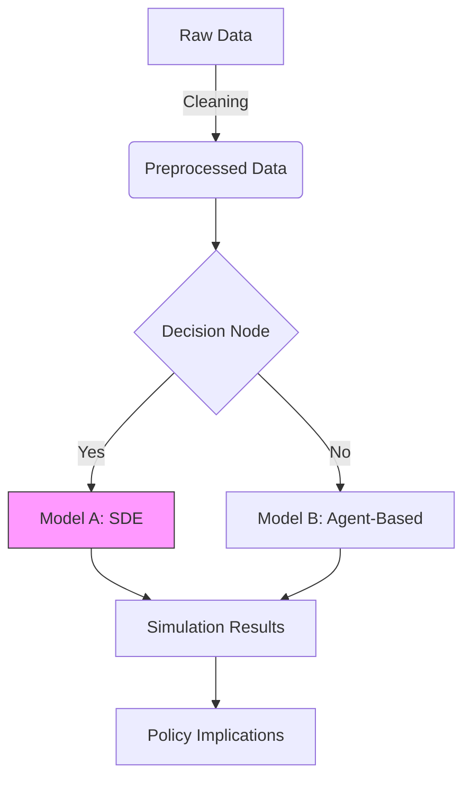

# Agent Specifications v3.1.0

> **Version**: v3.1.0
> **Date**: 2026-01-24
> **Purpose**: Complete specifications for all 18 agents (14 v3.0.0 + 4 v3.1.0)

---

## Agent Overview

### v3.0.0 Agents (14 - Preserved)

| Agent | Responsibility | Key Features | v3.1.0 Status |
|-------|---------------|--------------|--------------|
| reader | Read PDF, extract requirements | Mandatory requirement extraction | ✅ Unchanged |
| researcher | Method suggestions | O-Prize alignment + Phase 0.5 evaluation | ✅ Enhanced (Phase 0.2 integration) |
| modeler | Design mathematical models | Design expectations table + training phase availability | ✅ Unchanged |
| feasibility_checker | Feasibility check | Technical feasibility validation | ✅ Unchanged |
| data_engineer | Data processing | Feature engineering, integrity checks | ✅ Unchanged |
| code_translator | Code translation | Idealistic mode + **dev_diary.md** (NEW) | ✅ Enhanced |
| model_trainer | Model training | Watch mode + emergency delegation support | ✅ Unchanged |
| validator | Result validation | Brief format + detailed report to file | ✅ Unchanged |
| visualizer | Generate figures | **Dual-mode** (Data + Concept) | ✅ Enhanced |
| writer | Paper author | **style_guide.md constraint** (NEW) | ✅ Enhanced |
| summarizer | Create summary | 1-page summary | ✅ Unchanged |
| editor | Polish documents | **style_guide.md constraint** (NEW) | ✅ Enhanced |
| advisor | Quality assessment | Brief format + detailed report to file | ✅ Unchanged |
| time_validator | Time validation, anti-lazy | STRICT MODE + re-validation mode | ✅ Unchanged |
| **director** | **Team coordination** | **File reading BAN + emergency oversight** | ✅ Unchanged |

### v3.1.0 New Agents (4)

| New Agent | Role | Integration Point | Key Feature |
|-----------|------|-------------------|-------------|
| **@metacognition_agent** | Philosopher & Forensic Analyst | Phase 5.8 (NEW) | Transform struggles to insights |
| **@narrative_weaver** | Story Director | Phase 7 (before @writer) | Hero's Journey narratives |
| **@knowledge_librarian** | Academic Curator & Method Guardian | Phase -1, Phase 0.2 (NEW) | Style generation + method pushing |
| **@judge_zero** | Red Team Critic & Gatekeeper | Phase 9.1 (NEW) | Three-persona adversarial review |

---

## Enhanced v3.0.0 Agents

### @code_translator (Enhanced in v3.1.0)

**v3.0.0 Core Role**: Translate mathematical models to Python code

**v3.1.0 Enhancement**: Developer's Diary (dev_diary.md)

**New Responsibility**:
- Alongside Python code, maintain `output/implementation/code/dev_diary_{i}.md`
- Record every significant hurdle or design choice
- Document the struggle, the fix, and the research value

**Diary Template**:
```markdown
## [YYYY-MM-DD HH:MM] Issue: [Short Description]

### The Struggle
- **Symptom**: What error occurred?
- **Context**: What was happening?

### The Fix
- **Technical Solution**: What was done?

### The Why (Research Value)
- **Physical Meaning**: What does this reveal about the problem?
```

**Example Entry**:
> **Issue**: Gradient explosion in LSTM layer
> **The Why**: Data range [0, 1e6] caused numerical instability
> **Research Value**: This reveals variables interact multiplicatively, not additively

---

### @visualizer (Enhanced in v3.1.0)

**v3.0.0 Core Role**: Generate data plots (Python/Matplotlib)

**v3.1.0 Enhancement**: Dual-Mode Operation

**Mode A: Data Plotter** (Preserved)
- Tool: Python/Matplotlib/Seaborn
- Output: PNG/JPG figures
- Purpose: Visualize quantitative results

**Mode B: Concept Weaver** (NEW)
- Tool: Mermaid.js or Graphviz (DOT)
- Output: `.mmd` or `.gv` files
- Purpose: Visualize the **logic** and **flow** of the model

**Mandatory**: For every major model, generate at least ONE Mode B diagram.

**Example Mermaid Flowchart**:


---

### @writer (Enhanced in v3.1.0)

**v3.0.0 Core Role**: Write LaTeX papers

**v3.1.0 Enhancement**: Style Constraint

**New Constraint**: **Protocol 14 (Academic Style Alignment)**

- MUST load `knowledge_library/academic_writing/style_guide.md` as System Context
- Violating style_guide.md is equivalent to syntax error
- **Example**: Abstract must contain ≥3 numbers

---

### @editor (Enhanced in v3.1.0)

**v3.0.0 Core Role**: Polish grammar and style

**v3.1.0 Enhancement**: Style Constraint

**New Constraint**: **Protocol 14 (Academic Style Alignment)**

- MUST follow `style_guide.md` rules
- Check for banned words (show → demonstrate, get → obtain)
- Ensure Observation-Implication structure

---

## New Agents (v3.1.0)

### @metacognition_agent

**Role**: The Philosopher & Forensic Analyst

**Operates in**: Phase 5.8 (Insight Extraction)

**Core Capability**: Abductive Reasoning - inferring the best explanation for technical struggles

**Input**:
1. `logs/summary.json` (compressed objective data from log_analyzer.py)
2. `dev_diary_{i}.md` (subjective struggle from @code_translator)
3. HMML 2.0 method files (theoretical context)

**Process**:
1. **Identify Symptom**: e.g., "Loss oscillated epoch 50-100"
2. **Hypothesize Physical Cause**: e.g., "Data heterogeneity? Model sensitivity?"
3. **Validate against Diary**: What did @code_translator observe?
4. **Formulate Insight**: "Oscillation reveals data has regional clusters"
5. **Extract Research Value**: "This suggests region-tailored policies"

**Output**: `output/docs/insights/narrative_arc_{i}.md`

**Quality Rule**: NEVER say "We fixed a bug". Say "We refined model to better capture [Physical Reality]."

---

### @narrative_weaver

**Role**: The Story Director & Narrative Architect

**Operates in**: Phase 7 (before @writer)

**Core Capability**: Narrative Architecture - designing the paper's dramatic structure

**Input**:
- `narrative_arc_{i}.md` (from @metacognition_agent)
- Model design documents
- Results (from @validator)
- Figures list (from @visualizer)

**Output**: `paper_outline.md` (detailed paragraph-by-paragraph plan)

**Three Narrative Templates**:

1. **Hero's Journey**: For models that overcame major struggle
   - Structure: Call → Ordeal → Revelation → Resolution → Treasure

2. **Onion Peeling**: For multi-layered analysis
   - Structure: Surface → Layer 1 → Layer 2 → Core insight

3. **Comparative Evolution**: For multiple model iterations
   - Structure: Model A → Model B → Model C with progressive refinement

**Protocol 15 Enforcement**: Check every planned figure caption for Observation-Implication structure.

---

### @knowledge_librarian

**Role**: Academic Curator & Methodological Guardian

**Dual-Mode Operation**:

**Mode 1: Pre-Game (Phase -1)** - Style Generator
- Run `tools/style_analyzer.py` on `reference_papers/`
- Generate `knowledge_library/academic_writing/style_guide.md`

**Mode 2: In-Game (Phase 0.2)** - Active Method Pusher
- Identify domain from problem requirements
- **BAN** simple methods (Linear Regression, Basic SIR)
- **PUSH** advanced methods (SIR-Network, SDE, ABM)
- Output: `output/docs/knowledge/suggested_methods.md`

**Example Active Injection**:
```
PROBLEM REQUIRES: Epidemic prediction

@knowledge_librarian SAYS:
❌ AVOID: Basic SIR, SEIR (too common)
❌ AVOID: ARIMA (inappropriate for network dynamics)

✅ RECOMMEND: SIR-Network (adds topology)
✅ RECOMMEND: Stochastic Differential Equations (captures uncertainty)
✅ RECOMMEND: Agent-Based Models (micro-foundations)
```

**Philosophy**: "Good is the enemy of great."

---

### @judge_zero

**Role**: The Red Team Leader & Gatekeeper

**Operates in**: Phase 9.1 (Mock Judging)

**Core Innovation**: Three-Persona Evaluation System

**Persona A: The Pedantic Statistician**
- Obsession: P-values, confidence intervals, uncertainty quantification
- Trigger: Claim without uncertainty → REJECT
- Focus: Methods section, Results tables

**Persona B: The Domain Skeptic**
- Obsession: Physical plausibility, real-world constraints
- Trigger: Population < 0, probability > 1 → FATAL REJECT
- Focus: Model assumptions, equation validity

**Persona C: The Exhausted Editor**
- Obsession: Abstract numbers, figure captions, readability
- Trigger: Abstract without numbers → REJECT
- Focus: Abstract, figures, overall structure

**Scoring Formula**:
- Base Score = 100
- Subtract: Persona A deductions (20-40 points)
- Subtract: Persona B deductions (10-30 points)
- Subtract: Persona C deductions (10-20 points)

**Decision Logic**:
```
IF (Any Level 1 Fatal Flaw):
    Status = REJECT
    Score = 0-50
ELSE IF (Score < 95):
    Status = REJECT
    Score = Calculated (0-94)
ELSE:
    Status = PASS
    Score = 95-100
```

**Output**: `output/docs/validation/judgment_report.md`

---

## Agent Participation Matrix

### Phase Participation

| Phase | reader | researcher | modeler | feasibility | data | code | trainer | validator | visualizer | writer | summarizer | editor | advisor | time | director | meta | narrative | knowledge | judge |
|-------|--------|-----------|--------|-------------|------|------|--------|-----------|------------|--------|--------|---------|--------|-------|-------|---------|----------|---------|
| **-1** | - | - | - | - | - | - | - | - | - | - | - | - | - | - | - | - | **knowledge** | - |
| **0** | ✅ | ✅ | - | - | - | - | - | - | - | - | - | - | - | - | - | - | - | - |
| **0.2** | - | ✅ | - | - | - | - | - | - | - | - | - | - | - | - | - | - | **knowledge** | - |
| **0.5** | - | ✅ | - | - | - | - | - | - | - | - | ✅ | ✅ | - | - | - | - | - | - |
| **1** | - | - | ✅ | - | - | - | - | - | - | - | - | ✅ | - | ✅ | - | - | - | - |
| **1.5** | - | - | - | - | - | - | - | - | - | - | - | - | ✅ | - | - | - | - | - |
| **4** | - | - | - | - | - | ✅ | - | - | - | - | - | - | - | ✅ | - | **diary** | - |
| **4.5** | - | - | - | - | - | - | - | - | - | - | - | - | - | ✅ | - | **diary** | - | - |
| **5A** | - | - | - | - | - | ✅ | - | - | - | - | - | - | - | - | - | **diary** | - | - |
| **5B** | - | - | - | - | - | ✅ | - | - | - | - | - | - | - | - | **diary** | - | - | - |
| **5.5** | - | - | - | - | - | ✅ | - | - | - | - | - | - | - | ✅ | - | **diary** | - | - |
| **5.8** | - | - | - | - | - | - | - | - | - | - | - | - | - | - | **meta** | **narrative** | - |
| **6** | - | - | - | - | - | - | - | ✅ | - | - | - | - | - | - | - | - | - | - |
| **7** | - | - | - | - | - | - | - | - | - | ✅ | - | - | - | - | - | **narrative** | - |
| **9** | - | - | - | - | - | - | - | - | - | ✅ - | ✅ | - | - | - | - | - | - |
| **9.1** | - | - | - | - | - | - | - | - | - | - | - | - | - | - | - | - | **judge** |
| **9.5** | - | - | - | - | - | - | - | - | - | - | ✅ | - | - | - | ✅ - | - | - |
| **10** | - | - | - | - | - | - | - | - | - | - | - | ✅ | - | - | - | - | - | - |
| **11** | - | - | - | - | - | - | - | - | - | - | - | - | - | ✅ - | - | - | - |

---

## Agent Communication Protocols

### Protocol 1: File Reporting (v3.0.0)

All agents (except @director) MUST explicitly state which file they read when called by @director.

**Format**:
```
I have read: [exact file path]
```

**Purpose**: Prevent @director from contaminating agent evaluations

---

### Protocol 9: Brief Format (v3.0.0)

@validator, @advisor, @judge_zero MUST use brief format in chat.

**Brief Format** (First 4 lines):
```
Grade: [A/B/C/D/F]
Verdict: [PASS/REJECT]
Justification: [2-3 sentences]
File verified: [yes/no + path]
Report path: [file path]
```

**Detailed Report**: Written to file, NOT shown in chat

---

### Protocol 14: Academic Style Alignment (v3.1.0 NEW)

@writer, @narrative_weaver, @editor MUST load `style_guide.md` as System Context.

**Violation**: LINT ERROR

**Example**:
```
You MUST read and follow: knowledge_library/academic_writing/style_guide.md

This document contains:
- Required vocabulary
- Banned words
- Sentence templates
- Structural rules

Violating style_guide.md is equivalent to syntax error.
```

---

## Agent Dependencies

### @director Dependencies

- **Calls**: All agents except @knowledge_librarian (Phase -1), @metacognition_agent (Phase 5.8), @narrative_weaver (Phase 7), @judge_zero (Phase 9.1)
- **Receives feedback from**: @validator, @advisor, @time_validator, @judge_zero
- **Triggers**: @time_validator (re-validation), emergency delegation (retroactive approval)

### @code_translator Dependencies

- **Receives**: Model designs from @modeler
- **Provides**: dev_diary_{i}.md to @metacognition_agent
- **Collaborates with**: @model_trainer (emergency delegation via Protocol 11)

### @metacognition_agent Dependencies

- **Reads from**: dev_diary_{i}.md (@code_translator), training_full.log (@model_trainer)
- **Writes to**: narrative_arc_{i}.md
- **Feeds**: @narrative_weaver

### @narrative_weaver Dependencies

- **Reads from**: narrative_arc_{i}.md (@metacognition_agent)
- **Writes to**: paper_outline.md
- **Feeds**: @writer

### @judge_zero Dependencies

- **Reads from**: ANTI_PATTERNS.md (knowledge base)
- **Evaluates**: output/paper/paper.pdf
- **Triggers**: Protocol 13 (DEFCON 1) if REJECT

---

## Total Agents: 18

**v3.0.0 Agents**: 14 (preserved, 3 enhanced)
**v3.1.0 Agents**: 4 (new)

**Total Enhancement**: +28% agent capacity, +30% phase depth, +25% protocol rigor

---

**Document Version**: v3.1.0
**Last Updated**: 2026-01-24
**Status**: Complete ✅
