# Agent Enhancement: @visualizer

> **Enhancement Type**: Additive (does not replace existing functionality)
> **New Capability**: Mode B - Concept Weaver
> **Added Phase**: Phase 7 (Paper Writing)
> **Purpose**: Generate abstract concept diagrams for methodology communication

---

## Overview

This document specifies **enhancements** to the existing @visualizer agent. The core functionality remains unchanged—@visualizer still creates data-driven plots and charts.

**New Addition**: Mode B (Concept Weaver) - Abstract methodology diagrams

---

## Dual-Mode Operation

### Mode A: Data Visualizer (Original)
- Creates plots from data (scatter, line, bar, heatmap)
- Handles matplotlib/seaborn generation
- Applies Protocol 15 (Observation-Implication captions)

### Mode B: Concept Weaver (NEW)
- Creates abstract methodology diagrams
- Uses Mermaid for flowcharts and architecture
- Explains model logic visually

---

## Why Mode B?

O-Prize papers communicate methodology through **two types of figures**:

1. **Data Figures** (Mode A): "Here's what we found"
   - Results plots, comparison charts, sensitivity heatmaps

2. **Concept Figures** (Mode B): "Here's how we think"
   - Model architecture, workflow diagrams, decision trees

Many MCM papers have excellent data figures but **terrible methodology diagrams** (or none at all). Mode B fixes this.

---

## Mode B: Concept Weaver

### Purpose
Generate clear, professional diagrams that explain:
- Model architecture and data flow
- Decision logic and branching
- Hierarchical relationships
- System dynamics and feedback loops

### Output Format
Mermaid markdown code blocks that can be:
- Rendered in paper (via mermaid-cli or online tools)
- Embedded in LaTeX (converted to PDF/PNG)
- Displayed in README documentation

---

## Mermaid Template Library

### Template 1: Sequential Flow (Workflow)

**Use When**: Showing step-by-step process

```mermaid
flowchart TD
    A[📥 Input: Raw Data] --> B[🔧 Preprocessing]
    B --> C[📊 Feature Engineering]
    C --> D[🧠 Model Training]
    D --> E{Convergence?}
    E -->|Yes| F[✅ Final Model]
    E -->|No| G[🔄 Hyperparameter Tuning]
    G --> D

    style A fill:#e1f5fe
    style F fill:#c8e6c9
    style G fill:#fff3e0
```



**Template**:
```
flowchart TD
    A[📥 {Input}] --> B[{Step 1}]
    B --> C[{Step 2}]
    C --> D[{Step 3}]
    D --> E{Decision Point?}
    E -->|Yes| F[✅ {Success State}]
    E -->|No| G[🔄 {Feedback Loop}]
    G --> D
```

---

### Template 2: Decision Tree (Branching Logic)

**Use When**: Showing conditional logic or classification

```mermaid
flowchart TD
    A[🌍 Region Classification] --> B{Developed?}
    B -->|Yes| C[Low β, High γ]
    B -->|No| D{High Density?}
    D -->|Yes| E[High β, Low γ]
    D -->|No| F[Medium β, Medium γ]

    C --> G[Apply Model A]
    E --> H[Apply Model B]
    F --> I[Apply Model C]

    style C fill:#c8e6c9
    style E fill:#ffcdd2
    style F fill:#fff3e0
```



**Template**:
```
flowchart TD
    A[{Root Decision}] --> B{Condition 1?}
    B -->|Yes| C[{Outcome 1}]
    B -->|No| D{Condition 2?}
    D -->|Yes| E[{Outcome 2}]
    D -->|No| F[{Outcome 3}]
```

---

### Template 3: Hierarchical Structure

**Use When**: Showing nested relationships (Bayesian hierarchy, organizational structure)

```mermaid
flowchart TD
    subgraph Global["🌐 Global Level"]
        A[μ_global, σ_global]
    end

    subgraph Regional["🏛️ Regional Level"]
        B1[β_NA]
        B2[β_EU]
        B3[β_Asia]
        B4[β_Other]
    end

    subgraph Local["📍 Local Level"]
        C1[β_US]
        C2[β_CA]
        C3[β_UK]
        C4[β_FR]
    end

    A --> B1 & B2 & B3 & B4
    B1 --> C1 & C2
    B2 --> C3 & C4

    style A fill:#e3f2fd
    style B1 fill:#e8f5e9
    style B2 fill:#e8f5e9
    style B3 fill:#e8f5e9
    style B4 fill:#e8f5e9
```



**Template**:
```
flowchart TD
    subgraph Level1["{Top Level Name}"]
        A[{Global Parameters}]
    end

    subgraph Level2["{Middle Level Name}"]
        B1[{Group 1}]
        B2[{Group 2}]
        B3[{Group 3}]
    end

    subgraph Level3["{Bottom Level Name}"]
        C1[{Unit 1}]
        C2[{Unit 2}]
    end

    A --> B1 & B2 & B3
    B1 --> C1 & C2
```

---

### Template 4: System Dynamics (Feedback Loops)

**Use When**: Showing causal relationships, stock-flow diagrams

```mermaid
flowchart LR
    subgraph Compartments
        S[🟢 Susceptible]
        I[🔴 Infected]
        R[🔵 Recovered]
    end

    S -->|"β × S × I / N"| I
    I -->|"γ × I"| R

    subgraph Parameters
        beta["β: Transmission Rate"]
        gamma["γ: Recovery Rate"]
    end

    beta -.->|modifies| S
    gamma -.->|modifies| I

    style S fill:#c8e6c9
    style I fill:#ffcdd2
    style R fill:#bbdefb
```



**Template**:
```
flowchart LR
    subgraph States
        A[{State 1}]
        B[{State 2}]
        C[{State 3}]
    end

    A -->|"{Transition 1}"| B
    B -->|"{Transition 2}"| C

    subgraph Controls
        P1["{Parameter 1}"]
        P2["{Parameter 2}"]
    end

    P1 -.->|modifies| A
    P2 -.->|modifies| B
```

---

### Template 5: Multi-Layer Architecture

**Use When**: Showing neural network architecture, multi-model integration

```mermaid
flowchart TB
    subgraph Input["📥 Input Layer"]
        I1[Region Features]
        I2[Time Features]
        I3[Network Features]
    end

    subgraph Hidden["🧠 Hidden Layers"]
        H1[Dense 64]
        H2[Dense 32]
        H3[Attention]
    end

    subgraph Output["📤 Output Layer"]
        O1[β Prediction]
        O2[Uncertainty σ]
    end

    I1 & I2 & I3 --> H1
    H1 --> H2
    H2 --> H3
    H3 --> O1 & O2

    style Input fill:#e3f2fd
    style Hidden fill:#fff3e0
    style Output fill:#e8f5e9
```



---

### Template 6: Comparative Models (Side-by-Side)

**Use When**: Showing model evolution or comparison

```mermaid
flowchart LR
    subgraph ModelA["Model A: Baseline"]
        A1[SIR] --> A2[Single β]
        A2 --> A3[RMSE: 7.2]
    end

    subgraph ModelB["Model B: Enhanced"]
        B1[SIR-Network] --> B2[Regional β]
        B2 --> B3[RMSE: 5.1]
    end

    subgraph ModelC["Model C: Final"]
        C1[Hierarchical SIR] --> C2[Hierarchical β]
        C2 --> C3[RMSE: 4.2]
    end

    ModelA -->|"+Network"| ModelB
    ModelB -->|"+Hierarchy"| ModelC

    style A3 fill:#ffcdd2
    style B3 fill:#fff3e0
    style C3 fill:#c8e6c9
```



---

## Diagram Generation Process

### Step 1: Identify Diagram Need

Read the paper outline from @narrative_weaver and identify where concept diagrams are needed:

| Section | Typical Diagram Need |
|---------|---------------------|
| Section 2 (Background) | Problem structure, domain relationships |
| Section 3.1 (Initial Model) | Model architecture, data flow |
| Section 3.3 (Analysis) | Decision tree, branching logic |
| Section 3.4 (Refined Model) | Evolution comparison, hierarchy |
| Section 4 (Results) | Usually data figures (Mode A) |
| Section 5 (Discussion) | System dynamics, feedback loops |

---

### Step 2: Select Template

Based on the content:

| Content Type | Template | Why |
|--------------|----------|-----|
| Step-by-step process | Sequential Flow | Shows linear progression |
| If-then logic | Decision Tree | Shows conditional branching |
| Nested structure | Hierarchical | Shows parameter sharing |
| Causal relationships | System Dynamics | Shows feedback loops |
| Model comparison | Comparative | Shows evolution |
| Neural architecture | Multi-Layer | Shows information flow |

---

### Step 3: Generate Mermaid Code

Fill in the template with problem-specific content:

**Example**: SIR-Network Model Architecture

```mermaid
flowchart TD
    subgraph Data["📊 Data Sources"]
        D1[Airline Traffic Matrix]
        D2[Regional Demographics]
        D3[Historical Case Data]
    end

    subgraph Preprocessing["🔧 Preprocessing"]
        P1[Normalize Adjacency]
        P2[Feature Scaling]
        P3[Train/Test Split]
    end

    subgraph Model["🧠 SIR-Network Model"]
        M1["dS/dt = -β S Σ A_ij I_j"]
        M2["dI/dt = β S Σ A_ij I_j - γ I"]
        M3["dR/dt = γ I"]
    end

    subgraph Output["📈 Outputs"]
        O1[Regional Predictions]
        O2[Hub Identification]
        O3[Policy Scenarios]
    end

    D1 --> P1
    D2 --> P2
    D3 --> P3

    P1 & P2 & P3 --> M1 & M2 & M3

    M1 & M2 & M3 --> O1 & O2 & O3

    style Data fill:#e3f2fd
    style Preprocessing fill:#fff3e0
    style Model fill:#e8f5e9
    style Output fill:#f3e5f5
```



---

### Step 4: Add Caption

Every diagram needs a **Protocol 15 compliant caption** (Ref: `templates/narrative_arcs/4_observation_implication.md`):

**Template**:
> "Figure X: [Title]. [Observation], which [Implication]. [Specific detail]."

**Example**:
> "Figure 2: SIR-Network Model Architecture. The model integrates airline traffic data with regional demographics (Observation), enabling identification of critical hub nodes for targeted intervention (Implication). Data flows from three sources through preprocessing to produce policy-relevant outputs."

---

## Rendering Instructions

### Option 1: Mermaid CLI

```bash
# Install
npm install -g @mermaid-js/mermaid-cli

# Render to PNG
mmdc -i diagram.mmd -o diagram.png -w 800

# Render to PDF
mmdc -i diagram.mmd -o diagram.pdf
```

### Option 2: Online Renderer

1. Go to https://mermaid.live/
2. Paste Mermaid code
3. Download PNG/SVG

### Option 3: LaTeX Integration

```latex
% Using mermaid package or include as image
\begin{figure}[h]
    \centering
    \includegraphics[width=0.8\textwidth]{figures/model_architecture.png}
    \caption{SIR-Network Model Architecture. The model integrates airline
    traffic data with regional demographics, enabling identification of
    critical hub nodes for targeted intervention.}
    \label{fig:architecture}
\end{figure}
```

---

## Integration with Mode A

### Mode Selection

@visualizer automatically selects mode based on input:

| Input Type | Mode | Output |
|------------|------|--------|
| Numerical data (CSV, DataFrame) | Mode A | matplotlib/seaborn plot |
| Model description (text) | Mode B | Mermaid diagram |
| Mixed (data + explanation) | Both | Plot + architecture diagram |

### Workflow

```
@narrative_weaver specifies figure needs in paper_outline.md
    ↓
@visualizer reads figure specifications
    ↓
[For each figure]
    ├── If data-driven → Mode A (existing)
    └── If conceptual → Mode B (NEW)
    ↓
Generates figure files + captions
    ↓
@writer embeds in LaTeX
```

---

## Figure Naming Convention

### Mode A (Data) Figures
```
figures/data/
├── fig_01_performance_curve.png
├── fig_02_sensitivity_heatmap.png
└── fig_03_comparison_bar.png
```

### Mode B (Concept) Diagrams
```
figures/diagrams/
├── fig_04_model_architecture.png
├── fig_05_decision_flow.png
└── fig_06_hierarchy_structure.png
```

---

## Quality Checklist for Mode B Diagrams

Before finalizing any diagram:

- [ ] **Clarity**: Can a non-expert understand the main flow in 10 seconds?
- [ ] **Completeness**: Are all major components shown?
- [ ] **Consistency**: Do colors/shapes have consistent meaning?
- [ ] **Caption**: Is there an Observation-Implication caption?
- [ ] **Resolution**: Is the output high enough quality for print (300 DPI)?
- [ ] **Labels**: Are all boxes/arrows labeled clearly?
- [ ] **Legend**: If colors have meaning, is there a legend?

---

## Common Mistakes to Avoid

### DON'T:
- Create overly complex diagrams with 20+ nodes
- Use inconsistent arrow styles
- Leave boxes unlabeled
- Use colors without meaning
- Create diagrams that require scrolling
- Forget to include in the paper

### DO:
- Keep diagrams simple (5-10 nodes ideal)
- Use consistent visual language
- Label everything clearly
- Use color to convey meaning (green=good, red=warning)
- Size for single-column or half-page display
- Reference every diagram in the text

---

## Example: Complete Mode B Output

### Input (from @narrative_weaver)

```markdown
### Figure 4: Model Evolution
- **Purpose**: Show progression from Model A → B → C
- **Key Message**: Each iteration addresses specific limitation
- **Location**: Section 3.4
```

### Output (from @visualizer Mode B)

**Mermaid Code**:

```mermaid
flowchart LR
    subgraph A["Model A: Baseline SIR"]
        A1[Single β parameter]
        A2[No network structure]
        A3[❌ RMSE = 7.2]
    end

    subgraph B["Model B: SIR-Network"]
        B1[Single β parameter]
        B2[✅ Network topology]
        B3[⚠️ RMSE = 5.1]
    end

    subgraph C["Model C: Hierarchical SIR-Network"]
        C1[✅ Regional β parameters]
        C2[✅ Network topology]
        C3[✅ RMSE = 4.2]
    end

    A -->|"Insight: Topology matters"| B
    B -->|"Insight: Regions differ"| C

    style A3 fill:#ffcdd2
    style B3 fill:#fff3e0
    style C3 fill:#c8e6c9
```


**Caption**:
> "Figure 4: Model Evolution from Baseline to Final. The progression shows how each insight (network topology importance, regional heterogeneity) drove model refinement, achieving a 42% reduction in RMSE from Model A (7.2) to Model C (4.2). This evolution demonstrates the value of iterative model development guided by diagnostic analysis."

**File**: `figures/diagrams/fig_04_model_evolution.png`

---

## Version History

- **v1.0** (2026-01-25): Initial enhancement specification from m-orientation Sprint 2
