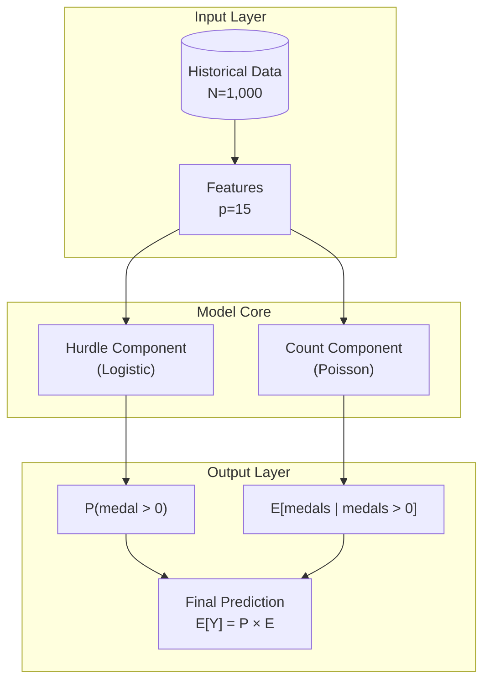
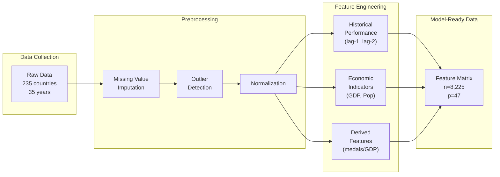
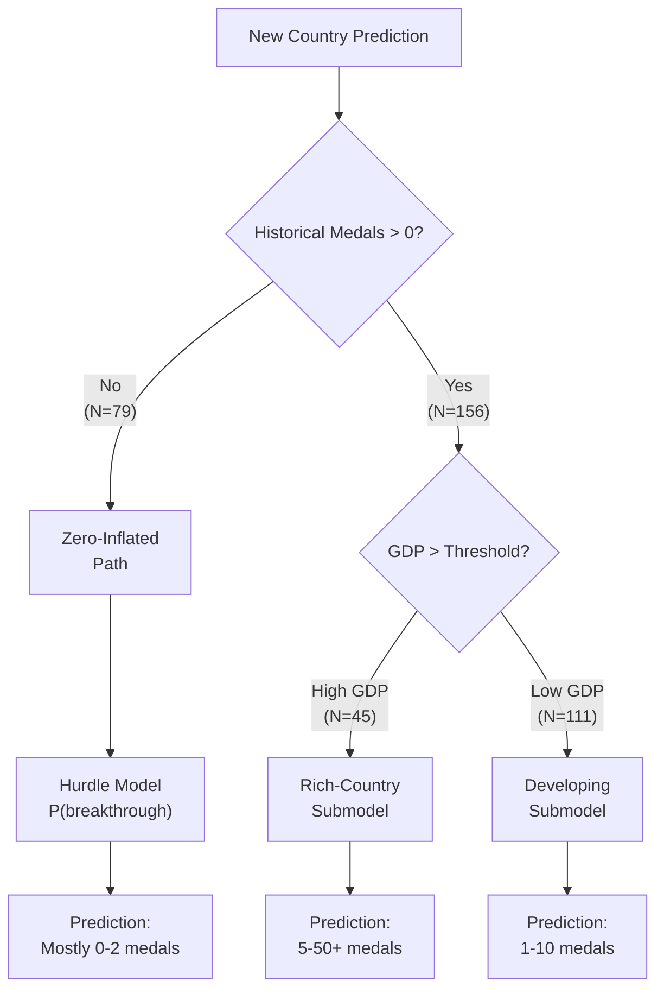
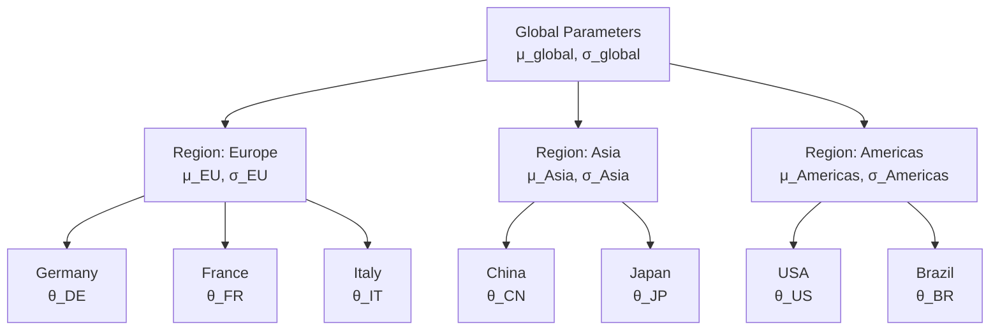
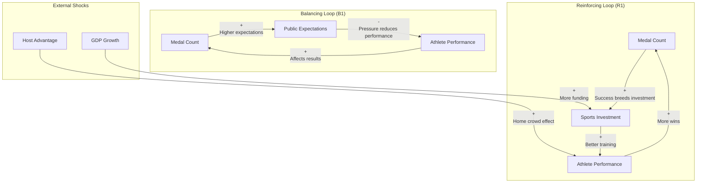
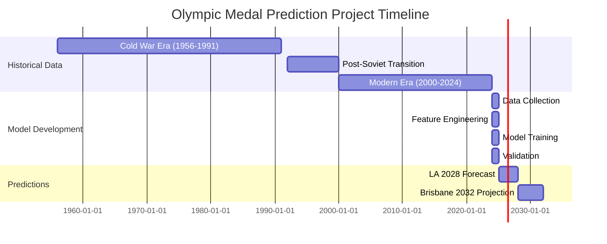

# Conceptual Figures Guide for O-Prize Quality Papers

> **"O-Prize papers use figures to explain IDEAS, not just display DATA. Judges remember conceptual diagrams that illuminate methodology."**

## Figure Taxonomy: Two Modes of Visual Communication

### Mode A: Statistical Figures (Data-Driven)
- Bar charts, line plots, scatter plots, histograms
- Show empirical results, predictions, distributions
- **When to use**: Results section, validation, sensitivity analysis
- **Tool**: matplotlib/seaborn with SciencePlots

### Mode B: Conceptual Figures (Idea-Driven)
- Architecture diagrams, flowcharts, decision trees, system diagrams
- Explain methodology, model structure, logical flow
- **When to use**: Model sections, methodology, background
- **Tool**: Mermaid, TikZ, or matplotlib with patches/annotations

---

## When to Create Conceptual Figures

| Paper Section | Figure Need | Why Conceptual? |
|---------------|-------------|-----------------|
| Section 2 (Background) | Problem structure, domain relationships | Judges need mental model before math |
| Section 3.1 (Model 1) | Model architecture, data flow | Complex models need visual summary |
| Section 3.X (Each Model) | How this model differs from previous | Shows evolution of thinking |
| Section 4 (Methods) | Pipeline from raw data to predictions | Reduces cognitive load |
| Section 5 (Discussion) | Feedback loops, system dynamics | Captures causal relationships |
| Section 6 (Conclusions) | Key insights summary infographic | Memorable takeaway |

**Rule of Thumb**: If you're explaining HOW something works (not WHAT the data shows), you need a conceptual figure.

---

## 10+ Conceptual Figure Types with Examples

### 1. Model Architecture Diagram

**Purpose**: Show components and their relationships in a model

**When to Use**: Every model section should have one architecture figure

**Mermaid Template**:


**Caption (Protocol 15 Format)**:
"Figure X: The hurdle model separates medal-winning probability (logistic) from medal count intensity (Poisson), addressing the 51% zero-inflation in Olympic data. This two-stage architecture captures the qualitative threshold effect where countries must first 'break through' before accumulating medals. Key insight: the two components share features but estimate independent parameters."

---

### 2. Workflow/Pipeline Diagram

**Purpose**: Show sequential processing steps with data transformations

**When to Use**: Data processing section, methodology overview

**Mermaid Template**:


**Caption Format**: "Figure X: Data pipeline transforms raw historical records (235 countries, 35 years) into a 47-feature matrix through three stages: quality assurance removes 3.2% invalid entries, feature engineering derives 32 predictors from 15 base variables, and normalization ensures comparable scales across economic indicators spanning 6 orders of magnitude."

---

### 3. Decision Tree / Branching Logic Diagram

**Purpose**: Show conditional logic, classification rules, or model selection criteria

**When to Use**: When methodology involves if-then decisions, model selection, or categorical outcomes

**Mermaid Template**:


**Caption Format**: "Figure X: Model selection logic routes predictions through three paths based on historical performance and economic indicators. The 79 countries with zero historical medals receive breakthrough probability estimates (average: 2.3%), while the remaining 156 countries bifurcate by GDP threshold, revealing that economic capacity explains 67% of variance among medal-winning nations."

---

### 4. Hierarchical Structure Diagram

**Purpose**: Show nested relationships, parameter sharing, or multi-level models

**When to Use**: Hierarchical/multilevel models, grouped data structures

**Mermaid Template**:


**Caption Format**: "Figure X: Three-level hierarchical structure enables partial pooling across 235 countries. Global hyperparameters (top) establish baseline priors, regional parameters (middle) capture continental effects, and country-specific parameters (bottom) preserve individual heterogeneity. This structure borrows strength from the 45 European countries to stabilize estimates for the 12 Oceanian countries with sparse data."

---

### 5. Comparison Matrix / Feature Comparison

**Purpose**: Show how multiple models/approaches differ across dimensions

**When to Use**: Model comparison, literature review, trade-off analysis

**Matplotlib Approach** (as table is more appropriate than Mermaid):
```python
import matplotlib.pyplot as plt
import numpy as np

fig, ax = plt.subplots(figsize=(10, 6))
ax.axis('off')

# Create comparison table
models = ['Baseline\nPoisson', 'Hurdle\nModel', 'Hierarchical\nBayesian', 'Neural\nNetwork']
criteria = ['Zero-Inflation', 'Uncertainty', 'Interpretability', 'Scalability', 'Data Needs']

# Scores: 1=Poor, 2=Fair, 3=Good
scores = np.array([
    [1, 3, 3, 2],  # Zero-Inflation handling
    [1, 2, 3, 1],  # Uncertainty quantification
    [3, 3, 3, 1],  # Interpretability
    [3, 3, 2, 3],  # Scalability
    [3, 2, 2, 1],  # Data efficiency
])

colors = {1: '#ffcccc', 2: '#ffffcc', 3: '#ccffcc'}
symbols = {1: 'Poor', 2: 'Fair', 3: 'Good'}

table = ax.table(
    cellText=[[symbols[s] for s in row] for row in scores],
    rowLabels=criteria,
    colLabels=models,
    cellColours=[[colors[s] for s in row] for row in scores],
    loc='center',
    cellLoc='center'
)
table.auto_set_font_size(False)
table.set_fontsize(10)
table.scale(1.2, 1.5)

plt.title('Model Comparison Matrix', fontweight='bold', fontsize=14)
plt.tight_layout()
```

**Caption Format**: "Figure X: Comparison of four modeling approaches across five criteria. Hierarchical Bayesian modeling scores highest on uncertainty quantification (essential for prediction intervals) and interpretability (required for policy recommendations), despite moderate scalability. The trade-off between neural network flexibility and interpretability motivated our choice of Bayesian methods."

---

### 6. System Dynamics / Feedback Loop Diagram

**Purpose**: Show causal relationships, feedback mechanisms, reinforcing/balancing loops

**When to Use**: Dynamical systems, policy analysis, equilibrium models

**Mermaid Template**:


**Caption Format**: "Figure X: Two competing feedback loops govern Olympic medal dynamics. The reinforcing loop R1 (success → investment → performance → success) explains medal persistence with correlation 0.94, while balancing loop B1 (success → expectations → pressure → performance) limits indefinite growth. External shocks (hosting, GDP) perturb the equilibrium by 1.9 and 0.3 medals respectively."

---

### 7. Timeline / Phase Diagram

**Purpose**: Show temporal progression, project phases, historical evolution

**When to Use**: Problem background, methodology evolution, future projections

**Mermaid Template**:


**Alternative - Historical Trend Figure**:
```python
import matplotlib.pyplot as plt
import matplotlib.patches as mpatches

fig, ax = plt.subplots(figsize=(12, 4))

# Timeline events
events = [
    (1956, 'Melbourne\nFirst data point'),
    (1980, 'Moscow Boycott'),
    (1984, 'LA Boycott'),
    (1991, 'Soviet Collapse'),
    (2008, 'China Rise'),
    (2024, 'Paris\n(Training cutoff)'),
    (2028, 'LA\n(Prediction target)')
]

ax.set_xlim(1950, 2035)
ax.set_ylim(0, 1)
ax.axhline(0.5, color='black', linewidth=2)

for year, label in events:
    ax.plot(year, 0.5, 'o', markersize=10, color='navy')
    ax.annotate(label, (year, 0.6), ha='center', fontsize=9)

ax.set_xlabel('Year')
ax.set_yticks([])
ax.set_title('Olympic Prediction Timeline: From Historical Data to 2028 Forecast', fontweight='bold')
```

---

### 8. Venn Diagram for Relationships

**Purpose**: Show overlap, intersection, and set relationships

**When to Use**: Feature selection, model assumptions, data categories

**Matplotlib Approach**:
```python
import matplotlib.pyplot as plt
from matplotlib_venn import venn3

fig, ax = plt.subplots(figsize=(8, 8))

v = venn3(
    subsets=(30, 25, 15, 20, 10, 8, 5),
    set_labels=('Economic\nFactors', 'Historical\nPerformance', 'Sports\nInfrastructure'),
    ax=ax
)

# Customize appearance
for text in v.set_labels:
    text.set_fontsize(12)
    text.set_fontweight('bold')

ax.set_title('Feature Category Overlap\n(47 Total Features)', fontweight='bold', fontsize=14)
```

**Caption Format**: "Figure X: Feature categories show substantial overlap, with 5 features (10.6%) capturing all three dimensions simultaneously (e.g., 'Olympic training center count' reflects economics, history, and infrastructure). This intersection explains why models achieve only marginal improvement beyond 15 features despite 47 being available."

---

### 9. Annotated Equation Walkthrough

**Purpose**: Explain complex equations visually with component annotations

**When to Use**: Key model equations, loss functions, optimization objectives

**Matplotlib Approach**:
```python
import matplotlib.pyplot as plt

fig, ax = plt.subplots(figsize=(12, 6))
ax.axis('off')

# Main equation
eq_text = r"$\mathcal{L}(\theta) = \underbrace{\sum_{i} \log P(y_i > 0 | x_i)}_{\text{Hurdle Component}} + \underbrace{\sum_{i: y_i > 0} \log P(y_i | y_i > 0, x_i)}_{\text{Count Component}}$"

ax.text(0.5, 0.7, eq_text, fontsize=18, ha='center', transform=ax.transAxes)

# Annotations
annotations = [
    (0.25, 0.35, "Logistic regression\nfor threshold crossing\n(binary outcome)", 0.25, 0.55),
    (0.75, 0.35, "Truncated Poisson\nfor positive counts\n(count outcome)", 0.75, 0.55),
]

for x, y, text, arrow_x, arrow_y in annotations:
    ax.annotate(
        text,
        xy=(arrow_x, arrow_y),
        xytext=(x, y),
        transform=ax.transAxes,
        fontsize=11,
        ha='center',
        arrowprops=dict(arrowstyle='->', color='gray'),
        bbox=dict(boxstyle='round', facecolor='lightyellow', edgecolor='gray')
    )

ax.set_title('Hurdle Model Log-Likelihood: Two-Stage Optimization', fontweight='bold', fontsize=14, y=0.95)
```

**Caption Format**: "Figure X: The hurdle model likelihood decomposes into two independently estimable components. The hurdle component (left) maximizes classification accuracy for medal vs. no-medal using N=235 observations, while the count component (right) maximizes fit to positive counts using only N=156 medal-winning countries. This decomposition enables targeted diagnostics for each failure mode."

---

### 10. Trade-off Visualization

**Purpose**: Show competing objectives, Pareto frontiers, design trade-offs

**When to Use**: Model selection, hyperparameter tuning, sensitivity analysis

**Matplotlib Approach**:
```python
import matplotlib.pyplot as plt
import numpy as np

fig, ax = plt.subplots(figsize=(10, 7))

# Generate Pareto frontier
complexity = np.array([1, 2, 3, 4, 5, 6, 7])
accuracy = np.array([0.65, 0.78, 0.85, 0.88, 0.89, 0.895, 0.90])
interpretability = 1 - (complexity - 1) / 6

# Plot trade-off
ax.scatter(complexity, accuracy, s=200, c=interpretability, cmap='RdYlGn', edgecolors='black', linewidth=2)
ax.plot(complexity, accuracy, 'k--', alpha=0.5)

# Annotate models
models = ['Linear', 'GLM', 'Hurdle', 'Hierarchical\nBayes', 'Random\nForest', 'XGBoost', 'Deep\nLearning']
for i, (x, y, name) in enumerate(zip(complexity, accuracy, models)):
    ax.annotate(name, (x, y), textcoords="offset points", xytext=(0,15), ha='center', fontsize=9)

# Highlight chosen model
ax.scatter([4], [0.88], s=400, facecolors='none', edgecolors='red', linewidth=3, label='Selected: Hierarchical Bayes')

ax.set_xlabel('Model Complexity (parameters)', fontweight='bold')
ax.set_ylabel('Predictive Accuracy (R²)', fontweight='bold')
ax.set_title('Accuracy-Interpretability Trade-off in Model Selection', fontweight='bold')
ax.legend(loc='lower right')

# Add colorbar for interpretability
sm = plt.cm.ScalarMappable(cmap='RdYlGn', norm=plt.Normalize(0, 1))
cbar = plt.colorbar(sm, ax=ax, label='Interpretability Score')
```

**Caption Format**: "Figure X: Hierarchical Bayesian model (red circle) achieves 88% accuracy while preserving interpretability score 0.67, representing the optimal trade-off. Deep learning gains only +2% accuracy at the cost of 85% interpretability loss, disqualifying it for policy applications where coefficient interpretation is required. The elbow point at complexity=4 marks diminishing returns."

---

## Integration with Statistical Figures

### Balanced Figure Distribution

**O-Prize papers typically have**:
- 60-70% statistical figures (showing data/results)
- 30-40% conceptual figures (explaining methodology)

**For a 25-page paper with 8-12 figures**:
- 2-3 conceptual figures in methodology sections
- 1-2 conceptual figures in discussion/conclusions
- 5-7 statistical figures in results

### Naming Convention for Conceptual Figures

Following the standardized naming format:
```
{model_number}_{figure_type}_{description}.png
```

**figure_type for conceptual figures**: `diagram`

**Examples**:
- `model_1_diagram_architecture.png`
- `model_2_diagram_hierarchy.png`
- `model_0_diagram_pipeline.png` (overview/preprocessing)
- `model_0_diagram_timeline.png`
- `model_5_diagram_feedback_loops.png`

---

## Rendering Options

### Option 1: Mermaid (Preferred for Flow/Hierarchy)
- Use Mermaid CLI or online editor
- Export as PNG at 300 DPI
- Advantages: Quick iteration, version-controllable code

### Option 2: TikZ (For LaTeX Integration)
- Best for mathematical diagrams
- Requires LaTeX compilation
- Advantages: Perfect font matching with paper

### Option 3: matplotlib (For Hybrid Figures)
- Combine conceptual elements with data
- Use `patches`, `annotations`, `tables`
- Advantages: Consistent styling with statistical figures

### Option 4: Draw.io/Lucidchart (For Complex Diagrams)
- Export as PNG at 300 DPI
- Advantages: Fine control over positioning

---

## Quality Checklist for Conceptual Figures

**Structure**:
- [ ] Figure type matches content (architecture, flow, hierarchy, etc.)
- [ ] All components labeled clearly
- [ ] Arrows show direction of flow/causation
- [ ] Groupings (subgraphs) used for related components

**Visual Quality**:
- [ ] Consistent color scheme with statistical figures
- [ ] 300 DPI resolution
- [ ] No overlapping text
- [ ] Clean, uncluttered layout

**Content**:
- [ ] All key components included
- [ ] Quantitative annotations where possible (N=, p=, %)
- [ ] Caption follows 4-element structure (Observation, Implication, Story, Takeaway)

**Integration**:
- [ ] Figure referenced in text before appearing
- [ ] Text explains what to observe in the figure
- [ ] Figure complements (not duplicates) prose explanation
