# Advanced Mermaid Templates for MCM Diagrams

> **"Mermaid diagrams bridge the gap between text explanations and formal diagrams. Master these templates for rapid conceptual figure generation."**

This guide extends the basic Mermaid templates in the visualizer agent with advanced patterns for MCM papers.

---

## Professional Styling Defaults

> **CRITICAL**: Every diagram MUST include the init block and class definitions below. This transforms basic diagrams into publication-quality figures.

### Default Init Block (Copy to Every Diagram)

```mermaid
%%{init: {
  'theme': 'base',
  'themeVariables': {
    'primaryColor': '#4a90d9',
    'primaryTextColor': '#ffffff',
    'primaryBorderColor': '#2c5282',
    'lineColor': '#4a5568',
    'secondaryColor': '#90cdf4',
    'tertiaryColor': '#f7fafc',
    'fontSize': '16px',
    'fontFamily': 'Arial, Helvetica, sans-serif'
  }
}}%%
```

### Standard Node Classes (Copy After Init Block)

```mermaid
classDef input fill:#e6f3ff,stroke:#2c5282,stroke-width:2px,color:#1a365d,font-weight:bold
classDef process fill:#4a90d9,stroke:#2c5282,stroke-width:2px,color:#ffffff,font-weight:bold
classDef output fill:#c6f6d5,stroke:#276749,stroke-width:2px,color:#1c4532,font-weight:bold
classDef decision fill:#faf089,stroke:#b7791f,stroke-width:2px,color:#744210,font-weight:bold
classDef highlight fill:#fed7aa,stroke:#c05621,stroke-width:3px,color:#7b341e,font-weight:bold
classDef database fill:#e2e8f0,stroke:#4a5568,stroke-width:2px,color:#1a202c
```

### Subgraph Color Palette

| Subgraph Type | Fill | Border | Example |
|---------------|------|--------|---------|
| Input/Data | `#e6f3ff` | `#2c5282` | `style Input fill:#e6f3ff,stroke:#2c5282,stroke-width:2px` |
| Processing | `#fff3e0` | `#c05621` | `style Process fill:#fff3e0,stroke:#c05621,stroke-width:2px` |
| Models | `#faf5ff` | `#6b46c1` | `style Models fill:#faf5ff,stroke:#6b46c1,stroke-width:2px` |
| Output | `#c6f6d5` | `#276749` | `style Output fill:#c6f6d5,stroke:#276749,stroke-width:2px` |

---

## Rendering Instructions

### Option 1: Mermaid CLI (Recommended)
```bash
# Install
npm install -g @mermaid-js/mermaid-cli

# Render to PNG (PRODUCTION COMMAND)
mmdc -i diagram.mmd -o output.png -w 3000 -H 2000 -b white

# Render to SVG (for vector quality)
mmdc -i diagram.mmd -o output.svg -b white
```

### Option 2: Online Editors
- [Mermaid Live Editor](https://mermaid.live/) - Real-time preview
- [Draw.io](https://draw.io) - Import Mermaid, export PNG

### Option 3: VS Code Extension
- Install "Markdown Preview Mermaid Support"
- Preview in markdown files
- Export via screenshot (lower quality)

### Quality Settings
- **Width**: 3000px minimum for complex diagrams (2000px for simple)
- **Background**: White (`-b white`) for paper submission
- **Format**: PNG for raster, SVG for vector
- **Final DPI**: Convert to 300 DPI if needed

See `rendering_best_practices.md` for complete production workflow.

---

## Template 1: Complex Flowchart with Subgraphs

**Use Case**: Multi-stage model pipelines, data processing workflows


**Styling Notes**:
- **ALWAYS include the init block** for professional colors
- Use `classDef` to define node styles by function
- Apply classes with `:::classname` syntax
- Use subgraphs to group related steps
- Style subgraphs with `style SubgraphName fill:...,stroke:...`
- Direction TB (top-bottom) for vertical flow
- Direction LR (left-right) for horizontal stages
- Add quantities in node labels (N=, %)
- Use `<b>...</b>` for bold subgraph titles

---

## Template 2: State Diagram for Model Transitions

**Use Case**: Markov models, state-based dynamics, transition systems


**Caption Format**: "Figure X: Countries transition between four medal-winning states with asymmetric probabilities. The 'breakthrough' transition (NonMedalist → Emerging) has probability 0.023/year, meaning the average non-medalist waits 43 years for their first medal. Regression is 3.5× more likely than breakthrough, explaining the persistence of medal inequality."

---

## Template 3: Sequence Diagram for Model Workflow

**Use Case**: Training procedures, iterative algorithms, agent interactions


**Caption Format**: "Figure X: The training pipeline processes 8,225 country-year observations through 6 stages. MCMC sampling (steps 7-10) runs for 10,000 iterations with convergence verification (R-hat < 1.1). The feedback loop (steps 11-12) doubles sample size if convergence fails, ensuring reliable posterior estimates."

---

## Template 4: Entity Relationship Diagram

**Use Case**: Data structure, database schema, variable relationships


**Caption Format**: "Figure X: The relational data model links 235 countries across 28 Olympic Games through 6,580 participation records. The FEATURES table derives 47 predictors from the base tables, with key transformations including lag features (1-3 games), rolling averages (4-game window), and normalized ratios (medals per GDP)."

---

## Template 5: Gantt Chart for Timeline

**Use Case**: Project phases, historical periods, prediction horizons


---

## Template 6: Pie Chart Alternative (Subgraph Distribution)

**Use Case**: Showing proportions without actual pie charts (which Mermaid doesn't support well)


**Better Alternative**: Use matplotlib for actual pie/donut charts.

---

## Template 7: Class Diagram for Model Components

**Use Case**: Object-oriented model design, component relationships


---

## Template 8: Mind Map for Problem Decomposition

**Use Case**: Research questions, problem structure, solution components


---

## Template 9: Comparison Flowchart (Before/After)

**Use Case**: Showing improvement, model evolution, design changes


---

## Template 10: Decision Matrix Flowchart

**Use Case**: Model selection criteria, feature selection, methodology choices


---

## Advanced Styling

### Professional Init Block (Required for All Diagrams)

Always start diagrams with this init block:

```mermaid
%%{init: {
  'theme': 'base',
  'themeVariables': {
    'primaryColor': '#4a90d9',
    'primaryTextColor': '#ffffff',
    'primaryBorderColor': '#2c5282',
    'lineColor': '#4a5568',
    'secondaryColor': '#90cdf4',
    'tertiaryColor': '#f7fafc',
    'fontSize': '16px',
    'fontFamily': 'Arial, Helvetica, sans-serif'
  }
}}%%
```

### Complete Node Class Library

```mermaid
%% Input/Data nodes
classDef input fill:#e6f3ff,stroke:#2c5282,stroke-width:2px,color:#1a365d,font-weight:bold
classDef database fill:#e2e8f0,stroke:#4a5568,stroke-width:2px,color:#1a202c

%% Processing nodes
classDef process fill:#4a90d9,stroke:#2c5282,stroke-width:2px,color:#ffffff,font-weight:bold
classDef transform fill:#fff3e0,stroke:#c05621,stroke-width:2px,color:#7b341e

%% Decision nodes
classDef decision fill:#faf089,stroke:#b7791f,stroke-width:2px,color:#744210,font-weight:bold

%% Output nodes
classDef output fill:#c6f6d5,stroke:#276749,stroke-width:2px,color:#1c4532,font-weight:bold
classDef result fill:#d1fae5,stroke:#059669,stroke-width:2px,color:#065f46

%% Special emphasis
classDef highlight fill:#fed7aa,stroke:#c05621,stroke-width:3px,color:#7b341e,font-weight:bold
classDef selected fill:#90EE90,stroke:#006400,stroke-width:3px,color:#1a202c,font-weight:bold

%% Model nodes
classDef model fill:#fef3c7,stroke:#d97706,stroke-width:2px,color:#92400e,font-weight:bold
classDef submodel fill:#e9d8fd,stroke:#6b46c1,stroke-width:2px,color:#44337a

%% Status nodes
classDef success fill:#c6f6d5,stroke:#276749,stroke-width:2px,color:#1c4532
classDef warning fill:#fefcbf,stroke:#b7791f,stroke-width:2px,color:#744210
classDef error fill:#fed7d7,stroke:#c53030,stroke-width:2px,color:#742a2a
```

### Custom Colors with Style Attribute


### Link Labels with Values

```mermaid
flowchart LR
    A["Raw Data"] -->|"N=8,225"| B["Clean Data"]
    B -->|"47 features"| C["Model"]
    C -->|"R²=0.89"| D["Predictions"]

    linkStyle 0 stroke:#2c5282,stroke-width:2px
    linkStyle 1 stroke:#6b46c1,stroke-width:2px
    linkStyle 2 stroke:#276749,stroke-width:2px
```


### Subgraph Styling (Professional Pattern)


### Arrow/Link Styling by Meaning


---

## Conversion to Image

### Recommended Workflow

1. **Write Mermaid code** in `.mmd` file with init block and classDefs
2. **Preview** in Mermaid Live Editor (https://mermaid.live/)
3. **Render** with CLI:
   ```bash
   mmdc -i diagram.mmd -o model_1_diagram_architecture.png -w 3000 -H 2000 -b white
   ```
4. **Verify** resolution: should be ≥3000px wide for complex diagrams
5. **Convert if needed**: ensure 300 DPI for paper submission

### Production Rendering Commands

```bash
# Standard architecture diagram
mmdc -i diagram.mmd -o output.png -w 3000 -H 2000 -b white

# Large/complex pipeline
mmdc -i diagram.mmd -o output.png -w 4000 -H 2500 -b white

# With config file for consistent styling
mmdc -i diagram.mmd -o output.png -w 3000 -c mermaid-config.json

# Batch render all diagrams
for f in *.mmd; do mmdc -i "$f" -o "${f%.mmd}.png" -w 3000 -b white; done
```

### Troubleshooting

| Issue | Solution |
|-------|----------|
| Text too small | Increase width (`-w 3000` or `-w 4000`) |
| Diagram cut off | Increase height (`-H 2500`) or omit -H for auto |
| Low resolution | Export as SVG, convert to PNG at 300 DPI |
| Colors wrong | Check `style` syntax, use hex codes with `#` |
| Fonts not matching | Use web-safe: `Arial, Helvetica, sans-serif` |

See `rendering_best_practices.md` for complete production workflow.

---

## Naming Convention for Mermaid-Generated Figures

Following standardized naming:
```
{model_number}_diagram_{description}.png
```

**Examples**:
- `model_0_diagram_data_pipeline.png`
- `model_1_diagram_hurdle_architecture.png`
- `model_2_diagram_hierarchy.png`
- `model_3_diagram_ensemble_flow.png`
- `model_0_diagram_state_transitions.png`

---

## Before/After: Professional Styling Comparison

### BEFORE (Plain Mermaid - DO NOT USE)


**Problems:**
- Gray boxes with no visual hierarchy
- Thin default borders
- No color differentiation by function
- Generic appearance
- No emphasis on key elements
- Hard to distinguish node types

### AFTER (Professional Styling - USE THIS)

```mermaid
%%{init: {
  'theme': 'base',
  'themeVariables': {
    'primaryColor': '#4a90d9',
    'primaryTextColor': '#ffffff',
    'primaryBorderColor': '#2c5282',
    'lineColor': '#4a5568',
    'fontSize': '16px',
    'fontFamily': 'Arial, Helvetica, sans-serif'
  }
}}%%

flowchart TB
    classDef database fill:#e2e8f0,stroke:#4a5568,stroke-width:2px,color:#1a202c
    classDef process fill:#4a90d9,stroke:#2c5282,stroke-width:2px,color:#ffffff,font-weight:bold
    classDef output fill:#c6f6d5,stroke:#276749,stroke-width:2px,color:#1c4532,font-weight:bold

    subgraph Input["<b>📥 Data Sources</b>"]
        A[("Historical Data<br/>N=8,225")]:::database
        B[("External Data<br/>N=500")]:::database
    end

    subgraph Process["<b>⚙️ Processing Pipeline</b>"]
        C["Step 1: Clean<br/>Remove 3.2% invalid"]:::process
        D["Step 2: Transform<br/>47 features"]:::process
    end

    subgraph Output["<b>📊 Results</b>"]
        E["Predictions<br/>R²=0.89"]:::output
    end

    Input --> Process --> Output
    A --> C
    B --> C
    C --> D
    D --> E

    style Input fill:#e6f3ff,stroke:#2c5282,stroke-width:2px
    style Process fill:#fff3e0,stroke:#c05621,stroke-width:2px
    style Output fill:#c6f6d5,stroke:#276749,stroke-width:2px
```



**Improvements:**
- Color-coded by function (input blue, process orange, output green)
- 2px borders with theme-consistent colors
- Bold subgraph titles with icons
- Quantitative annotations (N=, R²=, %)
- Clear visual hierarchy
- Professional, publication-ready appearance

---

## Quick Reference: Minimum Professional Template

Copy this as your starting point for ANY diagram:

```mermaid
%%{init: {'theme': 'base', 'themeVariables': {'primaryColor': '#4a90d9', 'primaryTextColor': '#fff', 'primaryBorderColor': '#2c5282', 'lineColor': '#4a5568', 'fontSize': '16px', 'fontFamily': 'Arial, Helvetica, sans-serif'}}}%%

flowchart TB
    classDef input fill:#e6f3ff,stroke:#2c5282,stroke-width:2px,color:#1a365d
    classDef process fill:#4a90d9,stroke:#2c5282,stroke-width:2px,color:#fff
    classDef output fill:#c6f6d5,stroke:#276749,stroke-width:2px,color:#1c4532
    classDef decision fill:#faf089,stroke:#b7791f,stroke-width:2px,color:#744210

    %% Your diagram here
    A["Input"]:::input --> B["Process"]:::process --> C["Output"]:::output
```

See `professional_styling_guide.md` for complete color palettes and styling options.

---

## Template 11: Ensemble Architecture Diagram

**Use Case**: Showing how multiple models combine into ensemble predictions

```mermaid
%%{init: {
  'theme': 'base',
  'themeVariables': {
    'primaryColor': '#4a90d9',
    'primaryTextColor': '#ffffff',
    'primaryBorderColor': '#2c5282',
    'lineColor': '#4a5568',
    'fontSize': '16px',
    'fontFamily': 'Arial, Helvetica, sans-serif'
  }
}}%%

flowchart TB
    classDef input fill:#e6f3ff,stroke:#2c5282,stroke-width:2px,color:#1a365d,font-weight:bold
    classDef model fill:#fef3c7,stroke:#d97706,stroke-width:2px,color:#92400e,font-weight:bold
    classDef weight fill:#e9d8fd,stroke:#6b46c1,stroke-width:2px,color:#44337a
    classDef ensemble fill:#fed7aa,stroke:#c05621,stroke-width:3px,color:#7b341e,font-weight:bold
    classDef output fill:#c6f6d5,stroke:#276749,stroke-width:2px,color:#1c4532,font-weight:bold

    subgraph Data["<b>📥 Shared Input</b>"]
        D[(Feature Matrix<br/>N=8,225<br/>p=47)]:::input
    end

    subgraph Models["<b>🧮 Base Models</b>"]
        direction LR
        M1["Model 1<br/>Hurdle<br/>RMSE: 5.2"]:::model
        M2["Model 2<br/>Hierarchical<br/>RMSE: 4.8"]:::model
        M3["Model 3<br/>XGBoost<br/>RMSE: 5.0"]:::model
    end

    subgraph Weights["<b>⚖️ Optimized Weights</b>"]
        W1["w₁ = 0.30"]:::weight
        W2["w₂ = 0.45"]:::weight
        W3["w₃ = 0.25"]:::weight
    end

    subgraph Combination["<b>🎯 Ensemble</b>"]
        E["Weighted Average<br/>ŷ = Σ wᵢ × ŷᵢ<br/>RMSE: 4.3"]:::ensemble
    end

    subgraph Output["<b>📊 Final Prediction</b>"]
        O1["Point Estimate<br/>42 medals"]:::output
        O2["95% CI<br/>[36, 48]"]:::output
        O3["Uncertainty<br/>±6 medals"]:::output
    end

    D --> M1 & M2 & M3
    M1 --> W1 --> E
    M2 --> W2 --> E
    M3 --> W3 --> E
    E --> O1 & O2 & O3

    style Data fill:#e6f3ff,stroke:#2c5282,stroke-width:2px
    style Models fill:#fef3c7,stroke:#d97706,stroke-width:2px
    style Weights fill:#faf5ff,stroke:#6b46c1,stroke-width:2px
    style Combination fill:#fff3e0,stroke:#c05621,stroke-width:2px
    style Output fill:#c6f6d5,stroke:#276749,stroke-width:2px
```

**Caption Format**: "Figure X: Ensemble architecture combines three base models through optimized stacking weights. The Hierarchical model receives highest weight (0.45) due to superior cross-validation performance, while the Hurdle model contributes 0.30 for its zero-inflation handling. The ensemble achieves RMSE 4.3, a 10% improvement over the best individual model."

---

## Template 12: Optimization Workflow Diagram

**Use Case**: Hyperparameter tuning, Bayesian optimization, grid search visualization

```mermaid
%%{init: {
  'theme': 'base',
  'themeVariables': {
    'primaryColor': '#805ad5',
    'primaryTextColor': '#ffffff',
    'primaryBorderColor': '#553c9a',
    'lineColor': '#4a5568',
    'fontSize': '16px',
    'fontFamily': 'Arial, Helvetica, sans-serif'
  }
}}%%

flowchart TD
    classDef start fill:#e6f3ff,stroke:#2c5282,stroke-width:2px,color:#1a365d,font-weight:bold
    classDef process fill:#805ad5,stroke:#553c9a,stroke-width:2px,color:#ffffff,font-weight:bold
    classDef decision fill:#faf089,stroke:#b7791f,stroke-width:2px,color:#744210,font-weight:bold
    classDef loop fill:#fed7aa,stroke:#c05621,stroke-width:2px,color:#7b341e
    classDef output fill:#c6f6d5,stroke:#276749,stroke-width:2px,color:#1c4532,font-weight:bold

    subgraph Init["<b>🎯 Initialization</b>"]
        A["Define Search Space<br/>α ∈ [0.01, 1.0]<br/>λ ∈ [0.001, 10]"]:::start
        B["Initial Samples<br/>N=10 (Latin Hypercube)"]:::process
    end

    subgraph Loop["<b>🔄 Optimization Loop</b>"]
        direction TB
        C["Fit Surrogate Model<br/>(Gaussian Process)"]:::process
        D["Compute Acquisition<br/>Function (EI)"]:::process
        E["Select Next Point<br/>x* = argmax EI(x)"]:::process
        F["Evaluate Objective<br/>f(x*) = CV-RMSE"]:::loop
        G{{"Budget<br/>Exhausted?"}}:::decision
    end

    subgraph Result["<b>📊 Output</b>"]
        H["Best Parameters<br/>α* = 0.15<br/>λ* = 0.82"]:::output
        I["Best Score<br/>RMSE = 4.31"]:::output
    end

    A --> B --> C
    C --> D --> E --> F
    F --> G
    G -->|"No<br/>(iter < 50)"| C
    G -->|"Yes"| H --> I

    style Init fill:#e6f3ff,stroke:#2c5282,stroke-width:2px
    style Loop fill:#faf5ff,stroke:#6b46c1,stroke-width:2px
    style Result fill:#c6f6d5,stroke:#276749,stroke-width:2px
```

**Caption Format**: "Figure X: Bayesian optimization workflow for hyperparameter tuning. After 10 initial Latin Hypercube samples, the Gaussian Process surrogate guides selection via Expected Improvement (EI) acquisition. The process converges after 42 iterations to optimal regularization parameters (α*=0.15, λ*=0.82), achieving 15% RMSE reduction versus grid search with 8× fewer evaluations."

---

## Template 13: Validation Pipeline Diagram

**Use Case**: Showing complete model validation workflow with multiple checks

```mermaid
%%{init: {
  'theme': 'base',
  'themeVariables': {
    'primaryColor': '#38a169',
    'primaryTextColor': '#ffffff',
    'primaryBorderColor': '#276749',
    'lineColor': '#4a5568',
    'fontSize': '16px',
    'fontFamily': 'Arial, Helvetica, sans-serif'
  }
}}%%

flowchart LR
    classDef input fill:#e6f3ff,stroke:#2c5282,stroke-width:2px,color:#1a365d,font-weight:bold
    classDef check fill:#fef3c7,stroke:#d97706,stroke-width:2px,color:#92400e,font-weight:bold
    classDef pass fill:#c6f6d5,stroke:#276749,stroke-width:2px,color:#1c4532,font-weight:bold
    classDef fail fill:#fed7d7,stroke:#c53030,stroke-width:2px,color:#742a2a,font-weight:bold
    classDef gate fill:#38a169,stroke:#276749,stroke-width:3px,color:#ffffff,font-weight:bold

    subgraph Stage1["<b>Stage 1: Convergence</b>"]
        A["Trained<br/>Model"]:::input
        B["R-hat<br/>Check"]:::check
        C["ESS<br/>Check"]:::check
    end

    subgraph Stage2["<b>Stage 2: Fit Quality</b>"]
        D["Residual<br/>Diagnostics"]:::check
        E["PPC<br/>Check"]:::check
    end

    subgraph Stage3["<b>Stage 3: Predictive</b>"]
        F["CV<br/>Performance"]:::check
        G["Calibration<br/>Check"]:::check
    end

    subgraph Gate["<b>✓ Validation Gate</b>"]
        H{{"All<br/>Pass?"}}:::gate
    end

    subgraph Outcome["<b>Outcome</b>"]
        I["✓ APPROVED<br/>Proceed to<br/>Predictions"]:::pass
        J["✗ REJECTED<br/>Return to<br/>Training"]:::fail
    end

    A --> B & C
    B & C --> D & E
    D & E --> F & G
    F & G --> H
    H -->|"Yes"| I
    H -->|"No"| J
    J -.->|"Iterate"| A

    style Stage1 fill:#e6f3ff,stroke:#2c5282,stroke-width:2px
    style Stage2 fill:#fff3e0,stroke:#c05621,stroke-width:2px
    style Stage3 fill:#faf5ff,stroke:#6b46c1,stroke-width:2px
    style Gate fill:#fefcbf,stroke:#b7791f,stroke-width:2px
    style Outcome fill:#f7fafc,stroke:#4a5568,stroke-width:2px
```

**Caption Format**: "Figure X: Three-stage validation pipeline ensures model reliability. Stage 1 verifies MCMC convergence (R-hat<1.1, ESS>400), Stage 2 confirms distributional fit via residuals and posterior predictive checks, Stage 3 assesses predictive accuracy through 10-fold CV and calibration. All checks must pass; failures trigger re-training with adjusted priors."

---

## Template 14: Sensitivity Analysis Conceptual Diagram

**Use Case**: Showing the structure of sensitivity analysis approach

```mermaid
%%{init: {
  'theme': 'base',
  'themeVariables': {
    'primaryColor': '#dd6b20',
    'primaryTextColor': '#ffffff',
    'primaryBorderColor': '#c05621',
    'lineColor': '#4a5568',
    'fontSize': '16px',
    'fontFamily': 'Arial, Helvetica, sans-serif'
  }
}}%%

flowchart TB
    classDef param fill:#e6f3ff,stroke:#2c5282,stroke-width:2px,color:#1a365d
    classDef method fill:#dd6b20,stroke:#c05621,stroke-width:2px,color:#ffffff,font-weight:bold
    classDef output fill:#fef3c7,stroke:#d97706,stroke-width:2px,color:#92400e
    classDef result fill:#c6f6d5,stroke:#276749,stroke-width:2px,color:#1c4532,font-weight:bold

    subgraph Parameters["<b>📊 Input Parameters</b>"]
        direction LR
        P1["GDP<br/>±20%"]:::param
        P2["Population<br/>±15%"]:::param
        P3["Investment<br/>±25%"]:::param
        P4["Historical<br/>±10%"]:::param
        P5["Host Effect<br/>±50%"]:::param
    end

    subgraph Methods["<b>🔬 Sensitivity Methods</b>"]
        M1["One-at-a-Time<br/>(OAT)"]:::method
        M2["Morris<br/>Screening"]:::method
        M3["Sobol<br/>Indices"]:::method
    end

    subgraph Outputs["<b>📈 Analysis Outputs</b>"]
        O1["Tornado<br/>Diagram"]:::output
        O2["μ* vs σ<br/>Plot"]:::output
        O3["S₁ vs Sᴛ<br/>Chart"]:::output
    end

    subgraph Insights["<b>💡 Key Findings</b>"]
        I1["GDP: Most<br/>influential<br/>(S₁=0.35)"]:::result
        I2["Host×GDP:<br/>Significant<br/>interaction"]:::result
        I3["Population:<br/>Negligible<br/>effect"]:::result
    end

    Parameters --> M1 & M2 & M3
    M1 --> O1
    M2 --> O2
    M3 --> O3
    O1 & O2 & O3 --> Insights

    style Parameters fill:#e6f3ff,stroke:#2c5282,stroke-width:2px
    style Methods fill:#fff3e0,stroke:#c05621,stroke-width:2px
    style Outputs fill:#fef3c7,stroke:#d97706,stroke-width:2px
    style Insights fill:#c6f6d5,stroke:#276749,stroke-width:2px
```

**Caption Format**: "Figure X: Three-tier sensitivity analysis framework progresses from local (OAT) to global (Sobol) methods. OAT tornado diagrams provide quick parameter ranking, Morris screening identifies non-linear effects, and Sobol indices quantify variance attribution. Key insight: GDP dominates (S₁=0.35) with significant host advantage interaction, while population is negligible."

---

## Template 15: Algorithm Flow Diagram

**Use Case**: Visualizing step-by-step algorithm execution

```mermaid
%%{init: {
  'theme': 'base',
  'themeVariables': {
    'primaryColor': '#4a90d9',
    'primaryTextColor': '#ffffff',
    'primaryBorderColor': '#2c5282',
    'lineColor': '#4a5568',
    'fontSize': '16px',
    'fontFamily': 'Arial, Helvetica, sans-serif'
  }
}}%%

flowchart TD
    classDef start fill:#c6f6d5,stroke:#276749,stroke-width:2px,color:#1c4532,font-weight:bold
    classDef process fill:#4a90d9,stroke:#2c5282,stroke-width:2px,color:#ffffff,font-weight:bold
    classDef decision fill:#faf089,stroke:#b7791f,stroke-width:2px,color:#744210,font-weight:bold
    classDef loop fill:#e9d8fd,stroke:#6b46c1,stroke-width:2px,color:#44337a
    classDef end_node fill:#fed7aa,stroke:#c05621,stroke-width:2px,color:#7b341e,font-weight:bold

    A([Start]):::start
    B["Initialize θ⁰<br/>from prior"]:::process
    C["t = 1"]:::loop

    D["Propose θ'<br/>θ' ~ q(θ|θᵗ⁻¹)"]:::process
    E["Compute α<br/>α = min(1, π(θ')q(θᵗ⁻¹|θ')/π(θᵗ⁻¹)q(θ'|θᵗ⁻¹))"]:::process
    F["Draw u ~ U(0,1)"]:::process

    G{{"u < α?"}}:::decision

    H["Accept: θᵗ = θ'"]:::process
    I["Reject: θᵗ = θᵗ⁻¹"]:::process

    J["t = t + 1"]:::loop
    K{{"t > T?"}}:::decision

    L["Discard burn-in<br/>(first 20%)"]:::process
    M["Compute posterior<br/>statistics"]:::process
    N([Return θ samples]):::end_node

    A --> B --> C --> D --> E --> F --> G
    G -->|Yes| H
    G -->|No| I
    H --> J
    I --> J
    J --> K
    K -->|No| D
    K -->|"Yes<br/>(T=10,000)"| L --> M --> N
```

**Caption Format**: "Figure X: Metropolis-Hastings algorithm flow for posterior sampling. The accept-reject step (decision diamond) maintains detailed balance, with acceptance rate ~40% achieved through adaptive proposal tuning. After T=10,000 iterations and 20% burn-in discard, 8,000 posterior samples remain for inference with ESS>1,500."
