# Advanced Mermaid Templates for MCM Diagrams

> **"Mermaid diagrams bridge the gap between text explanations and formal diagrams. Master these templates for rapid conceptual figure generation."**

This guide extends the basic Mermaid templates in the visualizer agent with advanced patterns for MCM papers.

---

## Rendering Instructions

### Option 1: Mermaid CLI (Recommended)
```bash
# Install
npm install -g @mermaid-js/mermaid-cli

# Render to PNG
mmdc -i diagram.mmd -o output.png -w 2000 -H 1500 -b white

# Render to SVG (for vector quality)
mmdc -i diagram.mmd -o output.svg -b white
```

### Option 2: Online Editors
- [Mermaid Live Editor](https://mermaid.live/) - Real-time preview
- [Draw.io](https://draw.io) - Import Mermaid, export PNG

### Option 3: VS Code Extension
- Install "Markdown Preview Mermaid Support"
- Preview in markdown files
- Export via screenshot (lower quality)

### Quality Settings
- **Width**: 2000px minimum for paper figures
- **Background**: White (`-b white`)
- **Format**: PNG for raster, SVG for vector
- **Final DPI**: Convert to 300 DPI if needed

---

## Template 1: Complex Flowchart with Subgraphs

**Use Case**: Multi-stage model pipelines, data processing workflows

```mermaid
flowchart TB
    subgraph Input["📥 Data Collection"]
        direction TB
        R1[("Olympic Results<br/>1896-2024<br/>N=28 Games")]
        R2[("Country Stats<br/>GDP, Population<br/>N=235 Countries")]
        R3[("Sports Investment<br/>Training Facilities<br/>N=180 Countries")]
    end

    subgraph Preprocessing["🔧 Preprocessing"]
        direction TB
        P1["Missing Value<br/>Imputation<br/>(MICE Algorithm)"]
        P2["Outlier Detection<br/>(IQR Method)"]
        P3["Feature Scaling<br/>(Robust Scaler)"]
    end

    subgraph Features["📊 Feature Engineering"]
        direction TB
        F1["Lag Features<br/>(t-1, t-2, t-3)"]
        F2["Rolling Stats<br/>(4-game window)"]
        F3["Derived Ratios<br/>(medals/GDP)"]
        F4["Interaction Terms<br/>(GDP × Host)"]
    end

    subgraph Models["🧮 Modeling"]
        direction TB
        M1["Model 1<br/>Hurdle"]
        M2["Model 2<br/>Hierarchical"]
        M3["Model 3<br/>Ensemble"]
    end

    subgraph Output["📈 Predictions"]
        direction TB
        O1["Point Estimates<br/>2028 LA"]
        O2["95% Intervals"]
        O3["Sensitivity<br/>Analysis"]
    end

    Input --> Preprocessing
    Preprocessing --> Features
    Features --> Models
    Models --> Output

    R1 --> P1
    R2 --> P1
    R3 --> P2
    P1 --> P3
    P2 --> P3
    P3 --> F1
    P3 --> F2
    P3 --> F3
    F1 --> F4
    F2 --> F4
    F3 --> F4
    F4 --> M1
    F4 --> M2
    F4 --> M3
    M1 --> O1
    M2 --> O1
    M3 --> O1
    O1 --> O2
    O2 --> O3
```



**Styling Notes**:
- Use subgraphs to group related steps
- Direction TB (top-bottom) for vertical flow
- Direction LR (left-right) for horizontal stages
- Add quantities in node labels (N=, %)

---

## Template 2: State Diagram for Model Transitions

**Use Case**: Markov models, state-based dynamics, transition systems


**Caption Format**: "Figure X: Countries transition between four medal-winning states with asymmetric probabilities. The 'breakthrough' transition (NonMedalist → Emerging) has probability 0.023/year, meaning the average non-medalist waits 43 years for their first medal. Regression is 3.5× more likely than breakthrough, explaining the persistence of medal inequality."

---

## Template 3: Sequence Diagram for Model Workflow

**Use Case**: Training procedures, iterative algorithms, agent interactions


**Caption Format**: "Figure X: The training pipeline processes 8,225 country-year observations through 6 stages. MCMC sampling (steps 7-10) runs for 10,000 iterations with convergence verification (R-hat < 1.1). The feedback loop (steps 11-12) doubles sample size if convergence fails, ensuring reliable posterior estimates."

---

## Template 4: Entity Relationship Diagram

**Use Case**: Data structure, database schema, variable relationships


**Caption Format**: "Figure X: The relational data model links 235 countries across 28 Olympic Games through 6,580 participation records. The FEATURES table derives 47 predictors from the base tables, with key transformations including lag features (1-3 games), rolling averages (4-game window), and normalized ratios (medals per GDP)."

---

## Template 5: Gantt Chart for Timeline

**Use Case**: Project phases, historical periods, prediction horizons


---

## Template 6: Pie Chart Alternative (Subgraph Distribution)

**Use Case**: Showing proportions without actual pie charts (which Mermaid doesn't support well)


**Better Alternative**: Use matplotlib for actual pie/donut charts.

---

## Template 7: Class Diagram for Model Components

**Use Case**: Object-oriented model design, component relationships


---

## Template 8: Mind Map for Problem Decomposition

**Use Case**: Research questions, problem structure, solution components


---

## Template 9: Comparison Flowchart (Before/After)

**Use Case**: Showing improvement, model evolution, design changes


---

## Template 10: Decision Matrix Flowchart

**Use Case**: Model selection criteria, feature selection, methodology choices


---

## Advanced Styling

### Custom Colors


### Link Labels with Values

```mermaid
flowchart LR
    A["Raw Data"] -->|"N=8,225"| B["Clean Data"]
    B -->|"47 features"| C["Model"]
    C -->|"R²=0.89"| D["Predictions"]
```


### Subgraph Nesting


---

## Conversion to Image

### Recommended Workflow

1. **Write Mermaid code** in `.mmd` file
2. **Preview** in Mermaid Live Editor
3. **Render** with CLI:
   ```bash
   mmdc -i diagram.mmd -o model_1_diagram_architecture.png -w 2400 -H 1800 -b white
   ```
4. **Verify** resolution: should be ≥2000px wide
5. **Convert if needed**: ensure 300 DPI for paper

### Troubleshooting

| Issue | Solution |
|-------|----------|
| Text too small | Increase width (`-w 3000`) |
| Diagram cut off | Increase height (`-H 2500`) |
| Low resolution | Export as SVG, convert to PNG at 300 DPI |
| Colors wrong | Check `style` syntax, use hex codes |

---

## Naming Convention for Mermaid-Generated Figures

Following standardized naming:
```
{model_number}_diagram_{description}.png
```

**Examples**:
- `model_0_diagram_data_pipeline.png`
- `model_1_diagram_hurdle_architecture.png`
- `model_2_diagram_hierarchy.png`
- `model_3_diagram_ensemble_flow.png`
- `model_0_diagram_state_transitions.png`
