# Professional Styling Guide for Publication-Quality Diagrams

> **"Amateur diagrams have plain boxes and generic arrows. O-Prize diagrams have intentional color hierarchy, consistent typography, and visual rhythm that guides the reader's eye."**

This guide provides curated styling parameters to transform basic Mermaid diagrams into publication-ready figures.

---

## Core Principle: Visual Hierarchy Through Color

Every diagram should communicate hierarchy through:
1. **Color intensity** - Important nodes are more saturated
2. **Border weight** - Primary elements have thicker borders
3. **Size differentiation** - Key concepts are larger
4. **Grouping** - Related elements share visual characteristics

---

## Curated Color Palettes

### Palette 1: Academic Blue (Default - Recommended)

Best for: Model architectures, data pipelines, formal diagrams

```
Primary:     #4a90d9  (Strong blue - main processes)
Secondary:   #90cdf4  (Light blue - supporting elements)
Accent:      #ed8936  (Orange - highlights, decisions)
Success:     #48bb78  (Green - outputs, results)
Warning:     #ecc94b  (Yellow - decisions, gates)
Text Dark:   #2d3748  (Dark gray - primary text)
Text Light:  #ffffff  (White - on dark backgrounds)
Border Dark: #2c5282  (Dark blue - primary borders)
Background:  #f7fafc  (Off-white - subgraph backgrounds)
```

**Mermaid Init Block:**
```mermaid
%%{init: {
  'theme': 'base',
  'themeVariables': {
    'primaryColor': '#4a90d9',
    'primaryTextColor': '#ffffff',
    'primaryBorderColor': '#2c5282',
    'lineColor': '#4a5568',
    'secondaryColor': '#90cdf4',
    'tertiaryColor': '#f7fafc',
    'fontSize': '16px',
    'fontFamily': 'Arial, Helvetica, sans-serif'
  }
}}%%
```

---

### Palette 2: Nature Greens (Environmental/Ecological Models)

Best for: Sustainability problems, ecological systems, resource models

```
Primary:     #38a169  (Forest green - main processes)
Secondary:   #9ae6b4  (Light green - supporting)
Accent:      #805ad5  (Purple - special elements)
Earth:       #c69c6d  (Tan - natural resources)
Water:       #63b3ed  (Blue - water systems)
Text Dark:   #1a202c  (Near black)
Border:      #276749  (Dark green)
Background:  #f0fff4  (Mint - subgraph backgrounds)
```

**Mermaid Init Block:**
```mermaid
%%{init: {
  'theme': 'base',
  'themeVariables': {
    'primaryColor': '#38a169',
    'primaryTextColor': '#ffffff',
    'primaryBorderColor': '#276749',
    'lineColor': '#2d3748',
    'secondaryColor': '#9ae6b4',
    'tertiaryColor': '#f0fff4',
    'fontSize': '16px',
    'fontFamily': 'Arial, Helvetica, sans-serif'
  }
}}%%
```

---

### Palette 3: Warm Analytics (Business/Economic Models)

Best for: Economic modeling, optimization, decision analysis

```
Primary:     #dd6b20  (Burnt orange - main processes)
Secondary:   #fbd38d  (Light gold - supporting)
Accent:      #3182ce  (Blue - data elements)
Neutral:     #718096  (Gray - secondary info)
Success:     #38a169  (Green - positive outcomes)
Text Dark:   #1a202c  (Near black)
Border:      #c05621  (Dark orange)
Background:  #fffaf0  (Cream - subgraph backgrounds)
```

**Mermaid Init Block:**
```mermaid
%%{init: {
  'theme': 'base',
  'themeVariables': {
    'primaryColor': '#dd6b20',
    'primaryTextColor': '#ffffff',
    'primaryBorderColor': '#c05621',
    'lineColor': '#4a5568',
    'secondaryColor': '#fbd38d',
    'tertiaryColor': '#fffaf0',
    'fontSize': '16px',
    'fontFamily': 'Arial, Helvetica, sans-serif'
  }
}}%%
```

---

### Palette 4: Technical Purple (ML/Algorithm Diagrams)

Best for: Machine learning pipelines, neural networks, computational models

```
Primary:     #805ad5  (Purple - main processes)
Secondary:   #d6bcfa  (Light purple - supporting)
Accent:      #ed64a6  (Pink - special operations)
Data:        #4299e1  (Blue - data flows)
Compute:     #48bb78  (Green - computation)
Text Dark:   #1a202c  (Near black)
Border:      #553c9a  (Dark purple)
Background:  #faf5ff  (Lavender - subgraph backgrounds)
```

**Mermaid Init Block:**
```mermaid
%%{init: {
  'theme': 'base',
  'themeVariables': {
    'primaryColor': '#805ad5',
    'primaryTextColor': '#ffffff',
    'primaryBorderColor': '#553c9a',
    'lineColor': '#4a5568',
    'secondaryColor': '#d6bcfa',
    'tertiaryColor': '#faf5ff',
    'fontSize': '16px',
    'fontFamily': 'Arial, Helvetica, sans-serif'
  }
}}%%
```

---

## Node Class Definitions (Copy-Paste Ready)

### Standard Node Classes (Academic Blue Palette)

```mermaid
%% INPUT nodes - Light blue, data sources
classDef input fill:#e6f3ff,stroke:#2c5282,stroke-width:2px,color:#1a365d,font-weight:bold

%% PROCESS nodes - Main blue, processing steps
classDef process fill:#4a90d9,stroke:#2c5282,stroke-width:2px,color:#ffffff,font-weight:bold

%% OUTPUT nodes - Light green, results
classDef output fill:#c6f6d5,stroke:#276749,stroke-width:2px,color:#1c4532,font-weight:bold

%% DECISION nodes - Yellow, decision points
classDef decision fill:#faf089,stroke:#b7791f,stroke-width:2px,color:#744210,font-weight:bold

%% HIGHLIGHT nodes - Orange, key elements
classDef highlight fill:#fed7aa,stroke:#c05621,stroke-width:3px,color:#7b341e,font-weight:bold

%% DATABASE nodes - Gray-blue, data storage
classDef database fill:#e2e8f0,stroke:#4a5568,stroke-width:2px,color:#1a202c

%% SUBMODEL nodes - Light purple, sub-components
classDef submodel fill:#e9d8fd,stroke:#6b46c1,stroke-width:2px,color:#44337a

%% ERROR/WARNING nodes - Light red
classDef warning fill:#fed7d7,stroke:#c53030,stroke-width:2px,color:#742a2a
```

### Applying Classes to Nodes

```mermaid
flowchart TD
    A[("Raw Data<br/>N=8,225")]:::database
    B["Preprocessing<br/>Clean & Transform"]:::process
    C{"Quality Check<br/>Pass?"}:::decision
    D["Feature Engineering<br/>47 Features"]:::process
    E["Model Training<br/>Bayesian"]:::highlight
    F[("Results<br/>R²=0.89")]:::output

    A --> B --> C
    C -->|Yes| D --> E --> F
    C -->|No| B
```



---

## Typography Guidelines

### Font Sizes by Context

| Element | Size | Use Case |
|---------|------|----------|
| Node text | 14-16px | Standard nodes |
| Subgraph titles | 16-18px | Group headers |
| Link labels | 12-14px | Arrow annotations |
| Annotations | 11-12px | Supplementary info |

### Font Recommendations

**Primary**: `Arial, Helvetica, sans-serif` (best cross-platform rendering)

**Alternative**: `'Segoe UI', Roboto, 'Helvetica Neue', sans-serif` (modern feel)

**Monospace** (for code/formulas): `'Consolas', 'Monaco', monospace`

### Text Hierarchy

1. **Bold** for node titles/primary labels
2. **Regular** for descriptions and secondary info
3. **Line breaks** (`<br/>`) to separate title from details

**Example:**
```mermaid
A["<b>Hurdle Model</b><br/>P(medal > 0) × E[count | >0]<br/><i>N=235 countries</i>"]
```

---

## Border and Stroke Guidelines

### Stroke Width Hierarchy

| Element Type | Width | Visual Weight |
|--------------|-------|---------------|
| Primary nodes | 2-3px | Strong presence |
| Secondary nodes | 2px | Normal presence |
| Subgraph borders | 1-2px | Container (subtle) |
| Arrows/links | 2px | Clear connections |
| Highlight nodes | 3-4px | Maximum attention |

### Border Style

- **Solid** - Normal flow, confirmed connections
- **Dashed** - Optional paths, conditional flows
- **Dotted** - Weak dependencies, reference links


---

## Subgraph Styling

### Professional Subgraph Pattern

```mermaid
%%{init: {'theme': 'base', 'themeVariables': {'fontSize': '16px'}}}%%
flowchart TB
    subgraph Input["<b>📥 Data Collection</b>"]
        direction TB
        I1[("Historical<br/>1896-2024")]:::database
        I2[("Economic<br/>GDP, Pop")]:::database
    end

    subgraph Process["<b>⚙️ Processing</b>"]
        direction TB
        P1["Clean"]:::process
        P2["Transform"]:::process
        P1 --> P2
    end

    subgraph Output["<b>📊 Results</b>"]
        direction TB
        O1["Predictions"]:::output
    end

    Input --> Process --> Output

    style Input fill:#e6f3ff,stroke:#2c5282,stroke-width:2px
    style Process fill:#fff3e0,stroke:#c05621,stroke-width:2px
    style Output fill:#c6f6d5,stroke:#276749,stroke-width:2px
```



### Subgraph Color Coding

| Subgraph Type | Fill Color | Border | Icon |
|---------------|------------|--------|------|
| Data/Input | `#e6f3ff` | `#2c5282` | 📥 |
| Processing | `#fff3e0` | `#c05621` | ⚙️ |
| Models | `#faf5ff` | `#6b46c1` | 🧮 |
| Output/Results | `#c6f6d5` | `#276749` | 📊 |
| Validation | `#fefcbf` | `#b7791f` | ✓ |

---

## Arrow/Link Styling

### Link Style Options


### Link Color by Meaning

```mermaid
%% Apply link styles after defining connections
linkStyle 0 stroke:#2c5282,stroke-width:2px
linkStyle 1 stroke:#38a169,stroke-width:3px
linkStyle 2 stroke:#e53e3e,stroke-width:2px,stroke-dasharray:5,5
```

| Link Type | Color | Width | Style |
|-----------|-------|-------|-------|
| Data flow | `#2c5282` | 2px | Solid |
| Success path | `#38a169` | 2-3px | Solid |
| Error/Fallback | `#e53e3e` | 2px | Dashed |
| Optional | `#718096` | 1-2px | Dotted |
| Feedback loop | `#805ad5` | 2px | Solid |

---

## Node Shape Recommendations

### Shape by Function

| Function | Shape | Mermaid Syntax |
|----------|-------|----------------|
| Process/Action | Rounded rect | `[" "]` |
| Decision | Diamond | `{" "}` |
| Database/Storage | Cylinder | `[(" ")]` |
| Start/End | Stadium | `([" "])` |
| Document | Parallelogram | `[/" "/]` |
| Manual input | Trapezoid | `[\" "\]` |
| Subprocess | Double border | `[["  "]]` |

### Example with Multiple Shapes


---

## Complete Professional Template

Copy this template as a starting point for any diagram:

```mermaid
%%{init: {
  'theme': 'base',
  'themeVariables': {
    'primaryColor': '#4a90d9',
    'primaryTextColor': '#ffffff',
    'primaryBorderColor': '#2c5282',
    'lineColor': '#4a5568',
    'secondaryColor': '#90cdf4',
    'tertiaryColor': '#f7fafc',
    'fontSize': '16px',
    'fontFamily': 'Arial, Helvetica, sans-serif'
  }
}}%%

flowchart TB
    %% Node class definitions
    classDef input fill:#e6f3ff,stroke:#2c5282,stroke-width:2px,color:#1a365d,font-weight:bold
    classDef process fill:#4a90d9,stroke:#2c5282,stroke-width:2px,color:#ffffff,font-weight:bold
    classDef output fill:#c6f6d5,stroke:#276749,stroke-width:2px,color:#1c4532,font-weight:bold
    classDef decision fill:#faf089,stroke:#b7791f,stroke-width:2px,color:#744210,font-weight:bold
    classDef highlight fill:#fed7aa,stroke:#c05621,stroke-width:3px,color:#7b341e,font-weight:bold
    classDef database fill:#e2e8f0,stroke:#4a5568,stroke-width:2px,color:#1a202c

    %% Subgraph: Input
    subgraph InputLayer["<b>📥 Input Layer</b>"]
        direction TB
        D1[("Source 1<br/>N=1,000")]:::database
        D2[("Source 2<br/>N=500")]:::database
    end

    %% Subgraph: Processing
    subgraph ProcessLayer["<b>⚙️ Processing</b>"]
        direction TB
        P1["Step 1:<br/>Preprocess"]:::process
        P2{"Quality<br/>Check"}:::decision
        P3["Step 2:<br/>Transform"]:::process
    end

    %% Subgraph: Output
    subgraph OutputLayer["<b>📊 Output</b>"]
        direction TB
        O1["Results"]:::output
    end

    %% Connections
    InputLayer --> ProcessLayer
    ProcessLayer --> OutputLayer

    D1 --> P1
    D2 --> P1
    P1 --> P2
    P2 -->|Pass| P3
    P2 -->|Fail| P1
    P3 --> O1

    %% Subgraph styling
    style InputLayer fill:#e6f3ff,stroke:#2c5282,stroke-width:2px
    style ProcessLayer fill:#fff3e0,stroke:#c05621,stroke-width:2px
    style OutputLayer fill:#c6f6d5,stroke:#276749,stroke-width:2px
```



---

## Visual Quality Checklist

Before exporting any diagram:

**Color & Contrast**
- [ ] Text is readable on all backgrounds (contrast ratio ≥ 4.5:1)
- [ ] Colors are consistent with chosen palette
- [ ] Important elements have stronger visual weight

**Typography**
- [ ] Font size ≥ 14px for node text
- [ ] No overlapping text
- [ ] Consistent capitalization and formatting

**Structure**
- [ ] Visual hierarchy is clear (what to look at first, second, third)
- [ ] Related elements are grouped (subgraphs)
- [ ] Flow direction is intuitive (TB or LR)

**Professional Polish**
- [ ] All nodes have consistent styling (classDef applied)
- [ ] Arrows have appropriate thickness
- [ ] Subgraphs have distinct but harmonious colors
- [ ] No orphan nodes (everything connected)

---

## Before/After: What Professional Styling Changes

### BEFORE (Default Mermaid)
- Plain gray/white boxes
- Thin black borders
- No visual hierarchy
- Generic "auto-generated" appearance
- Hard to distinguish element types

### AFTER (Professional Styling)
- Color-coded by function (input/process/output)
- Consistent 2-3px borders with theme colors
- Clear visual hierarchy through saturation
- Subgraphs with distinct backgrounds
- Icons and formatted text for context
- Quantitative annotations (N=, R²=, %)

---

## Quick Reference: Copy-Paste Snippets

### Minimal Professional Init
```mermaid
%%{init: {'theme': 'base', 'themeVariables': {'primaryColor': '#4a90d9', 'primaryTextColor': '#fff', 'primaryBorderColor': '#2c5282', 'fontSize': '16px'}}}%%
```

### Essential Class Definitions
```mermaid
classDef input fill:#e6f3ff,stroke:#2c5282,stroke-width:2px,color:#1a365d
classDef process fill:#4a90d9,stroke:#2c5282,stroke-width:2px,color:#fff
classDef output fill:#c6f6d5,stroke:#276749,stroke-width:2px,color:#1c4532
classDef decision fill:#faf089,stroke:#b7791f,stroke-width:2px,color:#744210
```

### Subgraph Styles
```mermaid
style InputSG fill:#e6f3ff,stroke:#2c5282,stroke-width:2px
style ProcessSG fill:#fff3e0,stroke:#c05621,stroke-width:2px
style OutputSG fill:#c6f6d5,stroke:#276749,stroke-width:2px
```
