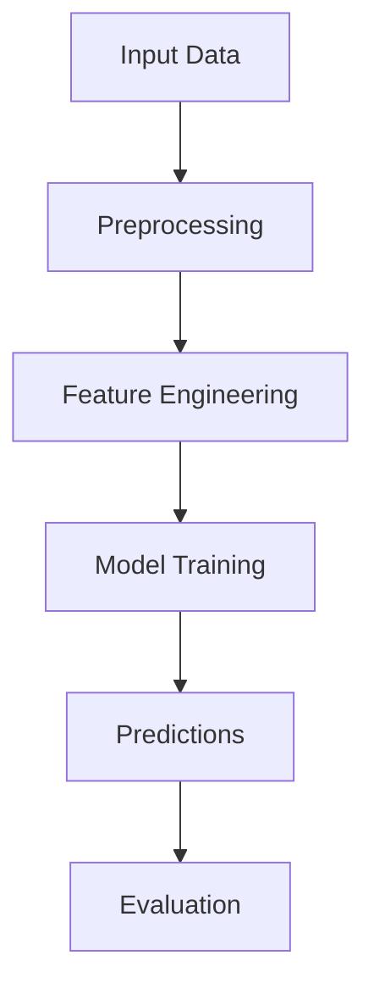

# Plot Type Decision Guide for MCM-Killer

## Overview

This guide helps visualization agents select the most appropriate plot type based on data characteristics and analytical goals.

---

## Decision Tree

```
START: What is your goal?
│
├─ Show trend over time?
│  └─ Use LINE PLOT (Protocol 4)
│     - X-axis: Time (years, days, dates)
│     - Y-axis: Measured value
│     - Add: Confidence intervals, trend lines
│
├─ Compare categories?
│  ├─ 2-3 categories → Use BAR CHART (Protocol 5)
│  │  - Grouped bars for comparison
│  │  - Add: Error bars, value labels
│  │
│  └─ 4+ categories → Use GROUPED BAR or HEATMAP
│     - Grouped bar: Show individual values
│     - Heatmap: Show patterns across categories
│
├─ Show relationship between variables?
│  ├─ 2 variables → Use SCATTER PLOT (Protocol 6)
│  │  - X-axis: Independent variable
│  │  - Y-axis: Dependent variable
│  │  - Add: Reference line, correlation coefficient
│  │
│  └─ 3+ variables → Use SCATTER MATRIX or 3D SCATTER
│     - Scatter matrix: All pairwise relationships
│     - 3D scatter: Three-dimensional relationships
│
├─ Show distribution?
│  ├─ Single variable → Use HISTOGRAM (Protocol 7)
│  │  - Show: Frequency, density
│  │  - Add: Mean/median reference line
│  │
│  └─ Multiple distributions → Use BOX PLOT or VIOLIN PLOT
│     - Box plot: Quartiles, outliers
│     - Violin plot: Density shape
│
├─ Show composition?
│  └─ Use STACKED BAR or PIE CHART
│     - Stacked bar: Parts of whole over time
│     - Pie chart: Parts of whole at one time point
│     - CAUTION: Pie charts are hard to read accurately
│
├─ Show correlation matrix?
│  └─ Use HEATMAP (Protocol 8)
│     - Diverging colormap (coolwarm, RdBu)
│     - Annotate cells with values
│     - Add: Colorbar with label
│
├─ Show geographic data?
│  └─ Use MAP (choropleth or bubble map)
│     - Choropleth: Color-coded regions
│     - Bubble map: Circle size represents value
│     - Add: Legend, scale bar
│
├─ Show model architecture?
│  └─ Use FLOWCHART (Mode B: Mermaid)
│     - Sequential workflow
│     - Decision trees
│     - Hierarchical structure
│     - See: visualizer.md (Mode B)
│
└─ Show multiple related metrics?
   └─ Use MULTI-PANEL FIGURE (Protocol 9)
      - 2x2 or 3x1 layout
      - Shared axes when appropriate
      - Label panels (A, B, C, ...)
```

---

## Plot Selection Matrix

| Goal | Data Type | Recommended Plot | Alternative | Protocol |
|------|-----------|------------------|-------------|----------|
| **Trend** | Time series | Line plot | Area chart | 4 |
| **Comparison** | Categorical | Bar chart | Grouped bar, Dot plot | 5 |
| **Correlation** | 2 continuous | Scatter plot | Line with error bars | 6 |
| **Distribution** | 1 continuous | Histogram | Box plot, Density plot | 7 |
| **Correlation Matrix** | Multiple | Heatmap | Scatter matrix | 8 |
| **Composition** | Parts of whole | Stacked bar | Pie chart (avoid) | 5 |
| **Geographic** | Spatial | Choropleth map | Bubble map | Specialized |
| **Architecture** | Conceptual | Flowchart | Diagram | Mode B |
| **Multi-metric** | Mixed | Multi-panel | Dashboard | 9 |

---

## Common MCM Scenarios

### Scenario 1: Model Performance Over Time

**Data**: Training loss vs. epoch, or predictions vs. year

**Recommended Plot**: Line plot (Protocol 4)

**Why**: Shows trend clearly, can add confidence intervals

**Example Code**:
```python
fig, ax = plt.subplots()
ax.plot(epochs, training_loss, 'o-', label='Training Loss')
ax.plot(epochs, validation_loss, 's-', label='Validation Loss')
ax.set_xlabel('Epoch')
ax.set_ylabel('Loss')
ax.set_title('Model Training Progress')
ax.legend()
ax.grid(True, alpha=0.3)
```

---

### Scenario 2: Comparing Multiple Models

**Data**: Performance metrics (accuracy, R², etc.) for different models

**Recommended Plot**: Grouped bar chart (Protocol 5)

**Why**: Direct comparison, easy to rank models

**Example Code**:
```python
fig, ax = plt.subplots()
x = np.arange(len(models))
width = 0.35

bars1 = ax.bar(x - width/2, model1_metrics, width, label='Model 1')
bars2 = ax.bar(x + width/2, model2_metrics, width, label='Model 2')

ax.set_xlabel('Metric')
ax.set_ylabel('Value')
ax.set_xticks(x)
ax.set_xticklabels(['Accuracy', 'R²', 'MAE', 'RMSE'])
ax.legend()
```

---

### Scenario 3: Predictions vs Actual

**Data**: Predicted values vs. ground truth

**Recommended Plot**: Scatter plot (Protocol 6)

**Why**: Shows correlation, deviations from perfect prediction

**Example Code**:
```python
fig, ax = plt.subplots()
ax.scatter(actual, predicted, alpha=0.6)

# Reference line
min_val = min(actual.min(), predicted.min())
max_val = max(actual.max(), predicted.max())
ax.plot([min_val, max_val], [min_val, max_val], 'r--', label='Perfect Prediction')

ax.set_xlabel('Actual')
ax.set_ylabel('Predicted')
ax.legend()
```

---

### Scenario 4: Model Architecture

**Data**: Model structure, data flow

**Recommended Plot**: Flowchart (Mode B: Mermaid)

**Why**: Shows workflow, decision points, hierarchy

**Example Code**:


---

### Scenario 5: Feature Importance

**Data**: Feature names and importance scores

**Recommended Plot**: Horizontal bar chart

**Why**: Easy to read labels, rank features clearly

**Example Code**:
```python
fig, ax = plt.subplots()

# Sort by importance
sorted_idx = np.argsort(importance)
features_sorted = [features[i] for i in sorted_idx]
importance_sorted = [importance[i] for i in sorted_idx]

ax.barh(features_sorted, importance_sorted)
ax.set_xlabel('Importance Score')
ax.set_title('Feature Importance')
ax.grid(True, alpha=0.3, axis='x')
```

---

### Scenario 6: Residual Analysis

**Data**: Residuals (predicted - actual)

**Recommended Plot**: Histogram (Protocol 7)

**Why**: Shows distribution, detects bias

**Example Code**:
```python
fig, ax = plt.subplots()
ax.hist(residuals, bins=30, density=True, alpha=0.7, edgecolor='black')

ax.axvline(0, color='red', linestyle='--', linewidth=2, label='Zero')
ax.axvline(residuals.mean(), color='blue', linestyle='--', linewidth=2, label='Mean')

ax.set_xlabel('Residual Value')
ax.set_ylabel('Density')
ax.legend()
```

---

### Scenario 7: Correlation Analysis

**Data**: Multiple numeric features

**Recommended Plot**: Heatmap (Protocol 8)

**Why**: Shows all pairwise correlations, detects multicollinearity

**Example Code**:
```python
fig, ax = plt.subplots(figsize=(10, 8))
corr_matrix = data.corr()

im = ax.imshow(corr_matrix, cmap='coolwarm', vmin=-1, vmax=1)
ax.figure.colorbar(im, ax=ax, label='Correlation')

# Add values
for i in range(len(corr_matrix)):
    for j in range(len(corr_matrix)):
        ax.text(j, i, f'{corr_matrix.iloc[i, j]:.2f}',
                ha='center', va='center', fontsize=8)

ax.set_xticks(range(len(corr_matrix.columns)))
ax.set_yticks(range(len(corr_matrix.index)))
ax.set_xticklabels(corr_matrix.columns, rotation=45, ha='right')
ax.set_yticklabels(corr_matrix.index)
```

---

### Scenario 8: Sensitivity Analysis

**Data**: Model output vs. parameter variation

**Recommended Plot**: Multi-panel figure (Protocol 9)

**Why**: Shows multiple parameters simultaneously

**Example Code**:
```python
fig, axes = plt.subplots(2, 2, figsize=(12, 10))

# Panel A: Parameter 1
axes[0, 0].plot(param1_values, outputs)
axes[0, 0].set_xlabel('Parameter 1')
axes[0, 0].set_ylabel('Output')
axes[0, 0].set_title('(A) Sensitivity to Parameter 1')
axes[0, 0].grid(True, alpha=0.3)

# Panel B: Parameter 2
axes[0, 1].plot(param2_values, outputs)
axes[0, 1].set_xlabel('Parameter 2')
axes[0, 1].set_ylabel('Output')
axes[0, 1].set_title('(B) Sensitivity to Parameter 2')
axes[0, 1].grid(True, alpha=0.3)

# ... continue for other parameters

plt.tight_layout()
```

---

## Avoid These Common Mistakes

### ❌ Wrong Plot Type

| Mistake | Why Wrong | Correct Approach |
|---------|-----------|------------------|
| Pie chart for comparisons | Hard to compare angles | Bar chart |
| 3D bar chart | Distorts values | 2D bar chart |
| Line plot for categorical data | Implies trend | Bar chart |
| Scatter plot for time series | Hides trend | Line plot |

### ❌ Poor Design Choices

| Mistake | Why Wrong | Correct Approach |
|---------|-----------|------------------|
| No axis labels | Unclear what data represents | Always label axes |
| Default colors | Hard to distinguish | Use colorblind palette |
| No legend | Can't identify series | Add clear legend |
| Too many data series | Overwhelming | Split into panels |

---

## Quick Reference Checklist

Before creating any figure, ask:

1. **What is the goal?** (Trend, comparison, correlation, distribution?)
2. **What is the data type?** (Time series, categorical, continuous?)
3. **What is the recommended plot?** (See decision tree above)
4. **Are there alternatives?** (Consider 2-3 options)
5. **Which plot best serves the goal?** (Choose based on clarity)

---

## Integration with Templates

All templates in `knowledge_library/templates/scienceplots/` follow this decision tree:

- `performance_comparison_template.py` → Scenario 2 (Comparison)
- `time_series_ci_template.py` → Scenario 1 (Trend)
- Additional templates available for other scenarios

When in doubt, start with the template that matches your scenario and customize as needed.
